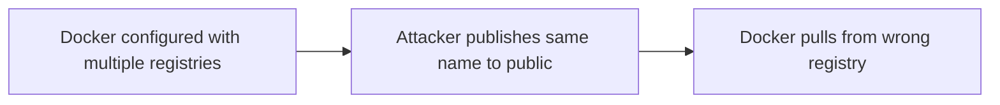

# Lab 3.4: Registry Confusion

<div class="lab-meta">
  <span>~20 min hands-on | ~10 min reference</span>
  <span class="difficulty intermediate">Intermediate</span>
  <span>Prerequisites: <a href="3.1-image-internals.md">Lab 3.1</a></span>
</div>

`docker pull myapp:latest` silently rewrites to `docker.io/library/myapp:latest`. This implicit behavior, combined with registry mirrors and search paths, creates an attack surface. An attacker publishes an image with the same name on a registry that takes priority over yours. This is dependency confusion for containers. In 2023, researchers identified widespread typosquatting campaigns on Docker Hub where attackers published images mimicking popular names, accumulating millions of pulls and deploying cryptominers and credential stealers.

---

### Attack Flow



---

## Environment

| Service | Address | Description |
|---------|---------|-------------|
| Private Registry | `registry:5000` | Your organization's registry with `myapp:latest` |
| Attacker Registry | `attacker-registry:5000` | Simulated public registry with malicious `myapp:latest` |
| Workstation | Pod with docker CLI, crane, kubectl | Your working environment |

## Connect to the Workstation

```bash
./weaklink shell
```

---

???+ info "Phase 1: UNDERSTAND. How Docker Resolves Image Names"

### Step 1: Understand name resolution

When you run `docker pull myapp:latest`, Docker:

1. Checks if the name contains a registry hostname (contains `.` or `:`)
2. If not, prepends `docker.io/library/`
3. If registry mirrors are configured, checks mirrors first

```bash
docker pull alpine:latest 2>&1 | head -5
docker pull registry:5000/myapp:latest 2>&1 | head -5
```

### Step 2: Check Docker daemon configuration

```bash
cat /etc/docker/daemon.json
```

The order of registries in `registry-mirrors` or `insecure-registries` matters. Docker checks them in order.

### Step 3: See what each registry has

```bash
crane catalog registry:5000
crane catalog attacker-registry:5000
```

Both have `myapp`. Same name, different registries.

### Step 4: Compare the images

```bash
crane digest registry:5000/myapp:latest
crane digest attacker-registry:5000/myapp:latest
```

Different digests. Different images.

### Step 5: Check the deployment

```bash
cat /app/deploy/deployment.yml
```

Does the image reference include the full registry hostname?

---

???+ warning "Phase 2: BREAK. Registry Confusion Attack"

### Step 1: Examine the vulnerable deployment

```bash
cat /app/deploy/deployment.yml
```

Short image name like `myapp:latest` without a registry prefix. Docker must decide which registry to pull from.

### Step 2: Deploy the application

```bash
kubectl apply -f /app/deploy/deployment.yml
kubectl rollout status deployment/myapp --timeout=60s
```

### Step 3: Check which image was pulled

```bash
kubectl get pod -l app=myapp -o jsonpath='{.items[0].status.containerStatuses[0].imageID}'
```

Compare against both registries:

```bash
echo "Private registry digest: $(crane digest registry:5000/myapp:latest)"
echo "Attacker registry digest: $(crane digest attacker-registry:5000/myapp:latest)"
```

### Step 4: Verify the damage

```bash
kubectl exec deploy/myapp -- cat /app/version.txt
```

If "ATTACKER-CONTROLLED", the deployment pulled from the wrong registry due to search order priority.

### Step 5: Document the attack

```bash
cat > /app/findings.txt << 'EOF'
FINDING: Registry confusion attack successful.
The deployment used an unqualified image name "myapp:latest".
Docker resolved this to the attacker's registry due to search order priority.
Private registry digest: <private-digest>
Attacker registry digest: <attacker-digest>
Deployed digest matched the attacker's image.
EOF
```

---

???+ success "Phase 3: DEFEND. Fully Qualified Names and Registry Allowlists"

### Defense 1: Use fully qualified image names

```bash
cat > /app/deploy/deployment.yml << 'EOF'
apiVersion: apps/v1
kind: Deployment
metadata:
  name: myapp
spec:
  replicas: 1
  selector:
    matchLabels:
      app: myapp
  template:
    metadata:
      labels:
        app: myapp
    spec:
      containers:
        - name: myapp
          image: registry:5000/myapp:latest
          imagePullPolicy: Always
EOF

kubectl apply -f /app/deploy/deployment.yml
kubectl rollout status deployment/myapp --timeout=60s
```

No ambiguity. Docker knows exactly which registry to pull from.

### Defense 2: Verify the correct image is running

```bash
kubectl exec deploy/myapp -- cat /app/version.txt
```

### Defense 3: Create a registry allowlist policy

```yaml
apiVersion: kyverno.io/v1
kind: ClusterPolicy
metadata:
  name: restrict-registries
spec:
  validationFailureAction: Enforce
  rules:
    - name: allowed-registries
      match:
        any:
          - resources:
              kinds: ["Pod"]
      validate:
        message: "Images must come from approved registries: registry:5000"
        pattern:
          spec:
            containers:
              - image: "registry:5000/*"
```

### Defense 4: Combine with digest pinning

For the strongest defense, use fully qualified names with digest pinning:

```yaml
image: registry:5000/myapp@sha256:<digest>
```

Eliminates both registry confusion and tag mutability.

### Step 5: Verify the lab

```bash
weaklink verify 3.4
```

---

??? danger "Phase 4: DETECT. Catching Registry Confusion in the Wild"

The core signal is a **container image pulled from a registry not on your approved list**. This indicates either misconfiguration or an active attack.

**Indicators:**

- Kubelet image pull events where resolved registry differs from expected
- Deployment manifests with unqualified image names (no registry hostname)
- Docker daemon pulling from mirrors when it should only use the private registry
- New repositories appearing in public registries matching your internal image names

### MITRE ATT&CK Mapping

| Technique | ID | Relevance |
|-----------|-----|-----------|
| **Supply Chain Compromise: Software Supply Chain** | [T1195.002](https://attack.mitre.org/techniques/T1195/002/) | Malicious image with same name on higher-priority registry |
| **Masquerading: Match Legitimate Name** | [T1036.005](https://attack.mitre.org/techniques/T1036/005/) | Attacker's image uses same name and tag as legitimate image |

---

??? tip "SOC Relevance"

    **Alerts:**

    - "Container image pulled from unapproved registry"
    - "Deployment uses unqualified image name"

    **Triage steps:**

    1. Check if the image reference is fully qualified with a registry hostname
    2. Compare digest of pulled image against your private registry
    3. Check Docker daemon config for `registry-mirrors` or multiple registries in search path
    4. Scan the pulled image for unexpected binaries, scripts, or layers
    5. Update the image reference to be fully qualified

    **Prevention:** Enforce fully qualified names via admission controller. Remove `registry-mirrors` from production Docker daemon config.

---

??? example "CI Integration"

    **`.github/workflows/registry-check.yml`:**

    ```yaml
    name: Registry Qualification Check

    on:
      pull_request:
        paths:
          - "k8s/**"
          - "deploy/**"
          - "helm/**"

    jobs:
      check-registry-refs:
        runs-on: ubuntu-latest
        env:
          ALLOWED_REGISTRIES: "registry.internal.corp,gcr.io/distroless,registry.k8s.io"
        steps:
          - uses: actions/checkout@v4

          - name: Reject unqualified image names
            run: |
              FOUND=0
              for f in $(find k8s/ deploy/ helm/ -name '*.yml' -o -name '*.yaml' 2>/dev/null); do
                while IFS= read -r line; do
                  IMAGE=$(echo "$line" | grep -oP 'image:\s*\K\S+')
                  [ -z "$IMAGE" ] && continue
                  if ! echo "$IMAGE" | grep -qE '^[a-z0-9.-]+[.:][a-z0-9]+/'; then
                    echo "::error file=$f::Unqualified image name: $IMAGE"
                    FOUND=1
                  fi
                done < "$f"
              done
              if [ "$FOUND" -eq 1 ]; then
                exit 1
              fi
              echo "PASS: All image references are fully qualified."
    ```

---

## What You Learned

- **Docker implicitly resolves short names.** `myapp:latest` becomes `docker.io/library/myapp:latest` unless you specify a hostname.
- **Registry search order creates attack surface.** If Docker checks multiple registries, an attacker can win by being on a higher-priority one.
- **Fully qualified names eliminate ambiguity.** `registry:5000/myapp:latest` always pulls from your registry.

## Further Reading

- [Docker: Image Naming and Tagging](https://docs.docker.com/reference/cli/docker/image/tag/)
- [containerd: Registry Configuration](https://github.com/containerd/containerd/blob/main/docs/hosts.md)
- [Kyverno: Restrict Image Registries](https://kyverno.io/policies/best-practices/restrict-image-registries/)
