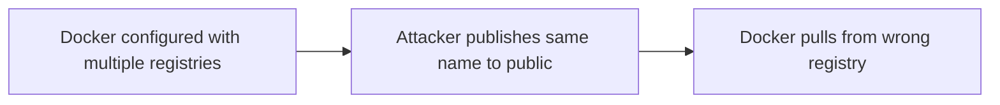

# Lab 3.4: Registry Confusion

  ~20 min hands-on | ~10 min reference
  Intermediate
  Prerequisites: <a href="../3.1-image-internals/">Lab 3.1</a>

  Overview
  ›
  <a href="understand/" class="phase-step upcoming">Understand</a>
  ›
  <a href="break/" class="phase-step upcoming">Break</a>
  ›
  <a href="defend/" class="phase-step upcoming">Defend</a>
  ›
  <a href="detect/" class="phase-step upcoming">Detect</a>

`docker pull myapp:latest` silently rewrites to `docker.io/library/myapp:latest`. This implicit behavior, combined with registry mirrors and search paths, creates an attack surface. An attacker publishes an image with the same name on a registry that takes priority over yours. This is dependency confusion for containers. In 2023, researchers identified widespread typosquatting campaigns on Docker Hub where attackers published images mimicking popular names, accumulating millions of pulls and deploying cryptominers and credential stealers.

### Attack Flow

## Environment

| Service | Address | Description |
|---------|---------|-------------|
| Private Registry | `registry:5000` | Your organization's registry with `myapp:latest` |
| Attacker Registry | `attacker-registry:5000` | Simulated public registry with malicious `myapp:latest` |
| Workstation | Pod with docker CLI, crane, kubectl | Your working environment |
