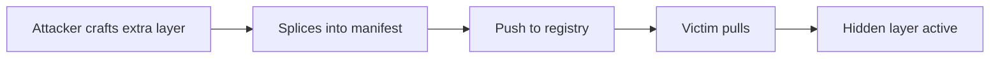

# Lab 3.5: Layer Injection

  ~25 min hands-on | ~10 min reference
  Advanced
  Prerequisites: <a href="../3.1-image-internals/">Lab 3.1</a>

  Overview
  ›
  <a href="understand/" class="phase-step upcoming">Understand</a>
  ›
  <a href="break/" class="phase-step upcoming">Break</a>
  ›
  <a href="defend/" class="phase-step upcoming">Defend</a>
  ›
  <a href="detect/" class="phase-step upcoming">Detect</a>

An attacker who can write to a registry can splice an additional layer into an existing image's manifest. The tag stays the same, the original application still works, but the extra layer drops a reverse shell into the filesystem. `docker pull` does not complain about extra layers. Without image signing, nothing detects the injection short of comparing layer digests against a known-good baseline. Aqua Security's 2023 research on "manifest confusion" demonstrated that OCI manifest manipulation could inject malicious layers into trusted images while preserving valid tag references, bypassing most registry-level scanning.

### Attack Flow

## Environment

| Service | Address | Description |
|---------|---------|-------------|
| OCI Registry | `registry:5000` | Local registry with pre-loaded images |
| Attacker Registry | `attacker-registry:5000` | Staging area for crafting malicious images |
| Workstation | Pod with docker CLI, crane, cosign, jq | Your working environment |

!!! tip "Related Labs"
    - **Prerequisite:** [3.1 Container Image Internals](../3.1-image-internals/index.md) — Understanding image layers is essential before injecting into them
    - **Next:** [3.6 Multi-Stage Build Leaks](../3.6-multistage-leaks/index.md) — Multi-stage leaks show how layer content bleeds between build stages
    - **See also:** [3.3 Base Image Poisoning](../3.3-base-image-poisoning/index.md) — Both attacks modify image content, but at different levels
    - **See also:** [2.7 Build Cache Poisoning](../../tier-2/2.7-build-cache-poisoning/index.md) — Build cache poisoning applies a similar persistence approach to CI
