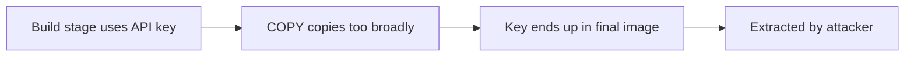

# Lab 3.6: Multi-Stage Build Leaks

<div class="lab-meta">
  <span>~20 min hands-on | ~10 min reference</span>
  <span class="difficulty intermediate">Intermediate</span>
  <span>Prerequisites: <a href="../3.1-image-internals/">Lab 3.1</a></span>
</div>

Multi-stage builds separate build tools from production images. But developers routinely leak secrets through this boundary: `ENV`/`ARG` values persisting in layer history, overbroad `COPY` instructions, and missing `.dockerignore` files. This lab exposes an API key from a "clean-looking" final image using three extraction techniques. In 2023, Sysdig researchers scanned public Docker Hub images and found thousands of exposed AWS keys, GCP credentials, and private SSH keys embedded in image layers, many still valid.

---

### Attack Flow



---

## Environment

| Service | Address | Description |
|---------|---------|-------------|
| Workstation | `weaklink-ws` | Has docker CLI, dive, crane, and jq |
| Registry | `registry:5000` | Local registry with pre-built images |

## Connect to the Workstation

```bash
./weaklink shell
```

---

???+ info "Phase 1: UNDERSTAND. How Multi-Stage Builds Work"

### Step 1: Examine the Dockerfile

```bash
cat /app/Dockerfile
```

Two stages:

- **`builder`:** Installs build tools, downloads dependencies, compiles. Has access to secrets needed during build.
- **`runtime`:** Minimal base, copies only the compiled artifact, sets entrypoint.

The assumption is that nothing from the builder stage leaks into the final image.

### Step 2: Build the image

```bash
docker build -t registry:5000/myapp:latest /app/
```

### Step 3: Verify the final image looks clean

```bash
docker run --rm registry:5000/myapp:latest
docker run --rm --entrypoint sh registry:5000/myapp:latest -c "ls -la /app/"
```

Only the compiled binary. No source code, no `.env`, no build tools.

---

???+ warning "Phase 2: BREAK. Extract Secrets From the Final Image"

### Leak 1: Secrets baked into ENV/ARG

```bash
docker history --no-trunc registry:5000/myapp:latest
```

Look for `ENV` or `ARG` instructions. If `ARG` is re-declared in the final stage, or `ENV` is used instead of `ARG`, the value persists.

```bash
crane config registry:5000/myapp:latest | jq '.config.Env'
```

Any `ENV` in the final stage is embedded in the image config as cleartext.

### Leak 2: Secrets in copied file metadata

```bash
docker save registry:5000/myapp:latest -o /tmp/myapp.tar
mkdir -p /tmp/myapp-layers
tar xf /tmp/myapp.tar -C /tmp/myapp-layers

for layer in /tmp/myapp-layers/*/layer.tar; do
    echo "=== $layer ==="
    tar tf "$layer" 2>/dev/null
done
```

Look for `.env` files or config directories accidentally included. Common mistake:

```dockerfile
# Intended: copy only the binary
COPY --from=builder /app/build/myapp /app/myapp

# Actual: copies everything
COPY --from=builder /app/ /app/
```

### Leak 3: Secrets in build context

```bash
cat /app/.dockerignore 2>/dev/null || echo "No .dockerignore found"
```

Without `.dockerignore`, the entire build context is sent to the Docker daemon, including `.env`, `.git/`, and credentials files.

```bash
ls -la /app/
cat /app/.env 2>/dev/null
cat /app/config/credentials.json 2>/dev/null
```

### Step 4: Collect all leaked secrets

```bash
cat > /app/findings.txt << 'EOF'
Multi-Stage Build Leak Analysis
================================

Leak 1 - ENV/ARG in layer history:
  Location: Image config -> .config.Env
  Secret: API_KEY=<extracted-value>
  Cause: ARG/ENV used for build-time secret persists in final image metadata

Leak 2 - Overbroad COPY:
  Location: Layer tarball -> /app/.env or /app/config/
  Secret: <file contents>
  Cause: COPY --from=builder /app/ copied more than just the binary

Leak 3 - Build context:
  Location: Build context sent to daemon
  Secret: .env file or credentials.json
  Cause: No .dockerignore to exclude sensitive files
EOF
```

---

???+ success "Phase 3: DEFEND. BuildKit Secrets, Precise COPY, and .dockerignore"

### Defense 1: Use BuildKit secret mounts instead of ENV/ARG

```dockerfile
# syntax=docker/dockerfile:1
FROM golang:1.22 AS builder

# Secret mounted at build time, never written to a layer
RUN --mount=type=secret,id=api_key \
    API_KEY=$(cat /run/secrets/api_key) && \
    go build -ldflags "-X main.apiKey=$API_KEY" -o /app/myapp .

FROM gcr.io/distroless/static:nonroot
COPY --from=builder /app/myapp /app/myapp
ENTRYPOINT ["/app/myapp"]
```

Build with:

```bash
echo "sk-real-secret-key" > /tmp/api_key.txt
DOCKER_BUILDKIT=1 docker build --secret id=api_key,src=/tmp/api_key.txt -t registry:5000/myapp:secure .
```

Verify:

```bash
docker history --no-trunc registry:5000/myapp:secure
crane config registry:5000/myapp:secure | jq '.config.Env'
```

No trace of the API key.

### Defense 2: Use precise COPY instructions

```dockerfile
# Bad: copies everything in /app/
COPY --from=builder /app/ /app/

# Good: copies exactly one file
COPY --from=builder /app/build/myapp /app/myapp
```

### Defense 3: Write a comprehensive .dockerignore

```bash
cat > /app/.dockerignore << 'EOF'
.env
.env.*
*.key
*.pem
credentials.json
config/secrets/
.git/
.github/
node_modules/
__pycache__/
*.pyc
EOF
```

### Defense 4: Scan for secrets in images

```bash
trivy image --scanners secret registry:5000/myapp:latest
```

### Step 5: Verify the lab

```bash
weaklink verify 3.6
```

---

??? danger "Phase 4: DETECT. Finding Leaked Secrets in Production Images"

The key signal is **secrets found in container image layers or config metadata**, surfaced by image scanning or when an attacker uses a leaked credential.

**Indicators:**

- Image scanning results showing API keys, passwords, or private keys in any layer
- `ENV` instructions in image history containing key/token/password/secret patterns
- Build logs showing `ARG` with secret values in plaintext
- Authentication logs showing valid credentials used from unexpected sources

### MITRE ATT&CK Mapping

| Technique | ID | Relevance |
|-----------|-----|-----------|
| **Unsecured Credentials: Credentials In Files** | [T1552.001](https://attack.mitre.org/techniques/T1552/001/) | Secrets in image layers, ENV variables, or copied files accessible to anyone with pull access |
| **Implant Internal Image** | [T1525](https://attack.mitre.org/techniques/T1525/) | Deliberately crafted image with hardcoded credentials for lateral movement |

---

??? tip "SOC Relevance"

    **Alert:** "Secret detected in container image layer" or "API key found in image environment variables"

    Developers routinely pass secrets via `ARG`/`ENV` because it is convenient. The risk escalates when images are pushed to shared registries: everyone with pull access can extract the secrets.

    **Triage steps:**

    1. Identify the secret type (API key, database password, private key)
    2. Check if the secret is still valid. **Rotate immediately** if so
    3. Determine blast radius: which registries have this image, who has pull access
    4. Rebuild using BuildKit secrets and push a clean replacement
    5. Audit other build pipelines for the same pattern

---

??? example "CI Integration"

    **`.github/workflows/image-secret-scan.yml`:**

    ```yaml
    name: Image Secret Scanner

    on:
      push:
        paths:
          - "Dockerfile*"
          - ".dockerignore"

    jobs:
      scan-secrets:
        runs-on: ubuntu-latest
        steps:
          - uses: actions/checkout@v4

          - name: Verify .dockerignore exists
            run: |
              if [ ! -f .dockerignore ]; then
                echo "::error::.dockerignore is missing"
                exit 1
              fi
              for pattern in ".env" "*.key" "*.pem" "credentials"; do
                if ! grep -q "$pattern" .dockerignore; then
                  echo "::warning::.dockerignore does not exclude '$pattern'"
                fi
              done

          - name: Check for ENV/ARG secret patterns
            run: |
              if grep -iE '^(ENV|ARG)\s+.*(KEY|TOKEN|PASSWORD|SECRET|CREDENTIAL)' Dockerfile; then
                echo "::error::Dockerfile uses ENV/ARG for secret values. Use --mount=type=secret instead."
                exit 1
              fi

          - name: Build image
            run: DOCKER_BUILDKIT=1 docker build -t scan-target:latest .

          - name: Scan for secrets with Trivy
            uses: aquasecurity/trivy-action@master
            with:
              image-ref: scan-target:latest
              scanners: secret
              severity: CRITICAL,HIGH
              exit-code: 1
    ```

---

## What You Learned

- **Multi-stage builds do not automatically protect secrets.** Secrets leak through ENV, ARG, overbroad COPY, and build context.
- **`ARG` and `ENV` values persist in layer history.** `docker history --no-trunc` and `crane config` expose them as cleartext.
- **BuildKit `--mount=type=secret` is the correct pattern.** It mounts a secret at build time without writing it to any layer.

## Further Reading

- [BuildKit Dockerfile secrets](https://docs.docker.com/build/building/secrets/)
- [Dive: exploring image layers](https://github.com/wagoodman/dive)
- [Trivy secret scanning](https://aquasecurity.github.io/trivy/latest/docs/scanner/secret/)
