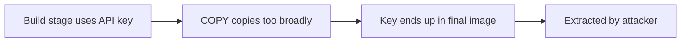

# Lab 3.6: Multi-Stage Build Leaks

  Understand: ~7 min | Break: ~7 min | Defend: ~6 min | Detect: ~10 min
  Intermediate
  Prerequisites: <a href="../3.1-image-internals/">Lab 3.1</a>

  Overview
  ›
  <a href="understand/" class="phase-step upcoming">Understand</a>
  ›
  <a href="break/" class="phase-step upcoming">Break</a>
  ›
  <a href="defend/" class="phase-step upcoming">Defend</a>
  ›
  <a href="detect/" class="phase-step upcoming">Detect</a>

Multi-stage builds separate build tools from production images. But developers routinely leak secrets through this boundary: `ENV`/`ARG` values persisting in layer history, overbroad `COPY` instructions, and missing `.dockerignore` files. This lab exposes an API key from a "clean-looking" final image using three extraction techniques. In 2023, Sysdig researchers scanned public Docker Hub images and found thousands of exposed AWS keys, GCP credentials, and private SSH keys embedded in image layers, many still valid.

### Attack Flow

## Environment

| Service | Address | Description |
|---------|---------|-------------|
| Workstation | `weaklink-ws` | Has docker CLI, dive, crane, and jq |
| Registry | `registry:5000` | Local registry with pre-built images |
