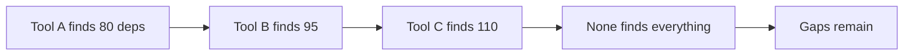

# Lab 4.2: SBOM Gaps in Practice

<div class="lab-meta">
  <span>Phase 1 ~10min | Phase 2 ~10min | Phase 3 ~15min</span>
  <span class="difficulty intermediate">Intermediate</span>
  <span>Prerequisites: <a href="4.1-sbom-contents.md">Lab 4.1</a></span>
</div>

Organizations treat SBOMs as compliance truth. If the SBOM says "no libxml2," the vulnerability check passes and the audit is clean. But SBOM tools scan package metadata, not binary contents. A vendored `.so` file copied into a container will not appear in any SBOM. In this lab you run three industry-standard SBOM generators on the same image, get three different answers, and find a CVE-laden library that all three miss entirely.

### Attack Flow



---

## Environment

| Service | Address | Description |
|---------|---------|-------------|
| Workstation | `weaklink-ws` | Has syft, trivy, cdxgen, grype installed |
| Registry | `registry:5000` | Contains `weaklink-app:vulnerable` with a vendored libxml2 |

## Connect to the Workstation

```bash
./weaklink shell
```

---

???+ info "Phase 1: UNDERSTAND. Different Tools, Different Results"

    **Goal:** Run multiple SBOM generators on the same image and see how their outputs differ.

### Step 1: Pull the target image

```bash
crane pull registry:5000/weaklink-app:vulnerable /tmp/vuln-image.tar
```

### Step 2: Generate SBOMs with three different tools

```bash
# Tool 1: syft
syft registry:5000/weaklink-app:vulnerable -o cyclonedx-json > /app/sbom-syft.json

# Tool 2: trivy
trivy image --format cyclonedx registry:5000/weaklink-app:vulnerable > /app/sbom-trivy.json

# Tool 3: cdxgen
cdxgen -t docker -o /app/sbom-cdxgen.json registry:5000/weaklink-app:vulnerable
```

### Step 3: Compare component counts

```bash
echo "syft:   $(jq '.components | length' /app/sbom-syft.json) components"
echo "trivy:  $(jq '.components | length' /app/sbom-trivy.json) components"
echo "cdxgen: $(jq '.components | length' /app/sbom-cdxgen.json) components"
```

The numbers will differ:

| Tool | Strategy | Strengths | Blind Spots |
|------|----------|-----------|-------------|
| syft | Package manager databases (dpkg, rpm, pip, npm) | Broad language support | Misses vendored/compiled code |
| trivy | Package managers + OS package DBs + advisory matching | Good OS-level coverage | Misses non-standard layouts |
| cdxgen | Language-specific manifest parsing | Deep language support | Weaker on OS packages |

### Step 4: Find the differences

```bash
jq -r '.components[].name' /app/sbom-syft.json | sort -u > /tmp/names-syft.txt
jq -r '.components[].name' /app/sbom-trivy.json | sort -u > /tmp/names-trivy.txt
jq -r '.components[].name' /app/sbom-cdxgen.json | sort -u > /tmp/names-cdxgen.txt

echo "=== Only in syft ==="
comm -23 /tmp/names-syft.txt /tmp/names-trivy.txt

echo "=== Only in trivy ==="
comm -13 /tmp/names-syft.txt /tmp/names-trivy.txt

echo "=== Components all three agree on ==="
comm -12 /tmp/names-syft.txt /tmp/names-trivy.txt | comm -12 - /tmp/names-cdxgen.txt | wc -l
```

---

???+ warning "Phase 2: BREAK. The Invisible CVE"

    **Goal:** A vendored C library with a known CVE exists in the image. No SBOM tool finds it.

### Step 1: Look inside the container

```bash
docker run --rm -it registry:5000/weaklink-app:vulnerable sh

# Inside the container:
ls /app/vendor/
strings /app/vendor/libxml2.so | grep -i "LIBXML"
strings /app/vendor/libxml2.so | grep "2\." | head -5
```

A vendored `libxml2.so` in the vendor directory. The version string reveals known CVEs.

### Step 2: Verify SBOMs missed it

```bash
echo "syft:"; jq '.components[] | select(.name | test("xml"; "i"))' /app/sbom-syft.json
echo "trivy:"; jq '.components[] | select(.name | test("xml"; "i"))' /app/sbom-trivy.json
echo "cdxgen:"; jq '.components[] | select(.name | test("xml"; "i"))' /app/sbom-cdxgen.json
```

All three return nothing. The vendored library is invisible because:

1. Not installed via a package manager (no `dpkg` or `rpm` entry)
2. A compiled `.so` file, not a source package
3. No manifest declaring it as a dependency
4. SBOM tools scan metadata, not binary contents

### Step 3: The false negative

If someone asks "is libxml2 vulnerable?" and you check the SBOM, the answer is "we don't use libxml2." But you do. It's invisible.

### Step 4: Calculate the false negative rate

```bash
docker run --rm registry:5000/weaklink-app:vulnerable sh -c \
  "dpkg-query -f '\${Package}\n' -W | wc -l; pip list --format=freeze 2>/dev/null | wc -l; ls /app/vendor/*.so 2>/dev/null | wc -l"

echo "Best SBOM coverage: $(jq '.components | length' /app/sbom-trivy.json) / TOTAL"
```

---

???+ success "Phase 3: DEFEND. Layered Detection"

    **Goal:** Complement SBOMs with vulnerability scanning and binary analysis.

### Step 1: Run a vulnerability scanner directly on the image

```bash
grype registry:5000/weaklink-app:vulnerable -o table > /app/vuln-scan.txt
cat /app/vuln-scan.txt
```

Grype scans the actual filesystem, not just package metadata.

### Step 2: Run Trivy in vulnerability mode (not SBOM mode)

```bash
trivy image registry:5000/weaklink-app:vulnerable --severity HIGH,CRITICAL
```

Compare what Trivy finds in vulnerability mode vs. what it included in the SBOM.

### Step 3: Manual binary analysis for vendored components

```bash
docker run --rm registry:5000/weaklink-app:vulnerable \
  strings /app/vendor/libxml2.so | grep -E "^[0-9]+\.[0-9]+\.[0-9]+"

echo "Check: https://nvd.nist.gov/vuln/search?query=libxml2+<VERSION>"
```

### Step 4: Write the gap analysis

```bash
cat > /app/gap-analysis.md << 'ANALYSIS'
# SBOM Gap Analysis

## Missed: vendored libxml2 (CVE-2022-40303, CVE-2022-40304)
- syft: missed -- no package manager metadata
- trivy: missed -- no dpkg/rpm entry
- cdxgen: missed -- not in any manifest file

## Root Cause
The library was compiled from source and placed in /app/vendor/.
No SBOM tool performs binary analysis or version extraction from
compiled shared objects.

## Remediation
- Add vendored components to SBOM manually or via enrichment tooling
- Run binary composition analysis
- Flag any /vendor/ or /third-party/ directories for manual review
ANALYSIS
```

### Step 5: Verify the lab

```bash
weaklink verify 4.2
```

---

??? danger "Phase 4: DETECT. Catching SBOM Gaps Before They Become Blind Spots"

    **Goal:** Build detection for incomplete SBOMs and vendored dependency drift.

**What to look for:**

- Container images with vendor directories containing `.so`, `.a`, or `.dll` files not in the SBOM
- SBOM component count significantly lower than actual package count inside the container
- Vulnerability scan findings for CVEs in packages absent from the SBOM
- SBOM generation logs showing warnings about unrecognized file types

| Indicator | What It Means |
|-----------|---------------|
| `/vendor/*.so` or `/third-party/*.a` in container | Compiled vendored deps likely missing from SBOM |
| SBOM has 0 components of type "library" (native) | Tool only found package manager deps |
| `find / -name "*.so" | wc -l` >> SBOM library count | Gap between actual and declared libraries |

### MITRE ATT&CK Mapping

| Technique | ID | Relevance |
|-----------|-----|-----------|
| **Supply Chain Compromise: Compromise Software Supply Chain** | [T1195.002](https://attack.mitre.org/techniques/T1195/002/) | Incomplete SBOMs create blind spots that allow compromised vendored code to evade detection |

---

??? tip "SOC Relevance"

    **Alert you will see:** "Vulnerability found in component not present in SBOM"

    Most organizations treat the SBOM as compliance truth. If the SBOM says "no log4j," the check passes. But the container may still contain log4j as a vendored JAR, shaded dependency, or transitive inclusion.

    **Triage steps:**

    1. Compare the vulnerability scanner's finding against all three SBOM sources
    2. If no SBOM tool found the component, check if it's vendored (`find /vendor/ /third-party/ /lib/`)
    3. Verify the CVE by checking the actual binary version
    4. Add the component to the SBOM manually and update the enrichment process

---

## What You Learned

1. **No SBOM tool finds everything**. syft, trivy, and cdxgen on the same image produce different component lists.
2. **Vendored compiled code is invisible to SBOM tools**. a `.so` copied into the image won't be detected from package metadata.
3. **Complement SBOMs with direct vulnerability scanning**. scan the artifact itself, not just the SBOM.

## Further Reading

- [Anchore: Why SBOMs Are Not Enough](https://anchore.com/blog/why-sboms-are-not-enough/)
- [OWASP Dependency-Track](https://dependencytrack.org/)
- [Grype: A Vulnerability Scanner for Container Images](https://github.com/anchore/grype)
