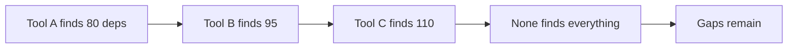

# Lab 4.2: SBOM Gaps in Practice

  Understand: ~10 min | Break: ~10 min | Defend: ~15 min | Detect: ~5 min
  Intermediate
  Prerequisites: <a href="../4.1-sbom-contents/">Lab 4.1</a>

  Overview
  ›
  <a href="understand/" class="phase-step upcoming">Understand</a>
  ›
  <a href="break/" class="phase-step upcoming">Break</a>
  ›
  <a href="defend/" class="phase-step upcoming">Defend</a>
  ›
  <a href="detect/" class="phase-step upcoming">Detect</a>

Organizations treat SBOMs as compliance truth. If the SBOM says "no libxml2," the vulnerability check passes and the audit is clean. But SBOM tools scan package metadata, not binary contents. A vendored `.so` file copied into a container will not appear in any SBOM. In this lab you run three industry-standard SBOM generators on the same image, get three different answers, and find a CVE-laden library that all three miss entirely.

### Attack Flow

## Environment

| Service | Address | Description |
|---------|---------|-------------|
| Workstation | `weaklink-ws` | Has syft, trivy, cdxgen, grype installed |
| Registry | `registry:5000` | Contains `weaklink-app:vulnerable` with a vendored libxml2 |
