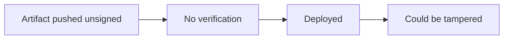

# Lab 4.3: Signing Fundamentals

<div class="lab-meta">
  <span>Phase 1 ~10min | Phase 2 ~8min | Phase 3 ~12min</span>
  <span class="difficulty beginner">Beginner</span>
  <span>Prerequisites: <a href="../tier-0/0.3-containers.md">Lab 0.3</a></span>
</div>

The SolarWinds attack succeeded because Orion updates were unsigned, or more precisely, the build system's signing was compromised. Without cryptographic signing, there is no way to verify that an artifact was built by the right system from the right source. In this lab you deploy an unsigned container image, see that Kubernetes accepts it without complaint, then sign an image with cosign and create a policy that rejects anything unsigned.

### Attack Flow



---

## Environment

| Service | Address | Description |
|---------|---------|-------------|
| Workstation | `weaklink-ws` | Has cosign, crane, and kubectl installed |
| Registry | `registry:5000` | Local registry with signed and unsigned images |
| Kubernetes | `kind-cluster` | Local cluster for deployment testing |

## Connect to the Workstation

```bash
./weaklink shell
```

---

???+ info "Phase 1: UNDERSTAND. What Signing Actually Means"

    **Goal:** Learn the mechanics of cryptographic signing and what it proves.

### Step 1: Generate a cosign key pair

```bash
cd /app
cosign generate-key-pair
```

Enter a password when prompted (or leave blank for the lab). This creates:

- `cosign.key`. private key (used to sign, keep secret)
- `cosign.pub`. public key (used to verify, distribute freely)

### Step 2: Understand what signing proves

A signature proves:

1. **Integrity**. the artifact hasn't been modified since signing
2. **Authenticity**. someone with the private key approved this artifact
3. **Non-repudiation**. the signer can't deny signing it (if key management is solid)

A signature does NOT prove the artifact is safe, does what it claims, or was built from specific source code (that's attestation. [Lab 4.4](4.4-attestation-slsa.md)).

### Step 3: Explore the registry

```bash
crane catalog registry:5000
crane ls registry:5000/weaklink-app
```

Two tags: `signed` and `unsigned`. Both contain the same application code. The registry doesn't care about signatures.

### Step 4: Inspect an image's signatures

```bash
cosign tree registry:5000/weaklink-app:signed
cosign tree registry:5000/weaklink-app:unsigned
```

The signed image has a `.sig` tag. The unsigned image has nothing. Both are valid container images.

### Step 5: Compare GPG and cosign

| Feature | GPG | cosign | Notation |
|---------|-----|--------|----------|
| Key format | PGP keys | ECDSA P-256 / ed25519 | x509 certificates |
| Key management | Manual (keyrings) | Key pairs or keyless (Sigstore) | Certificate chain |
| Signature storage | Detached `.asc` file | OCI registry (alongside image) | OCI registry |
| Verification | `gpg --verify` | `cosign verify` | `notation verify` |
| Keyless option | No | Yes (Sigstore Fulcio + Rekor) | No |

For container images, cosign is the standard. GPG is still common for git commits, tarballs, and Linux packages.

---

???+ warning "Phase 2: BREAK. Unsigned Artifacts Are Accepted by Default"

    **Goal:** Deploy an unsigned image and see that nothing stops you.

### Step 1: Deploy the unsigned image

```bash
kubectl run test-unsigned --image=registry:5000/weaklink-app:unsigned
kubectl get pods
```

The pod starts. No warnings, no errors, no admission control.

### Step 2: Verify it's actually running

```bash
kubectl logs test-unsigned
kubectl exec test-unsigned -- cat /app/version.txt
```

From the cluster's perspective, there is zero difference between a signed and unsigned image.

### Step 3: The default state

Docker, Kubernetes, and cloud registries all accept any image by default. Signing is opt-in at every layer. If you sign but don't enforce verification, an attacker can push unsigned malicious images that deploy just as easily.

### Step 4: Clean up

```bash
kubectl delete pod test-unsigned
```

---

???+ success "Phase 3: DEFEND. Sign and Enforce"

    **Goal:** Sign an image with cosign and create a policy that rejects unsigned images.

### Step 1: Sign the image

```bash
cosign sign --key /app/cosign.key registry:5000/weaklink-app:signed
```

Verify the signature:

```bash
cosign verify --key /app/cosign.pub registry:5000/weaklink-app:signed
```

### Step 2: Try verifying the unsigned image

```bash
cosign verify --key /app/cosign.pub registry:5000/weaklink-app:unsigned
```

Fails with "no matching signatures".

### Step 3: Create an admission policy

```bash
KEY_DATA=$(sed 's/^/          /' /app/cosign.pub)

cat > /app/policy.yaml << EOF
apiVersion: policy.sigstore.dev/v1beta1
kind: ClusterImagePolicy
metadata:
  name: require-signature
spec:
  images:
    - glob: "registry:5000/**"
  authorities:
    - key:
        data: |
${KEY_DATA}
EOF

cat /app/policy.yaml
```

The policy now embeds your actual public key. Any image pulled from the registry must have a valid cosign signature matching this key.

### Step 4: Apply and test the policy

```bash
kubectl apply -f /app/policy.yaml

# Signed image -- should succeed
kubectl run test-signed --image=registry:5000/weaklink-app:signed

# Unsigned image -- should be rejected
kubectl run test-unsigned --image=registry:5000/weaklink-app:unsigned
```

The unsigned image is now rejected at admission time.

### Step 5: Verify the lab

```bash
weaklink verify 4.3
```

---

??? danger "Phase 4: DETECT. Identifying Unsigned Deployments"

    **Goal:** Detect when unsigned or improperly signed images are deployed.

**What to look for:**

- Kubernetes audit logs showing image deployments without cosign signatures
- Admission controller deny events for unsigned images
- Images pulled from registries lacking `.sig` tags
- cosign verification failures in CI/CD pipeline logs

| Indicator | What It Means |
|-----------|---------------|
| `admission.k8s.io/deny` with "signature" in message | Policy controller rejected unsigned image |
| Pod creation for image without `.sig` tag | Image was never signed |
| `cosign verify` exit code != 0 in CI logs | Signature verification failed |
| Image digest changes without new signature | Image modified after signing (or re-tagged) |

### MITRE ATT&CK Mapping

| Technique | ID | Relevance |
|-----------|-----|-----------|
| **Subvert Trust Controls** | [T1553](https://attack.mitre.org/techniques/T1553/) | Deploying unsigned artifacts bypasses the intended trust chain |
| **Obtain Capabilities: Code Signing Certificates** | [T1588](https://attack.mitre.org/techniques/T1588/) | Attackers may steal signing keys to sign malicious artifacts |

---

??? tip "SOC Relevance"

    **Alert you will see:** "Unsigned container image deployed to production cluster"

    Without signing enforcement, an attacker with registry write access can push any image. There's no cryptographic barrier between "push to registry" and "running in production." Signing + enforcement creates that barrier.

    **Triage steps:**

    1. Check who pushed the image (`crane manifest` + registry access logs)
    2. Verify if the image was ever signed (`cosign tree <image>`)
    3. Check if this is a new image or a re-tag of an existing one
    4. If unsigned and running in production, treat as potential supply chain compromise
    5. If the admission controller should have blocked it, investigate the policy gap

---

## What You Learned

1. **Signing creates a cryptographic link between a key holder and an artifact**. it proves integrity, authenticity, and non-repudiation.
2. **Unsigned images are accepted everywhere by default**. signing without enforcement is meaningless.
3. **Keyless signing (Sigstore) ties signatures to CI identities instead of static keys**. harder to compromise than managing key pairs.

## Further Reading

- [Sigstore: cosign](https://docs.sigstore.dev/cosign/signing/signing_with_containers/)
- [Sigstore Policy Controller](https://docs.sigstore.dev/policy-controller/overview/)
- [SLSA: Verification](https://slsa.dev/spec/v1.0/verifying-artifacts)
