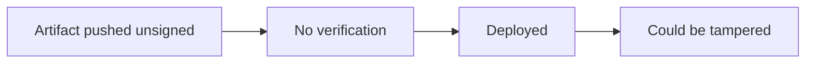

# Lab 4.3: Signing Fundamentals

  Understand: ~10 min | Break: ~8 min | Defend: ~12 min | Detect: ~5 min
  Beginner
  Prerequisites: <a href="../../tier-0/0.3-containers.md">Lab 0.3</a>

  Overview
  ›
  <a href="understand/" class="phase-step upcoming">Understand</a>
  ›
  <a href="break/" class="phase-step upcoming">Break</a>
  ›
  <a href="defend/" class="phase-step upcoming">Defend</a>
  ›
  <a href="detect/" class="phase-step upcoming">Detect</a>

The SolarWinds attack succeeded because Orion updates were unsigned, or more precisely, the build system's signing was compromised. Without cryptographic signing, there is no way to verify that an artifact was built by the right system from the right source. In this lab you deploy an unsigned container image, see that Kubernetes accepts it without complaint, then sign an image with cosign and create a policy that rejects anything unsigned.

### Attack Flow

## Environment

| Service | Address | Description |
|---------|---------|-------------|
| Workstation | `weaklink-ws` | Has cosign, crane, and kubectl installed |
| Registry | `registry:5000` | Local registry with signed and unsigned images |
| Kubernetes | `kind-cluster` | Local cluster for deployment testing |
