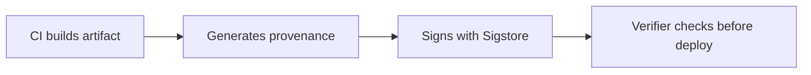

# Lab 4.4: Attestation & Provenance (SLSA)

<div class="lab-meta">
  <span>~20 min hands-on | ~15 min reference</span>
  <span class="difficulty intermediate">Intermediate</span>
  <span>Prerequisites: <a href="4.3-signing-fundamentals.md">Lab 4.3</a></span>
</div>

Signing proves who approved an artifact. Attestation proves where it came from. Build provenance answers: "Was this built by trusted CI from reviewed source, or did someone build it on their laptop and push it?"

---

### Attack Flow



---

## Environment

| Service | Address | Description |
|---------|---------|-------------|
| Workstation | `weaklink-ws` | Has cosign, crane, slsa-verifier, jq |
| Registry | `registry:5000` | Contains images with and without provenance attestations |
| Kubernetes | `kind-cluster` | Local cluster for deployment testing |

## Connect to the Workstation

```bash
./weaklink shell
```

---

???+ info "Phase 1: UNDERSTAND. What Build Provenance Proves"

### Step 1: Signatures vs. attestations

A **signature** says: "I approve this artifact."
An **attestation** says: "Here are machine-verifiable facts about this artifact."

```
Signature:     "key-holder X approves artifact Y"
Attestation:   "artifact Y was built by CI system Z from source repo A at commit B"
```

### Step 2: SLSA levels

| Level | Requirement | What It Proves |
|-------|-------------|---------------|
| SLSA 1 | Build process exists and produces provenance | "Something built this" |
| SLSA 2 | Build runs on a hosted service, provenance is signed | "A CI system built this" |
| SLSA 3 | Build runs on a hardened, isolated platform | "A tamper-resistant CI built this" |
| SLSA 4 | Hermetic, reproducible build with two-party review | "This was built exactly as specified" |

Most organizations target SLSA 2-3. GitHub Actions with the SLSA generator achieves SLSA 3.

### Step 3: in-toto attestation format

Attestations use the [in-toto Statement](https://in-toto.io/Statement/v0.1) format. Three fields matter:

- **subject**. the artifact this attestation describes (identified by digest)
- **predicate.builder.id**. which CI system produced the build
- **predicate.invocation.configSource**. which source repo and commit triggered the build

You'll see the full structure when you download an attestation in Phase 3.

### Step 4: Examine the images in the registry

```bash
# Image with provenance
cosign tree registry:5000/weaklink-app:attested

# Image without provenance
cosign tree registry:5000/weaklink-app:no-provenance
```

The attested image has both a signature and an attestation attached. The unattested image has neither.

---

???+ warning "Phase 2: BREAK. Without Provenance, Origin Is Unknown"

### Step 1: Try to verify provenance on the unattested image

```bash
cosign verify-attestation --key /app/cosign.pub \
  --type slsaprovenance \
  registry:5000/weaklink-app:no-provenance
```

Fails. No attestation. No way to know where this image came from.

### Step 2: Build an image locally and push it

```bash
cat > /tmp/Dockerfile << 'EOF'
FROM alpine:3.18
RUN echo "built locally, not in CI" > /app/origin.txt
CMD ["cat", "/app/origin.txt"]
EOF

docker build -t registry:5000/weaklink-app:local-build /tmp/
docker push registry:5000/weaklink-app:local-build
```

### Step 3: Compare the two unattested images

```bash
crane manifest registry:5000/weaklink-app:no-provenance | jq '.mediaType'
crane manifest registry:5000/weaklink-app:local-build | jq '.mediaType'
```

Without provenance, these images are indistinguishable. One may have been built from reviewed source in CI, the other on a developer laptop with modified code. The registry doesn't know.

### Step 4: The insider threat scenario

An insider with registry write access can clone the repo, add a backdoor, build locally, and push with the same tag. Without provenance verification, the replacement is undetectable.

---

> **Checkpoint:** You should now have two unattested images in the registry (`no-provenance` and `local-build`) and understand why they are indistinguishable without provenance. Run `cosign verify-attestation` on both to confirm they fail.

---

???+ success "Phase 3: DEFEND. Generate and Verify Provenance"

### Step 1: Create a provenance attestation

```bash
DIGEST=$(crane digest registry:5000/weaklink-app:attested)
echo "Digest: $DIGEST"
```

Create the provenance document:

```bash
cat > /app/provenance.json << EOF
{
  "_type": "https://in-toto.io/Statement/v0.1",
  "predicateType": "https://slsa.dev/provenance/v0.2",
  "subject": [{
    "name": "registry:5000/weaklink-app",
    "digest": {"sha256": "${DIGEST#sha256:}"}
  }],
  "predicate": {
    "builder": {"id": "https://github.com/weaklink-labs/ci-builder"},
    "buildType": "https://github.com/weaklink-labs/build/v1",
    "invocation": {
      "configSource": {
        "uri": "git+https://github.com/weaklink-labs/app@refs/heads/main",
        "digest": {"sha1": "$(git rev-parse HEAD 2>/dev/null || echo 'abc123')"},
        "entryPoint": ".github/workflows/build.yml"
      }
    }
  }
}
EOF
```

### Step 2: Attach the attestation to the image

```bash
cosign attest --key /app/cosign.key \
  --predicate /app/provenance.json \
  --type slsaprovenance \
  registry:5000/weaklink-app:attested
```

### Step 3: Verify the attestation

```bash
cosign verify-attestation --key /app/cosign.pub \
  --type slsaprovenance \
  registry:5000/weaklink-app:attested
```

Inspect the provenance:

```bash
cosign verify-attestation --key /app/cosign.pub \
  --type slsaprovenance \
  registry:5000/weaklink-app:attested | jq -r '.payload' | base64 -d | jq '.predicate.builder'
```

### Step 4: Confirm the locally-built image has no provenance

```bash
cosign verify-attestation --key /app/cosign.pub \
  --type slsaprovenance \
  registry:5000/weaklink-app:local-build
```

Fails. Now you can distinguish CI-built (attested) from locally-built (unattested).

### Step 5: Create a deployment policy that requires provenance

```bash
cat > /app/provenance-policy.yaml << 'EOF'
apiVersion: policy.sigstore.dev/v1beta1
kind: ClusterImagePolicy
metadata:
  name: require-slsa-provenance
spec:
  images:
    - glob: "registry:5000/**"
  authorities:
    - key:
        data: |
          <COSIGN_PUB_KEY>
      attestations:
        - name: must-have-slsa
          predicateType: "https://slsa.dev/provenance/v0.2"
          policy:
            type: cue
            data: |
              predicate: builder: id: =~"^https://github.com/weaklink-labs/"
EOF
```

This policy requires both a valid signature AND a SLSA provenance attestation from a trusted builder.

### Step 6: Verify the lab

```bash
weaklink verify 4.4
```

---

??? danger "Phase 4: DETECT. Catching Unattested Deployments"

| Indicator | What It Means |
|-----------|---------------|
| Image has `.sig` but no `.att` tag | Signed but no provenance, possibly built locally |
| Attestation builder ID doesn't match expected CI | Wrong CI system or forged attestation |
| `buildInvocationId` not found in CI system logs | Provenance claims a build that never happened |
| `configSource.uri` points to unexpected repo/branch | Built from unauthorized source |

### MITRE ATT&CK Mapping

| Technique | ID | Relevance |
|-----------|-----|-----------|
| **Compromise Software Supply Chain** | [T1195.002](https://attack.mitre.org/techniques/T1195/002/) | Without provenance, locally-built backdoored artifacts are indistinguishable from CI-built ones |
| **Subvert Trust Controls** | [T1553](https://attack.mitre.org/techniques/T1553/) | Bypassing provenance requirements to deploy unattested artifacts |

---

??? tip "SOC Relevance"

    **Alert:** "Image deployed without SLSA provenance attestation"

    Signing proves approval. Provenance proves origin. A signed image could have been built anywhere; a provenance attestation ties the build to a specific CI run, repo, and commit.

    **Triage steps:**

    1. Check if the image was intentionally deployed without provenance (emergency hotfix?)
    2. Look up the image digest in your CI system
    3. If no CI build matches, treat as potential supply chain compromise
    4. Check who pushed the image to the registry (registry access logs)

---

??? example "CI Integration"

    Add a `provenance` job after your existing build job:

    ```yaml
      provenance:
        needs: build
        permissions:
          actions: read
          id-token: write
          packages: write
        uses: slsa-framework/slsa-github-generator/.github/workflows/generator_container_slsa3.yml@v1.9.0
        with:
          image: ghcr.io/${{ github.repository }}
          digest: ${{ needs.build.outputs.digest }}
          registry-username: ${{ github.actor }}
        secrets:
          registry-password: ${{ secrets.GITHUB_TOKEN }}
    ```

---

## What You Learned

1. **Without provenance, CI-built and locally-built are indistinguishable.** An insider can push a backdoored image undetected.
2. **in-toto attestations bind signed provenance claims to artifact digests.** The standard format for SLSA.
3. **Provenance policies should check builder identity,** not just "is there an attestation?"

## Further Reading

- [SLSA Specification](https://slsa.dev/spec/v1.0/)
- [in-toto Attestation Framework](https://github.com/in-toto/attestation)
- [SLSA GitHub Generator](https://github.com/slsa-framework/slsa-github-generator)
