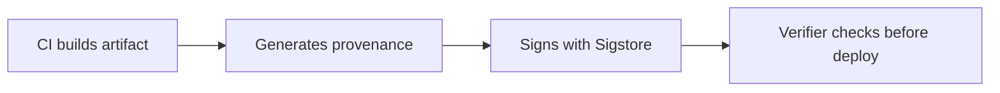

# Lab 4.4: Attestation & Provenance (SLSA)

  ~20 min hands-on | ~15 min reference
  Intermediate
  Prerequisites: <a href="../4.3-signing-fundamentals/">Lab 4.3</a>

  Overview
  ›
  <a href="understand/" class="phase-step upcoming">Understand</a>
  ›
  <a href="break/" class="phase-step upcoming">Break</a>
  ›
  <a href="defend/" class="phase-step upcoming">Defend</a>
  ›
  <a href="detect/" class="phase-step upcoming">Detect</a>

Signing proves who approved an artifact. Attestation proves where it came from. Build provenance answers: "Was this built by trusted CI from reviewed source, or did someone build it on their laptop and push it?"

### Attack Flow

## Environment

| Service | Address | Description |
|---------|---------|-------------|
| Workstation | `weaklink-ws` | Has cosign, crane, slsa-verifier, jq |
| Registry | `registry:5000` | Contains images with and without provenance attestations |
| Kubernetes | `kind-cluster` | Local cluster for deployment testing |

!!! tip "Related Labs"
    - **Prerequisite:** [4.3 Signing Fundamentals](../4.3-signing-fundamentals/index.md) — Signing fundamentals underpin attestation and provenance
    - **Next:** [4.6 Attestation Forgery](../4.6-attestation-forgery/index.md) — Attestation forgery attacks the provenance chain built here
    - **See also:** [8.1 SLSA Framework Deep Dive](../../tier-8/8.1-slsa-deep-dive/index.md) — SLSA framework formalizes the attestation levels covered here
    - **See also:** [2.1 CI/CD Fundamentals](../../tier-2/2.1-cicd-fundamentals/index.md) — CI/CD pipelines generate the build provenance attested here
