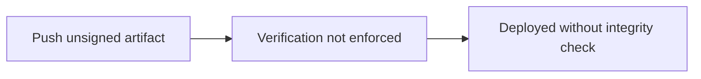

# Lab 4.5: Signature Bypass Attacks

<div class="lab-meta">
  <span>~20 min hands-on | ~15 min reference</span>
  <span class="difficulty advanced">Advanced</span>
  <span>Prerequisites: <a href="4.3-signing-fundamentals.md">Lab 4.3</a></span>
</div>

Signing is only useful if verification is enforced, the right key is checked, and old signatures can't be replayed. This lab demonstrates three bypass techniques that defeat signing in practice.

---

### Attack Flow



---

## Environment

| Service | Address | Description |
|---------|---------|-------------|
| Workstation | `weaklink-ws` | Has cosign, crane, kubectl, and two key pairs (trusted + attacker) |
| Registry | `registry:5000` | Contains signed, unsigned, and attacker-signed images |
| Kubernetes | `kind-cluster` | Local cluster with optional policy controller |

## Connect to the Workstation

```bash
./weaklink shell
```

---

???+ info "Phase 1: UNDERSTAND. When Signing Fails to Protect"

### Step 1: The signing trust model

```
Signer (private key) --> Signature --> Verifier (public key) --> Decision (accept/reject)
```

This chain breaks in three places:

| Bypass | Where It Breaks |
|--------|-----------------|
| No enforcement | Verifier step is missing |
| Key confusion | Wrong public key used for verification |
| Signature rollback | Old valid signature applied to new artifact |

### Step 2: Check the current state

```bash
ls /app/*.pub /app/*.key 2>/dev/null
crane ls registry:5000/weaklink-app
```

### Step 3: Verify the trusted image works

```bash
cosign verify --key /app/cosign.pub registry:5000/weaklink-app:signed
```

---

???+ warning "Phase 2: BREAK. Three Bypass Techniques"

### Bypass 1: No Enforcement (the unsigned path)

Push an unsigned image and deploy it:

```bash
cat > /tmp/Dockerfile << 'EOF'
FROM alpine:3.18
RUN echo "malicious payload" > /evil.txt
CMD ["cat", "/evil.txt"]
EOF
docker build -t registry:5000/weaklink-app:backdoor /tmp/
docker push registry:5000/weaklink-app:backdoor

kubectl run bypass1 --image=registry:5000/weaklink-app:backdoor
kubectl get pods bypass1
kubectl logs bypass1
```

Unless an admission controller enforces signature verification, the unsigned image runs. Most clusters have no enforcement.

```bash
kubectl delete pod bypass1
```

### Bypass 2: Key Confusion (sign with attacker key)

```bash
cd /app && cosign generate-key-pair --output-key-prefix attacker-cosign

docker build -t registry:5000/weaklink-app:attacker-signed /tmp/
docker push registry:5000/weaklink-app:attacker-signed

cosign sign --key /app/attacker-cosign.key registry:5000/weaklink-app:attacker-signed
```

Verify with the attacker's public key:

```bash
cosign verify --key /app/attacker-cosign.pub registry:5000/weaklink-app:attacker-signed
```

Passes. The image is "signed," but by someone you don't trust. If a policy uses `cosign verify` without specifying which key to trust, the attacker-signed image passes.

Confirm it fails with the trusted key:

```bash
cosign verify --key /app/cosign.pub registry:5000/weaklink-app:attacker-signed
```

### Bypass 3: Signature Rollback / Replay

Attempt to reuse a valid signature from one image on a different image:

```bash
SIGNED_DIGEST=$(crane digest registry:5000/weaklink-app:signed)
MALICIOUS_DIGEST=$(crane digest registry:5000/weaklink-app:backdoor)

cosign copy registry:5000/weaklink-app:signed registry:5000/weaklink-app:backdoor 2>&1 || true

cosign verify --key /app/cosign.pub registry:5000/weaklink-app:backdoor
```

With cosign, this fails because signatures are bound to the image digest. In systems that use detached signatures (GPG `.asc` files) without digest binding, old signatures can be replayed on new artifacts.

---

> **Checkpoint:** You should have three images in the registry (`backdoor`, `attacker-signed`, `signed`) and understand why each bypass works. Run `cosign verify --key /app/cosign.pub` against all three to confirm which pass and which fail.

---

???+ success "Phase 3: DEFEND. Enforce, Pin, Timestamp"

### Defense 1: Enforce verification with admission policy

```bash
KEY_DATA=$(sed 's/^/          /' /app/cosign.pub)

cat > /app/enforce-policy.yaml << EOF
apiVersion: policy.sigstore.dev/v1beta1
kind: ClusterImagePolicy
metadata:
  name: enforce-trusted-signatures
spec:
  images:
    - glob: "registry:5000/**"
  authorities:
    - key:
        data: |
${KEY_DATA}
EOF

cat /app/enforce-policy.yaml
```

With this policy applied via Sigstore policy-controller, unsigned and attacker-signed images are both rejected. Only images signed with the trusted key pass admission.

### Defense 2: Pin trusted keys/identities

For key-based signing, hash-pin the trusted public key so a swapped file is detected. Better: use keyless signing and pin the OIDC identity:

```bash
cosign verify \
  --certificate-identity="https://github.com/your-org/your-app/.github/workflows/build.yml@refs/heads/main" \
  --certificate-oidc-issuer="https://token.actions.githubusercontent.com" \
  $IMAGE
```

Immune to key confusion because the identity is tied to a specific GitHub Actions workflow.

### Defense 3: Include timestamps and expiry

```bash
cosign verify --key /app/cosign.pub registry:5000/weaklink-app:signed | jq '.[].optional.Bundle.Payload.integratedTime'
```

Rekor timestamps prove when a signature was created. You can reject signatures older than your policy allows.

### Step 4: Verify the lab

```bash
weaklink verify 4.5
```

---

??? danger "Phase 4: DETECT. Identifying Signature Bypass Attempts"

| Indicator | Bypass Type | What It Means |
|-----------|-------------|---------------|
| Image deployed, no `.sig` tag exists | No enforcement | Signing requirement is not enforced |
| `cosign verify` succeeds with unknown key fingerprint | Key confusion | Someone signed with an untrusted key |
| Signature timestamp >> image push timestamp | Rollback | Old signature copied to new image |
| `cosign generate-key-pair` in workstation logs | Key confusion prep | Someone generating keys to forge signatures |

### MITRE ATT&CK Mapping

| Technique | ID | Relevance |
|-----------|-----|-----------|
| **Subvert Trust Controls** | [T1553](https://attack.mitre.org/techniques/T1553/) | All three bypasses subvert the intended signature-based trust model |
| **Masquerading** | [T1036](https://attack.mitre.org/techniques/T1036/) | Attacker signs malicious artifacts to make them appear legitimate |

---

??? tip "SOC Relevance"

    **Alert:** "Image signature verification succeeded with unknown key"

    This is the most dangerous variant. The image IS signed. Verification DID pass. But the key doesn't belong to your organization. A signed-with-wrong-key image looks legitimate, unlike an obviously unsigned one.

    **Triage steps:**

    1. Extract the public key used for the signature
    2. Compare against your inventory of trusted signing keys
    3. If the key is unknown, treat as potential supply chain compromise
    4. Check for `cosign generate-key-pair` in recent process logs on that host
    5. If using keyless signing, check the OIDC identity in the certificate

---

??? example "CI Integration"

    **`.github/workflows/verify-before-deploy.yml`:**

    ```yaml
    name: Verify Signatures Before Deploy

    on:
      workflow_dispatch:
        inputs:
          image:
            description: "Image to deploy"
            required: true

    jobs:
      verify-and-deploy:
        runs-on: ubuntu-latest
        permissions:
          id-token: write
        steps:
          - name: Install cosign
            uses: sigstore/cosign-installer@v3

          - name: Verify signature (keyless, identity-pinned)
            run: |
              cosign verify \
                --certificate-identity="https://github.com/${{ github.repository }}/.github/workflows/build.yml@refs/heads/main" \
                --certificate-oidc-issuer="https://token.actions.githubusercontent.com" \
                ${{ inputs.image }}

          - name: Deploy (only if verification passed)
            run: |
              kubectl set image deployment/app app=${{ inputs.image }}
    ```

---

## What You Learned

1. **No enforcement = no security.** Signing without verification is security theater.
2. **Key confusion is the most dangerous bypass.** A signed artifact isn't safe unless verified against a pinned trusted key or OIDC identity.
3. **Digest-bound signatures (cosign) prevent replay.** Detached GPG signatures without digest binding remain vulnerable.

## Further Reading

- [Sigstore Policy Controller](https://docs.sigstore.dev/policy-controller/overview/)
- [Sigstore: Keyless Signing](https://docs.sigstore.dev/cosign/signing/signing_with_containers/#keyless-signing)
- [The Update Framework (TUF)](https://theupdateframework.io/)
