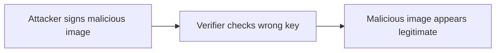

# Lab 4.5: Signature Bypass Attacks

  Understand: ~7 min | Break: ~7 min | Defend: ~6 min | Detect: ~15 min
  Advanced
  Prerequisites: <a href="../4.3-signing-fundamentals/">Lab 4.3</a>

  Overview
  ›
  <a href="understand/" class="phase-step upcoming">Understand</a>
  ›
  <a href="break/" class="phase-step upcoming">Break</a>
  ›
  <a href="defend/" class="phase-step upcoming">Defend</a>
  ›
  <a href="detect/" class="phase-step upcoming">Detect</a>

Signing is only useful if verification checks the right signer. This lab focuses on the most dangerous bypass in real deployments: key confusion. The artifact is signed, verification appears to pass, but the signature belongs to an attacker key instead of a trusted identity.

### Attack Flow

## Environment

| Service | Address | Description |
|---------|---------|-------------|
| Workstation | `weaklink-ws` | Has cosign, crane, kubectl, and two key pairs (trusted + attacker) |
| Registry | `registry:5000` | Contains signed, unsigned, and attacker-signed images |
| Kubernetes | `kind-cluster` | Local cluster with optional policy controller |

> **Related Labs**
>
> - **Prerequisite:** [4.3 Signing Fundamentals](../4.3-signing-fundamentals/index.md) — Understanding signatures before learning to bypass them
> - **Next:** [4.6 Attestation Forgery](../4.6-attestation-forgery/index.md) — Attestation forgery extends bypass attacks to provenance
> - **See also:** [4.7 SBOM Tampering](../4.7-sbom-tampering/index.md) — SBOM tampering bypasses integrity checks on metadata
> - **See also:** [5.5 Kubernetes Admission Controller Bypass](../../tier-5/5.5-admission-controller-bypass/index.md) — Admission controller bypass defeats signature enforcement
> - **Variant, not mainline here:** unsigned-image deployment is already covered in [4.3 Signing Fundamentals](../4.3-signing-fundamentals/index.md)
