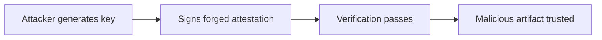

# Lab 4.6: Attestation Forgery

  ~25 min hands-on | ~15 min reference
  Advanced
  Prerequisites: <a href="../4.4-attestation-slsa/">Lab 4.4</a>

  Overview
  ›
  <a href="understand/" class="phase-step upcoming">Understand</a>
  ›
  <a href="break/" class="phase-step upcoming">Break</a>
  ›
  <a href="defend/" class="phase-step upcoming">Defend</a>
  ›
  <a href="detect/" class="phase-step upcoming">Detect</a>

If an attacker controls the signing key, they control the attestation. They can generate a valid in-toto attestation claiming "built by GitHub Actions from main branch" for an image they built on their laptop with a backdoor.

This lab puts you in the attacker's seat: forge an attestation, pass verification, then learn how keyless signing and transparency logs make forgery detectable.

### Attack Flow

## Environment

| Service | Address | Description |
|---------|---------|-------------|
| Workstation | `weaklink-ws` | Has cosign, slsa-verifier, in-toto, rekor-cli, jq |
| Registry | `registry:5000` | Contains images with real and forged attestations |
