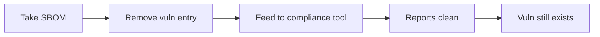

# Lab 4.7: SBOM Tampering

<div class="lab-meta">
  <span>~15 min hands-on | ~15 min reference</span>
  <span class="difficulty intermediate">Intermediate</span>
  <span>Prerequisites: <a href="../4.1-sbom-contents/">Lab 4.1</a>, <a href="../4.3-signing-fundamentals/">Lab 4.3</a></span>
</div>

An SBOM is a JSON file. Without cryptographic signing, anyone with write access can remove a vulnerable component, change a version number, or delete an entire dependency tree. The modified SBOM passes schema validation and compliance checks without raising an alert. NIST SP 800-218 (SSDF) control PW.4.1 explicitly requires verifying SBOM integrity, recognizing that an unprotected SBOM is no better than no SBOM at all.

---

### Attack Flow



---

## Environment

| Service | Address | Description |
|---------|---------|-------------|
| Workstation | `weaklink-ws` | Has syft, grype, cosign, jq, and a Python application |
| Registry | `registry:5000` | Local registry with images and attached SBOMs |

## Connect to the Workstation

```bash
./weaklink shell
```

---

???+ info "Phase 1: UNDERSTAND. SBOMs Are Just JSON Files"

### Step 1: Generate an SBOM for the application

```bash
syft /app -o cyclonedx-json > /app/sbom.json
```

### Step 2: Inspect the structure

```bash
cat /app/sbom.json | jq '{
  bomFormat: .bomFormat,
  specVersion: .specVersion,
  serialNumber: .serialNumber,
  components_count: (.components | length)
}'
```

A CycloneDX SBOM is a JSON document with a `components` array. Each component has a name, version, purl, and optional hashes. There is no signature, no MAC, no integrity field.

### Step 3: Find vulnerable components

```bash
grype sbom:/app/sbom.json --output table
```

Note a component with a critical CVE.

---

???+ warning "Phase 2: BREAK. Remove a Vulnerable Component and Pass Compliance"

### Step 1: Identify the target component

```bash
grype sbom:/app/sbom.json --output json | jq -r '
  .matches[]
  | select(.vulnerability.severity == "Critical")
  | "\(.artifact.name) \(.artifact.version) - \(.vulnerability.id)"
' | head -5
```

### Step 2: Create the tampered SBOM

```bash
cat /app/sbom.json | jq '
  .components = [.components[] | select(.name != "requests")]
' > /app/sbom-tampered.json

echo "Original components: $(jq '.components | length' /app/sbom.json)"
echo "Tampered components: $(jq '.components | length' /app/sbom-tampered.json)"
```

One line of `jq`.

### Step 3: Run the compliance check on the tampered SBOM

```bash
echo "=== Original SBOM ==="
grype sbom:/app/sbom.json --output table --only-fixed 2>&1 | head -20

echo "=== Tampered SBOM ==="
grype sbom:/app/sbom-tampered.json --output table --only-fixed 2>&1 | head -20
```

The tampered SBOM produces a clean compliance report. The vulnerability still exists in the actual artifact.

### Step 4: Version number tampering

Removal is obvious if someone compares component counts. A subtler attack:

```bash
cat /app/sbom.json | jq '
  .components = [.components[] |
    if .name == "requests" and .version == "2.25.0"
    then .version = "2.31.0" | .purl = (.purl | gsub("2.25.0"; "2.31.0"))
    else .
    end
  ]
' > /app/sbom-version-tampered.json

grype sbom:/app/sbom-version-tampered.json --output table 2>&1 | grep -i requests || echo "No findings for requests"
```

Same component count, but the CVE no longer matches. The actual deployed artifact still runs `requests==2.25.0`.

---

> **Checkpoint:** You should have `sbom.json`, `sbom-tampered.json`, and `sbom-version-tampered.json`. Run grype against all three and confirm the original flags the CVE while the tampered versions don't.

---

???+ success "Phase 3: DEFEND. Sign SBOMs and Generate Them in CI"

### Defense 1: Sign the SBOM with cosign

```bash
cosign generate-key-pair

cosign sign-blob --key cosign.key /app/sbom.json --output-signature /app/sbom.json.sig
```

Verify before consuming:

```bash
cosign verify-blob --key cosign.pub --signature /app/sbom.json.sig /app/sbom.json
```

If the SBOM was modified after signing, verification fails.

### Defense 2: Attach the SBOM to the container image

```bash
cosign attach sbom --sbom /app/sbom.json registry:5000/webapp:latest

cosign verify-attestation --key cosign.pub registry:5000/webapp:latest --type cyclonedx
```

When the SBOM is attached to the image and signed, tampering invalidates the signature.

### Defense 3: Generate SBOMs in CI, never manually

The SBOM should be generated in the same CI pipeline that builds the artifact, signed immediately, and published alongside the artifact.

```yaml
- name: Generate SBOM
  run: syft $IMAGE -o cyclonedx-json > sbom.json

- name: Sign and attach SBOM
  run: |
    cosign attest --predicate sbom.json --type cyclonedx $IMAGE
```

### Defense 4: Cross-validate SBOM against the artifact

```bash
syft registry:5000/webapp:latest -o cyclonedx-json > /app/sbom-fresh.json

diff <(jq -r '.components[].purl' /app/sbom.json | sort) \
     <(jq -r '.components[].purl' /app/sbom-fresh.json | sort)
```

If they disagree, the stored SBOM was tampered with or is stale.

### Step 5: Verify the lab

```bash
weaklink verify 4.7
```

---

??? danger "Phase 4: DETECT. Spotting Tampered SBOMs"

| Indicator | What It Means |
|-----------|---------------|
| Vuln scanner finds CVE in `requests==2.25.0` but SBOM lists `requests==2.31.0` | Version was tampered |
| SBOM lists 15 components but `pip list` in container shows 22 | Components were removed from the SBOM |
| SBOM signature verification fails | Modified after signing |
| `serialNumber` or `metadata.timestamp` doesn't match CI pipeline records | SBOM may have been replaced |

### MITRE ATT&CK Mapping

| Technique | ID | Relevance |
|-----------|-----|-----------|
| **Compromise Software Supply Chain** | [T1195.002](https://attack.mitre.org/techniques/T1195/002/) | Tampering lets a compromised dependency pass compliance checks undetected |
| **Indicator Removal** | [T1070](https://attack.mitre.org/techniques/T1070/) | Removing a component from an SBOM is evidence tampering |

---

??? tip "SOC Relevance"

    **Alert:** "SBOM signature verification failed" or "Vulnerability found at different version than SBOM declares"

    SBOM tampering is the supply chain equivalent of editing audit logs. The attacker doesn't change the artifact; they change the documentation that compliance tools rely on.

    **Triage steps:**

    1. Verify the SBOM signature
    2. Regenerate the SBOM from the actual artifact and compare
    3. If version numbers differ, check the actual installed version (`pip show`, `npm list`, `dpkg -l`)
    4. If tampering is confirmed, quarantine the artifact and audit who had write access to SBOM storage

---

??? example "CI Integration"

    **`.github/workflows/sbom-integrity.yml`:**

    ```yaml
    - name: Generate SBOM from built image
      run: syft $IMAGE -o cyclonedx-json > sbom.json

    - name: Sign and attach SBOM as attestation
      run: cosign attest --predicate sbom.json --type cyclonedx $IMAGE

    - name: Cross-validate SBOM against vulnerability scan
      run: |
        grype $IMAGE --output json > scan-results.json
        SCAN_PKGS=$(jq -r '.matches[].artifact.name' scan-results.json | sort -u)
        for pkg in $SCAN_PKGS; do
          if ! jq -e ".components[] | select(.name == \"$pkg\")" sbom.json > /dev/null 2>&1; then
            echo "::error::Vulnerable component '$pkg' found by scanner but missing from SBOM"
          fi
        done
    ```

---

## What You Learned

1. **SBOMs have no built-in integrity.** A single `jq` command removes a component or changes a version. Tampered SBOMs pass schema validation.
2. **Version tampering is subtler than removal.** Component count stays identical but the CVE match disappears.
3. **Sign SBOMs at generation time and cross-validate against the actual artifact.** Signing detects post-generation tampering; cross-validation catches incomplete generation.

## Further Reading

- [CycloneDX Signing Specification](https://cyclonedx.org/capabilities/signing/)
- [cosign attach sbom](https://docs.sigstore.dev/signing/other_types/#sboms)
- [CISA SBOM Sharing Guidance](https://www.cisa.gov/sbom)
