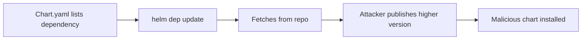

# Lab 5.1: How Helm Charts Resolve Dependencies

<div class="lab-meta">
  <span>Phase 1: ~10 min | Phase 2: ~10 min | Phase 3: ~10 min | Phase 4: ~5 min</span>
  <span class="difficulty intermediate">Intermediate</span>
  <span>Prerequisites: <a href="../tier-0/0.3-containers.md">Lab 0.3</a></span>
</div>

`helm dependency update` resolves chart dependencies from configured repositories. A `Chart.yaml` with `version: ">=18.0.0"` tells Helm "give me the highest match." If an attacker publishes a higher version on a public repo, Helm pulls it without question.

---

### Attack Flow



---

## Environment

| Component | Path | Description |
|-----------|------|-------------|
| Webapp Chart | `/app/webapp/` | Application Helm chart with dependencies |
| Malicious Chart | `/app/malicious-redis-chart/` | Attacker's redis chart v99.0.0 with exfil hook |
| Private Registry | `private-registry:5000` | Trusted OCI-based chart registry |
| Public Repo | `untrusted-public` | Simulated public Helm repository |

## Connect to the Workstation

```bash
./weaklink shell
```

---

???+ info "Phase 1: UNDERSTAND. How Helm Resolves Chart Dependencies"

### Step 1: Examine the application chart

```bash
cat /app/webapp/Chart.yaml
```

This chart depends on `redis`, `postgresql`, and `nginx`. Notice the version constraints:

- `redis` and `postgresql` use `>=` (range) from a public repo
- `nginx` uses an exact version from a private OCI registry

### Step 2: Check configured Helm repositories

```bash
helm repo list
```

Both `untrusted-public` and `private-charts` are configured. Helm searches all configured repos when resolving dependencies.

### Step 3: See what is available

```bash
# What versions does the public repo have?
helm search repo untrusted-public/redis --versions
helm search repo untrusted-public/postgresql --versions

# What does the private registry have?
helm search repo private-charts/ --versions
```

### Step 4: Resolve and download dependencies

```bash
helm dependency update /app/webapp/
```

With `>=18.0.0`, Helm picks the highest available version.

### Step 5: Inspect what was downloaded

```bash
ls -la /app/webapp/charts/
helm dependency list /app/webapp/
```

### Step 6: Understand Chart.lock

```bash
cat /app/webapp/Chart.lock
```

The lock file records exact versions and digests. If present, `helm dependency build` uses it instead of re-resolving. Without it, every `helm dependency update` can produce different results.

---

???+ warning "Phase 2: BREAK. Hijacking Chart Resolution"

### Step 1: Examine the malicious chart

```bash
cat /app/malicious-redis-chart/Chart.yaml
```

Version 99.0.0. The attacker's chart.

### Step 2: Look at the malicious templates

```bash
cat /app/malicious-redis-chart/templates/post-install-exfil.yaml
```

The chart includes a legitimate redis deployment plus a `post-install` hook disguised as a "health check." This hook:

1. Reads the Kubernetes service account token from the pod filesystem
2. Sends it to `attacker.example.com` via HTTP POST
3. Prints "Health check completed successfully" to look normal

### Step 3: Simulate the attack

The attacker publishes v99.0.0 to the public repository. `helm dependency update` picks it because it satisfies `>=18.0.0`.

```bash
# Render the chart to see what would be deployed
helm template my-release /app/webapp/ 2>/dev/null | grep -A 30 'kind: Job'
```

The exfiltration job appears in the rendered output, buried among hundreds of lines of YAML.

### Step 4: Understand the blast radius

If installed on a real cluster:

- The post-install hook runs as a Kubernetes Job with access to `/var/run/secrets/`
- The attacker authenticates to the Kubernetes API with the service account token
- Depending on RBAC: read secrets, deploy pods, escalate privileges
- `helm install` output shows "deployed successfully"

---

???+ check "Checkpoint"
    Before continuing: you should have a resolved `Chart.lock` with the attacker's v99.0.0 redis chart, and have seen the exfiltration Job in `helm template` output. If the exfil Job did not appear, re-check that `helm dependency update` pulled v99.0.0.

---

???+ success "Phase 3: DEFEND. Pinning Charts and Locking Dependencies"

### Step 1: Remove the untrusted repository

```bash
helm repo remove untrusted-public
helm repo list
```

### Step 2: Pin exact versions in Chart.yaml

```bash
cat > /app/webapp/Chart.yaml << 'EOF'
apiVersion: v2
name: webapp
description: Internal web application
type: application
version: 1.0.0
appVersion: "1.0.0"

dependencies:
  - name: redis
    version: "18.6.1"
    repository: "oci://private-registry:5000/charts"
  - name: postgresql
    version: "13.4.3"
    repository: "oci://private-registry:5000/charts"
  - name: nginx
    version: "1.2.0"
    repository: "oci://private-registry:5000/charts"
EOF
```

### Step 3: Rebuild the lock file

```bash
helm dependency update /app/webapp/
cat /app/webapp/Chart.lock
```

The lock file now contains exact versions with SHA256 digests.

### Step 4: Verify the defense

```bash
helm repo list
helm dependency list /app/webapp/
grep 'digest:' /app/webapp/Chart.lock
```

### Step 5: Run verification

```bash
weaklink verify 5.1
```

### Additional defenses

1. **OCI registries** support content-addressable storage with SHA digests, making substitution harder.
2. **Sign charts with Helm provenance.** `helm package --sign` creates a `.prov` file. `helm install --verify` checks it.
3. **Mirror charts locally** into your private registry and point all dependencies to it.
4. **Audit Chart.lock in CI.** Block PRs that modify Chart.yaml without updating Chart.lock.

---

??? danger "Phase 4: DETECT. Finding Chart Hijacking in Production"

### Detection signals

Helm resolving from untrusted repos or chart versions jumping to unusual numbers (e.g., 18.6.1 to 99.0.0). Primary telemetry sources: Helm audit logs, container registry access logs, CI/CD network traffic.

**Key indicators:**

- Helm pulling charts from public repos when policy requires private only
- Chart version numbers jumping unexpectedly
- Post-install hooks creating Jobs, ClusterRoleBindings, or other security-sensitive resources
- Outbound HTTP from Helm hook Jobs to external endpoints

| Indicator | What It Means |
|-----------|---------------|
| HTTP GET to `charts.example.com` from CI runners | Charts pulled from public repo |
| HTTP POST from a K8s Job pod to external IP | Post-install hook exfiltrating data |
| OCI registry pull from `ghcr.io`/`docker.io` for chart artifacts | Charts from public OCI registry |

### MITRE ATT&CK Mapping

| Technique | ID | Relevance |
|-----------|-----|-----------|
| **Supply Chain Compromise: Compromise Software Supply Chain** | [T1195.002](https://attack.mitre.org/techniques/T1195/002/) | Attacker publishes higher-version chart to hijack dependency resolution |
| **Deploy Container** | [T1610](https://attack.mitre.org/techniques/T1610/) | Malicious chart deploys attacker-controlled containers via hook Jobs |

---

??? tip "SOC Relevance"

    **Alert:** "Helm chart resolved from unapproved repository" or "Unusually high chart version installed"

    Helm dependency resolution is the Kubernetes equivalent of `pip install --extra-index-url`. Highest version wins regardless of source repo.

    **Triage steps:**

    1. Check which chart was pulled and from which repository
    2. Compare the version against `Chart.lock` in version control
    3. Render with `helm template` and look for hooks, Jobs, or RBAC resources
    4. If a post-install hook exists: check for network calls or RBAC bindings
    5. If confirmed malicious: check all clusters that pulled from the same repo in the same timeframe

    **False positive rate:** Low for version anomalies (>50.x.x). Medium for public repo pulls.

---

??? example "CI Integration"

    **`.github/workflows/helm-chart-check.yml`:**

    ```yaml
    name: Helm Chart Dependency Check

    on:
      pull_request:
        paths:
          - "**/Chart.yaml"
          - "**/Chart.lock"
          - "**/values.yaml"

    jobs:
      check-helm-deps:
        runs-on: ubuntu-latest
        steps:
          - uses: actions/checkout@v4

          - name: Install Helm
            uses: azure/setup-helm@v4

          - name: Reject version ranges in Chart.yaml
            run: |
              FOUND=0
              for f in $(find . -name "Chart.yaml" -not -path "*/charts/*"); do
                if grep -E 'version:\s*"[><=~^]' "$f"; then
                  echo "::error file=$f::Chart dependency uses version range. Pin to exact version."
                  FOUND=1
                fi
              done
              [ "$FOUND" -eq 0 ] || exit 1

          - name: Verify Chart.lock exists and has digests
            run: |
              for chart_yaml in $(find . -name "Chart.yaml" -not -path "*/charts/*"); do
                dir=$(dirname "$chart_yaml")
                if grep -q "dependencies:" "$chart_yaml"; then
                  if [ ! -f "$dir/Chart.lock" ]; then
                    echo "::error file=$chart_yaml::Chart has dependencies but no Chart.lock."
                    exit 1
                  fi
                  if ! grep -q "digest:" "$dir/Chart.lock"; then
                    echo "::error file=$dir/Chart.lock::Chart.lock missing digests."
                    exit 1
                  fi
                fi
              done

          - name: Reject public repositories
            env:
              ALLOWED_REPOS: "oci://private-registry.corp,https://charts.internal.corp"
            run: |
              FOUND=0
              for f in $(find . -name "Chart.yaml" -not -path "*/charts/*"); do
                while IFS= read -r repo; do
                  repo=$(echo "$repo" | xargs)
                  ALLOWED=0
                  IFS=',' read -ra REPOS <<< "$ALLOWED_REPOS"
                  for allowed in "${REPOS[@]}"; do
                    if [[ "$repo" == "$allowed"* ]]; then ALLOWED=1; break; fi
                  done
                  if [ "$ALLOWED" -eq 0 ] && [ -n "$repo" ]; then
                    echo "::error file=$f::Unapproved chart repository: $repo"
                    FOUND=1
                  fi
                done < <(grep "repository:" "$f" | sed 's/.*repository:\s*//' | tr -d '"')
              done
              [ "$FOUND" -eq 0 ] || exit 1
    ```

---

## What You Learned

- **Version ranges (`>=`, `^`, `~`) let Helm pull malicious higher versions.** Chart.lock pins exact versions with SHA digests and must be committed.
- **Public Helm repos are attack surface.** Use private registries or mirror vetted charts.
- **OCI registries add integrity** through content-addressable storage, making chart substitution harder than traditional repos.

## Further Reading

- [Helm Documentation: Chart Dependencies](https://helm.sh/docs/helm/helm_dependency/)
- [Helm Documentation: Provenance and Integrity](https://helm.sh/docs/topics/provenance/)
- [Helm Documentation: OCI Registries](https://helm.sh/docs/topics/registries/)
