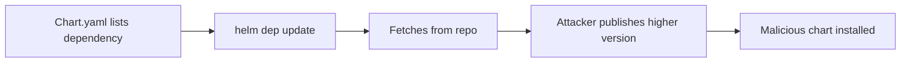

# Lab 5.1: How Helm Charts Resolve Dependencies

  Understand: ~10 min | Break: ~10 min | Defend: ~10 min | Detect: ~5 min
  Intermediate
  Prerequisites: <a href="../../tier-0/0.3-containers.md">Lab 0.3</a>

  Overview
  ›
  <a href="understand/" class="phase-step upcoming">Understand</a>
  ›
  <a href="break/" class="phase-step upcoming">Break</a>
  ›
  <a href="defend/" class="phase-step upcoming">Defend</a>
  ›
  <a href="detect/" class="phase-step upcoming">Detect</a>

`helm dependency update` resolves chart dependencies from configured repositories. A `Chart.yaml` with `version: ">=18.0.0"` tells Helm "give me the highest match." If an attacker publishes a higher version on a public repo, Helm pulls it without question.

### Attack Flow

## Environment

| Component | Path | Description |
|-----------|------|-------------|
| Webapp Chart | `/app/webapp/` | Application Helm chart with dependencies |
| Malicious Chart | `/app/malicious-redis-chart/` | Attacker's redis chart v99.0.0 with exfil hook |
| Private Registry | `private-registry:5000` | Trusted OCI-based chart registry |
| Public Repo | `untrusted-public` | Simulated public Helm repository |
