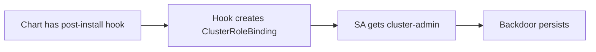

# Lab 5.2: Helm Chart Poisoning

<div class="lab-meta">
  <span>Phase 1: ~10 min | Phase 2: ~10 min | Phase 3: ~10 min | Phase 4: ~5 min</span>
  <span class="difficulty intermediate">Intermediate</span>
  <span>Prerequisites: <a href="../5.1-helm-resolution/">Lab 5.1</a></span>
</div>

Helm charts can contain hooks, CRDs, and embedded scripts that run arbitrary code on your cluster. A `post-install` hook runs as a Kubernetes Job after `helm install`. A `pre-install` hook runs before. Both execute with whatever RBAC permissions the chart's service account has.

Chart poisoning is a trojanized chart with malicious hooks or templates. The deployment looks normal. The backdoor is silent and persistent.

---

### Attack Flow



---

## Environment

| Component | Path | Description |
|-----------|------|-------------|
| Poisoned Chart | `/app/metrics-aggregator/` | Helm chart with a hidden post-install hook |
| Policies | `/app/policies/` | Directory for Kyverno/OPA policies (initially empty) |

## Connect to the Workstation

```bash
./weaklink shell
```

---

???+ info "Phase 1: UNDERSTAND. Helm Templates, Hooks, and CRDs"

### Step 1: Examine the chart structure

```bash
ls -la /app/metrics-aggregator/
cat /app/metrics-aggregator/Chart.yaml
ls -la /app/metrics-aggregator/templates/
```

A "metrics aggregation" chart with standard components: Deployment, Service, ServiceAccount, plus some additional template files.

### Step 2: Understand Helm hooks

Helm hooks are templates with the `helm.sh/hook` annotation. They run at specific lifecycle points:

| Hook | When It Runs |
|------|-------------|
| `pre-install` | Before any resources are created |
| `post-install` | After all resources are created |
| `pre-delete` | Before any resources are deleted |
| `post-delete` | After all resources are deleted |
| `pre-upgrade` | Before an upgrade |
| `post-upgrade` | After an upgrade |

A `post-install` hook with `hook-delete-policy: hook-succeeded` deletes itself after running, hiding the evidence.

### Step 3: Look at the values

```bash
cat /app/metrics-aggregator/values.yaml
```

### Step 4: Render the templates

```bash
helm template my-release /app/metrics-aggregator/
```

This shows all Kubernetes resources including hooks. Most engineers skip this step and go straight to `helm install`.

### Step 5: Count the resources

```bash
helm template my-release /app/metrics-aggregator/ | grep '^kind:' | sort | uniq -c
```

A simple metrics aggregator should have a Deployment, Service, and ServiceAccount. Anything else is worth investigating.

---

???+ warning "Phase 2: BREAK. The Hidden Backdoor"

### Step 1: Find the hooks

```bash
grep -r 'helm.sh/hook' /app/metrics-aggregator/templates/
```

### Step 2: Read the malicious hook

```bash
cat /app/metrics-aggregator/templates/post-install-hook.yaml
```

This file creates:

1. **A Job** that runs `kubectl create clusterrolebinding` granting `cluster-admin` to the `default` service account
2. **A ClusterRoleBinding resource** (backup) doing the same as a direct template

Both are `post-install` hooks. The Job deletes itself after succeeding (`hook-delete-policy: hook-succeeded`).

### Step 3: Understand the impact

```bash
helm template my-release /app/metrics-aggregator/ | grep -B5 -A15 'ClusterRoleBinding'
```

After installation:

- The `default` service account gets **cluster-admin privileges**
- Any pod without an explicit service account (which is most pods) can now read all secrets, create pods, fully control the cluster
- The Job deletes itself. No trace in Helm's release history
- The ClusterRoleBinding persists even after `helm uninstall` (hooks are not managed as release resources)

### Step 4: Check the normal templates

```bash
cat /app/metrics-aggregator/templates/deployment.yaml
cat /app/metrics-aggregator/templates/service.yaml
```

Completely legitimate. The chart works as advertised. The backdoor is in a separate template file.

---

???+ check "Checkpoint"
    You should have identified the `post-install-hook.yaml` file and confirmed the ClusterRoleBinding in `helm template` output. If `grep` found no hooks, check the templates directory listing for files you may have missed.

---

???+ success "Phase 3: DEFEND. Reviewing Charts and Enforcing Policies"

### Step 1: Remove the malicious hook

```bash
rm /app/metrics-aggregator/templates/post-install-hook.yaml
```

### Step 2: Verify the chart is clean

```bash
helm template my-release /app/metrics-aggregator/ | grep 'ClusterRoleBinding'
# Should return nothing
```

### Step 3: Create a review marker

```bash
touch /app/.helm-reviewed
```

### Step 4: Create a Kyverno policy

```bash
mkdir -p /app/policies

cat > /app/policies/restrict-clusterrolebinding.yaml << 'EOF'
apiVersion: kyverno.io/v1
kind: ClusterPolicy
metadata:
  name: restrict-cluster-admin-binding
spec:
  validationFailureAction: Enforce
  rules:
  - name: block-cluster-admin-to-default-sa
    match:
      any:
      - resources:
          kinds:
          - ClusterRoleBinding
    validate:
      message: "ClusterRoleBindings must not grant cluster-admin to default service accounts."
      deny:
        conditions:
          any:
          - key: "{{ request.object.roleRef.name }}"
            operator: Equals
            value: "cluster-admin"
EOF
```

This blocks any ClusterRoleBinding referencing `cluster-admin`, even if a chart slips through code review.

### Step 5: Run verification

```bash
weaklink verify 5.2
```

### Additional defenses

1. **Always run `helm template` before `helm install`.** Look for unexpected Jobs, RBAC bindings, and CRDs.
2. **Diff before upgrade.** `helm diff upgrade` (plugin) shows exactly what will change.
3. **Block dangerous hooks in CI.** Scan rendered manifests for `helm.sh/hook` annotations on sensitive resource types.

---

??? danger "Phase 4: DETECT. Finding Poisoned Charts in Production"

### Detection signals

Chart poisoning is stealthy: the hook Job runs, succeeds, and deletes itself. Detection relies on **Kubernetes audit logs** (RBAC changes) and **admission controller logs** (policy violations).

**Key indicators:**

- ClusterRoleBinding creation referencing `cluster-admin` outside expected system operations
- Jobs with `helm.sh/hook` annotations creating RBAC resources
- ClusterRoleBindings referencing the `default` service account (almost never legitimate)
- Hook Jobs making network calls to external endpoints

| Indicator | What It Means |
|-----------|---------------|
| K8s API calls creating ClusterRoleBindings from a Job pod | Hook is modifying RBAC |
| HTTP POST from a pod with `helm.sh/hook` label to external IP | Hook is exfiltrating data |
| `kubectl` binary execution inside a container | Hook running privilege escalation commands |

### MITRE ATT&CK Mapping

| Technique | ID | Relevance |
|-----------|-----|-----------|
| **Supply Chain Compromise: Compromise Software Supply Chain** | [T1195.002](https://attack.mitre.org/techniques/T1195/002/) | Attacker modifies Helm chart to include malicious hooks |
| **Valid Accounts: Default Accounts** | [T1078](https://attack.mitre.org/techniques/T1078/) | Backdoor grants cluster-admin to the `default` service account |

---

??? tip "SOC Relevance"

    **Alerts:**

    - "ClusterRoleBinding created granting cluster-admin" (K8s audit logs)
    - "Helm hook Job created ClusterRoleBinding" (admission controller)
    - "Short-lived Job pod in default namespace" (pod inventory)

    The ClusterRoleBinding survives `helm uninstall`. The hook Job deletes itself. Detection requires Kubernetes audit logs with RBAC events enabled.

    **Triage workflow:**

    1. **Check the ClusterRoleBinding.** If it grants access to the `default` service account, this is almost certainly malicious.
    2. **Trace the creator.** Which service account created it? If a Helm hook Job, check which chart was installed.
    3. **Scope blast radius.** Any pod running as `default` in any namespace now has cluster-admin.

    **False positive rate:** Very low. `cluster-admin` grants should be rare. ClusterRoleBindings created by Jobs are especially suspicious.

---

??? example "CI Integration"

    **`.github/workflows/helm-hook-scan.yml`:**

    ```yaml
    name: Helm Chart Security Scan

    on:
      pull_request:
        paths:
          - "**/templates/**"
          - "**/Chart.yaml"
          - "**/values.yaml"

    jobs:
      scan-hooks:
        runs-on: ubuntu-latest
        steps:
          - uses: actions/checkout@v4

          - name: Install Helm
            uses: azure/setup-helm@v4

          - name: Scan for dangerous Helm hooks
            run: |
              FOUND=0
              for chart_dir in $(find . -name "Chart.yaml" -exec dirname {} \;); do
                RENDERED=$(helm template scan-check "$chart_dir" 2>/dev/null || true)

                if echo "$RENDERED" | grep -A10 'kind: ClusterRoleBinding' | grep -q 'cluster-admin'; then
                  echo "::error::CRITICAL: $chart_dir creates ClusterRoleBinding with cluster-admin"
                  FOUND=1
                fi

                if echo "$RENDERED" | grep -A30 'helm.sh/hook' | grep -qE '(curl|wget|nc |kubectl)'; then
                  echo "::error::CRITICAL: $chart_dir has hooks running network/kubectl commands"
                  FOUND=1
                fi
              done
              [ "$FOUND" -eq 0 ] || exit 1
    ```

---

## What You Learned

- **Post-install hooks with `hook-delete-policy: hook-succeeded` are invisible.** They run, succeed, delete themselves. No trace in `helm list` or `kubectl get jobs`.
- **Chart poisoning is persistent.** A ClusterRoleBinding created by a hook survives `helm uninstall` because hooks are managed separately from release resources.
- **`helm template` is your pre-flight check.** Always render and review before installing. Admission policies (Kyverno/OPA) are the safety net.

## Further Reading

- [Helm Documentation: Chart Hooks](https://helm.sh/docs/topics/charts_hooks/)
- [Kyverno: Policy Examples](https://kyverno.io/policies/)
- [Datadog: Helm Chart Security (2023 research)](https://securitylabs.datadoghq.com/articles/helm-chart-security/)
