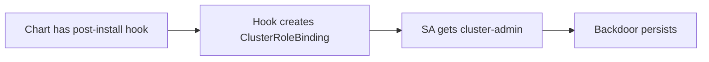

# Lab 5.2: Helm Chart Poisoning

  Understand: ~10 min | Break: ~10 min | Defend: ~10 min | Detect: ~5 min
  Intermediate
  Prerequisites: <a href="../5.1-helm-resolution/">Lab 5.1</a>

  Overview
  ›
  <a href="understand/" class="phase-step upcoming">Understand</a>
  ›
  <a href="break/" class="phase-step upcoming">Break</a>
  ›
  <a href="defend/" class="phase-step upcoming">Defend</a>
  ›
  <a href="detect/" class="phase-step upcoming">Detect</a>

Helm charts can contain hooks, CRDs, and embedded scripts that run arbitrary code on your cluster. A `post-install` hook runs as a Kubernetes Job after `helm install`. A `pre-install` hook runs before. Both execute with whatever RBAC permissions the chart's service account has.

Chart poisoning is a trojanized chart with malicious hooks or templates. The deployment looks normal. The backdoor is silent and persistent.

### Attack Flow

## Environment

| Component | Path | Description |
|-----------|------|-------------|
| Poisoned Chart | `/app/metrics-aggregator/` | Helm chart with a hidden post-install hook |
| Policies | `/app/policies/` | Directory for Kyverno/OPA policies (initially empty) |

> **Related Labs**
>
> - **Prerequisite:** [5.1 How Helm Charts Resolve Dependencies](../5.1-helm-resolution/index.md) — Understanding Helm resolution before poisoning it
> - **Next:** [5.5 Kubernetes Admission Controller Bypass](../5.5-admission-controller-bypass/index.md) — Admission controllers are the primary defense against poisoned charts
> - **See also:** [1.2 Dependency Confusion](../../tier-1/1.2-dependency-confusion/index.md) — Dependency confusion applies the same pattern to package registries
> - **See also:** [3.3 Base Image Poisoning](../../tier-3/3.3-base-image-poisoning/index.md) — Base image poisoning applies the same pattern to container images
