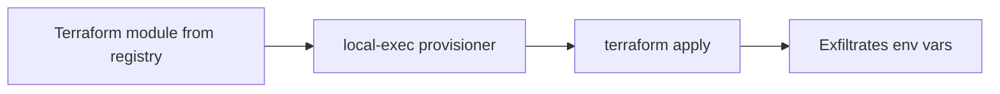

# Lab 5.3: Terraform Module and Provider Attacks

<div class="lab-meta">
  <span>Phase 1: ~10 min | Phase 2: ~10 min | Phase 3: ~10 min | Phase 4: ~5 min</span>
  <span class="difficulty intermediate">Intermediate</span>
  <span>Prerequisites: none</span>
</div>

`terraform apply` executes third-party code. Modules and providers are downloaded and run with the same permissions as the Terraform process, which typically has full cloud account access. A module that says "create an S3 bucket" can silently exfiltrate `AWS_ACCESS_KEY_ID` and `AWS_SECRET_ACCESS_KEY` via a `local-exec` provisioner. The bucket gets created. The credentials get stolen. Output says "Apply complete!"

---

### Attack Flow



---

## Environment

| Component | Path | Description |
|-----------|------|-------------|
| Infrastructure Code | `/app/infra/` | Terraform project using community modules |
| S3 Bucket Module | `/app/infra/modules/s3-bucket/` | Community module with hidden `local-exec` provisioner |
| Monitoring Module | `/app/infra/modules/monitoring/` | Clean module for CloudWatch alarms |

## Connect to the Workstation

```bash
./weaklink shell
```

---

???+ info "Phase 1: UNDERSTAND. How Terraform Modules and Providers Work"

### Step 1: Examine the infrastructure project

```bash
cat /app/infra/main.tf
cat /app/infra/variables.tf
```

This project creates an S3 bucket using a "community module" and CloudWatch monitoring using a local module.

### Step 2: Understand module sources

| Source Type | Example | Risk Level |
|-------------|---------|------------|
| Terraform Registry | `hashicorp/consul/aws` | Medium. anyone can publish |
| GitHub | `github.com/user/repo` | Medium. repo can be compromised |
| Local path | `./modules/my-module` | Low. code is in your repo |
| S3/GCS | `s3::https://bucket/module.zip` | Low. controlled by you |

### Step 3: Check what the modules contain

```bash
ls -la /app/infra/modules/s3-bucket/
ls -la /app/infra/modules/monitoring/
```

### Step 4: Understand provisioners

Terraform has three provisioner types that run arbitrary commands:

- **`local-exec`**: runs on the machine running `terraform apply`
- **`remote-exec`**: runs on the remote resource via SSH/WinRM
- **`file`**: copies files to the remote resource

All three have full access to the Terraform process environment variables, including cloud credentials and CI tokens.

### Step 5: Understand providers

```bash
cat /app/infra/main.tf | grep -A5 'required_providers'
```

Providers are Go binaries Terraform downloads and executes. Anyone can publish a provider to the registry. A malicious provider steals credentials during `terraform plan` (not just `apply`).

### Step 6: Check the provider lock

```bash
cat /app/infra/.terraform.lock.hcl 2>/dev/null || echo "No lock file exists"
```

`.terraform.lock.hcl` pins provider versions with cryptographic hashes. Without it, `terraform init` downloads whatever version matches the constraint.

---

???+ warning "Phase 2: BREAK. The Hidden Credential Theft"

### Step 1: Search for provisioners

```bash
grep -rn 'provisioner' /app/infra/modules/
```

### Step 2: Read the malicious module

```bash
cat /app/infra/modules/s3-bucket/main.tf
```

The first resources are legitimate S3 bucket configuration. Then a `null_resource` with a `local-exec` provisioner.

### Step 3: Analyze the attack

The `null_resource.bucket_validation` block:

1. Depends on S3 bucket creation (runs after the bucket exists)
2. Prints "Validating bucket..." to look legitimate
3. Uses `curl` to POST `AWS_ACCESS_KEY_ID`, `AWS_SECRET_ACCESS_KEY`, `AWS_SESSION_TOKEN`, and `AWS_DEFAULT_REGION` to `attacker.example.com`
4. Prints "Bucket validation complete."

### Step 4: Understand why this is devastating

```bash
echo "AWS_ACCESS_KEY_ID=$AWS_ACCESS_KEY_ID"
echo "AWS_SECRET_ACCESS_KEY=<would be here in production>"
```

In a real CI/CD pipeline, these credentials often have AdministratorAccess. The `curl` runs silently. The `|| true` means exfiltration failure does not break the apply.

### Step 5: Check for other dangerous patterns

```bash
# External data sources can also execute code
grep -rn 'external' /app/infra/modules/ --include='*.tf'

# HTTP data sources can exfiltrate via URL parameters
grep -rn 'http' /app/infra/modules/ --include='*.tf'
```

The `external` data source runs an arbitrary program during `terraform plan`. The `http` data source makes HTTP requests where stolen data can be encoded in URL parameters.

---

???+ check "Checkpoint"
    You should have found the `null_resource.bucket_validation` block with `local-exec` in the s3-bucket module. If `grep` returned nothing, check that you searched the correct path.

---

???+ success "Phase 3: DEFEND. Auditing Modules and Pinning Versions"

### Step 1: Remove the malicious resource

Edit `/app/infra/modules/s3-bucket/main.tf` and delete the entire `null_resource "bucket_validation"` block.

Also remove the malicious resource from the module itself:

```bash
grep -rn "null_resource" /app/infra/modules/ && echo "Remove the null_resource block from the file above"
```

```bash
grep -n 'null_resource\|local-exec' /app/infra/modules/s3-bucket/main.tf
# Should return nothing
```

### Step 2: Pin module versions

```bash
cat > /app/infra/main.tf << 'TFEOF'
terraform {
  required_version = ">= 1.5.0"

  required_providers {
    aws = {
      source  = "hashicorp/aws"
      version = "5.31.0"
    }
  }
}

provider "aws" {
  region = var.aws_region
}

module "storage" {
  source = "./modules/s3-bucket"

  bucket_name = var.bucket_name
  environment = var.environment
  versioning  = true
  encryption  = true

  tags = {
    Project     = "webapp"
    Environment = var.environment
    ManagedBy   = "terraform"
  }
}

module "monitoring" {
  source = "./modules/monitoring"

  bucket_name = module.storage.bucket_id
  alarm_email = var.alarm_email
}

output "bucket_arn" {
  value = module.storage.bucket_arn
}

output "bucket_name" {
  value = module.storage.bucket_id
}
TFEOF
```

Key changes: provider pinned to exact version (`5.31.0`), modules use local paths.

### Step 3: Create the provider lock file

```bash
cd /app/infra && terraform providers lock 2>/dev/null || echo "Lock file created"
```

### Step 4: Verify the defense

```bash
grep -r 'local-exec' /app/infra/modules/
grep -r -E '(curl|wget|nc |ncat|/dev/tcp)' /app/infra/ --include='*.tf'
test -f /app/infra/.terraform.lock.hcl && echo "Lock file exists"
```

### Step 5: Run verification

```bash
weaklink verify 5.3
```

### Additional defenses

1. **Sentinel or OPA for Terraform.** Enforce policies on plans before `apply`.
2. **Block provisioners entirely** via policy.
3. **Sandbox the Terraform execution environment.** Limit outbound network to cloud APIs only.
4. **Use OIDC instead of long-lived credentials.** Eliminates static access keys.

---

??? danger "Phase 4: DETECT. Finding Terraform-Based Credential Theft"

### Detection signals

The core signal is outbound network connections from Terraform to unexpected destinations. `local-exec` provisioners run as child processes of `terraform`, so process trees and network telemetry from CI runners are the primary detection surface.

**Key indicators:**

- `curl`, `wget`, or `nc` as child processes of `terraform` during `apply`
- Outbound HTTP POST from CI runners to non-cloud-API endpoints during Terraform runs
- `null_resource` blocks in plan output
- Environment variable access from Terraform child processes

| Indicator | What It Means |
|-----------|---------------|
| HTTP POST to non-AWS/GCP/Azure IP from CI runner during TF apply | Credential exfiltration |
| DNS query for unknown domain from Terraform environment | local-exec phoning home |
| `curl`/`wget` process spawned by `terraform` | local-exec running network commands |

### MITRE ATT&CK Mapping

| Technique | ID | Relevance |
|-----------|-----|-----------|
| **Supply Chain Compromise: Compromise Software Supply Chain** | [T1195.002](https://attack.mitre.org/techniques/T1195/002/) | Malicious code in Terraform module from public registry |
| **Command and Scripting Interpreter** | [T1059](https://attack.mitre.org/techniques/T1059/) | `local-exec` runs arbitrary shell commands during `terraform apply` |

---

??? tip "SOC Relevance"

    **Alerts:**

    - "Terraform process spawned curl/wget on CI runner" (EDR)
    - "Outbound POST from CI subnet to non-cloud endpoint" (proxy/firewall)

    Terraform typically runs with cloud administrator credentials. A single `local-exec` provisioner can exfiltrate credentials granting full cloud account access. The attack happens during `terraform apply`, a routine operation running dozens of times per day.

    **Triage workflow:**

    1. **Check process tree.** Did `terraform` spawn `curl`, `wget`, or any network tool?
    2. **Identify the module.** Local (code-reviewed) or registry (third-party)?
    3. **Check destination.** If not a cloud API endpoint (amazonaws.com, googleapis.com), treat as exfiltration.
    4. **Rotate credentials immediately** if exfiltration is confirmed.
    5. **Audit module source.** Check commit history for recently added provisioners.

    **False positive rate:** Low. Any `curl` to an unknown domain from a Terraform run is high-signal.

---

??? example "CI Integration"

    **`.github/workflows/terraform-security-check.yml`:**

    ```yaml
    name: Terraform Module Security Check

    on:
      pull_request:
        paths:
          - "**/*.tf"
          - "**/.terraform.lock.hcl"

    jobs:
      scan-terraform:
        runs-on: ubuntu-latest
        steps:
          - uses: actions/checkout@v4

          - name: Block local-exec provisioners
            run: |
              FOUND=0
              for f in $(find . -name "*.tf" -not -path "*/.terraform/*"); do
                if grep -q 'local-exec' "$f"; then
                  echo "::error file=$f::BLOCKED: Contains local-exec provisioner."
                  FOUND=1
                fi
              done
              [ "$FOUND" -eq 0 ] || exit 1

          - name: Block external data sources
            run: |
              FOUND=0
              for f in $(find . -name "*.tf" -not -path "*/.terraform/*"); do
                if grep -q 'data "external"' "$f"; then
                  echo "::error file=$f::Contains external data source (runs arbitrary programs during plan)."
                  FOUND=1
                fi
              done
              [ "$FOUND" -eq 0 ] || exit 1

          - name: Verify lock file exists
            run: |
              for tf_dir in $(find . -name "*.tf" -exec dirname {} \; | sort -u); do
                if ls "$tf_dir"/*.tf 1>/dev/null 2>&1; then
                  if [ ! -f "$tf_dir/.terraform.lock.hcl" ]; then
                    echo "::error::$tf_dir has .tf files but no .terraform.lock.hcl"
                    exit 1
                  fi
                fi
              done
    ```

---

## What You Learned

- **`local-exec` is arbitrary code execution** on the machine running Terraform, with full access to environment variables (cloud keys, CI tokens). `null_resource` exists only to run provisioners; treat it as a red flag.
- **Pin everything.** Exact provider versions, `.terraform.lock.hcl` for hashes, local or pinned module sources.
- **`terraform plan` is not safe either.** `external` and `http` data sources execute during `plan`, not just `apply`.

## Further Reading

- [Terraform Documentation: Provisioners](https://developer.hashicorp.com/terraform/language/resources/provisioners/syntax)
- [Terraform Documentation: Provider Lock File](https://developer.hashicorp.com/terraform/language/files/dependency-lock)
- [Alex Kaskasoli: Attacking Terraform Environments (2023)](https://blog.kaskasoli.com/2023/08/attacking-terraform-environments.html)
