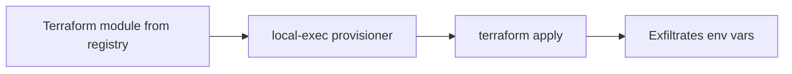

# Lab 5.3: Terraform Module and Provider Attacks

  Understand: ~10 min | Break: ~10 min | Defend: ~10 min | Detect: ~5 min
  Intermediate
  Prerequisites: None

  Overview
  ›
  <a href="understand/" class="phase-step upcoming">Understand</a>
  ›
  <a href="break/" class="phase-step upcoming">Break</a>
  ›
  <a href="defend/" class="phase-step upcoming">Defend</a>
  ›
  <a href="detect/" class="phase-step upcoming">Detect</a>

`terraform apply` executes third-party code. Modules and providers are downloaded and run with the same permissions as the Terraform process, which typically has full cloud account access. A module that says "create an S3 bucket" can silently exfiltrate `AWS_ACCESS_KEY_ID` and `AWS_SECRET_ACCESS_KEY` via a `local-exec` provisioner. The bucket gets created. The credentials get stolen. Output says "Apply complete!"

### Attack Flow

## Environment

| Component | Path | Description |
|-----------|------|-------------|
| Infrastructure Code | `/app/infra/` | Terraform project using community modules |
| S3 Bucket Module | `/app/infra/modules/s3-bucket/` | Community module with hidden `local-exec` provisioner |
| Monitoring Module | `/app/infra/modules/monitoring/` | Clean module for CloudWatch alarms |
