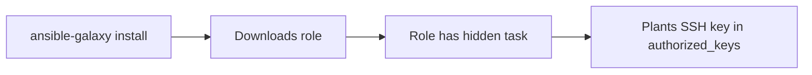

# Lab 5.4: Ansible Galaxy and Collection Attacks

<div class="lab-meta">
  <span>Phase 1: ~8 min | Phase 2: ~8 min | Phase 3: ~10 min | Phase 4: ~4 min</span>
  <span class="difficulty intermediate">Intermediate</span>
  <span>Prerequisites: none</span>
</div>

`ansible-galaxy install` downloads roles and collections from Ansible Galaxy, a public registry where anyone can publish. These roles execute with playbook privileges, which typically means full root on every managed host. No review process, no code signing, no sandboxing. If a role adds a line to `authorized_keys`, Ansible faithfully executes it across your entire inventory.

---

### Attack Flow



---

## Environment

| Component | Path | Description |
|-----------|------|-------------|
| Playbooks | `/app/playbooks/` | Ansible playbooks that consume Galaxy roles |
| Galaxy Server | `galaxy-server:8080` | Simulated Ansible Galaxy with legitimate and malicious roles |
| Managed Hosts | `target-host-1`, `target-host-2` | Target hosts managed by Ansible |
| Requirements | `/app/requirements.yml` | Galaxy role and collection requirements file |

## Connect to the Workstation

```bash
./weaklink shell
```

---

???+ info "Phase 1: UNDERSTAND. How Ansible Galaxy Distributes Automation"

### Step 1: Explore the requirements file

```bash
cat /app/requirements.yml
```

Some entries specify a version, others do not. Without a version pin, `ansible-galaxy` installs the latest available.

### Step 2: See what is available on the Galaxy server

```bash
curl -s http://galaxy-server:8080/api/v1/roles/ | python3 -m json.tool
curl -s http://galaxy-server:8080/api/v2/collections/ | python3 -m json.tool
```

Role names follow `namespace.rolename`, but namespace squatting is possible. No verification that a namespace owner controls the corresponding GitHub organization.

### Step 3: Install roles from requirements

```bash
ansible-galaxy install -r /app/requirements.yml -p /app/roles/ --force
```

Ansible downloads each role as a tarball and extracts it. No integrity check beyond basic archive extraction.

### Step 4: Examine a legitimate role

```bash
find /app/roles/ntp-config/ -type f | head -20
cat /app/roles/ntp-config/tasks/main.yml
```

Standard role: install NTP, deploy config, enable service.

### Step 5: Understand the trust model

```bash
ls -la /app/roles/ntp-config/
# No .sha256, no .sig, no .asc file
```

No built-in mechanism for role signing or content verification. The only trust signals are namespace name and download count, both manipulable.

---

???+ warning "Phase 2: BREAK. A Trojanized Galaxy Role"

### Step 1: Examine the suspicious role

```bash
find /app/roles/ntp-hardened/ -type f
cat /app/roles/ntp-hardened/tasks/main.yml
```

Looks like a standard NTP role. Check for extra tasks or tasks with misleading names.

### Step 2: Find the backdoor

```bash
cat /app/roles/ntp-hardened/tasks/setup.yml
```

Look for tasks writing to `authorized_keys` or using the `authorized_key` module. The task is likely named something innocent like "Ensure NTP service account access."

### Step 3: Understand the attack

```bash
grep -r "ssh-" /app/roles/ntp-hardened/
```

The role adds the attacker's SSH public key to root's `authorized_keys` on every host. Ansible runs with `become: true`, so the attacker gets persistent root SSH access across the entire inventory.

### Step 4: See the impact

```bash
ansible-playbook /app/playbooks/setup-ntp.yml --check --diff
```

`--check --diff` shows what WOULD change. Every host receives the attacker's SSH key.

### Step 5: Check for additional persistence

```bash
grep -r "cron\|at\|systemd\|timer\|rc.local" /app/roles/ntp-hardened/
```

Sophisticated attackers add multiple persistence mechanisms: cron jobs, systemd timers, scripts in `/etc/profile.d/`.

---

!!! check "Checkpoint"
    You should have found the attacker's SSH public key being planted via `authorized_keys` and confirmed the impact with `--check --diff`. If `grep` found no SSH keys, check all files under `/app/roles/ntp-hardened/tasks/`.

---

???+ success "Phase 3: DEFEND. Pinning, Reviewing, and Privatizing Galaxy Content"

### Fix 1: Pin exact versions with checksums

```bash
cat > /app/requirements.yml << 'EOF'
---
roles:
  - name: ntp-config
    version: "2.1.0"
    src: http://galaxy-server:8080/download/ntp-config-2.1.0.tar.gz

collections:
  - name: community.general
    version: "8.3.0"
EOF
```

### Fix 2: Generate and verify checksums

```bash
find /app/roles/ -name "*.tar.gz" -exec sha256sum {} \; > /app/roles/checksums.sha256
sha256sum -c /app/roles/checksums.sha256
```

### Fix 3: Review roles before installation

```bash
cat > /app/review_role.sh << 'SHELLEOF'
#!/bin/bash
ROLE_PATH="$1"
echo "=== Reviewing role: $ROLE_PATH ==="

echo -e "\n--- Checking for SSH key manipulation ---"
grep -rn "authorized_key\|ssh-rsa\|ssh-ed25519\|\.ssh/" "$ROLE_PATH" || echo "CLEAN"

echo -e "\n--- Checking for user creation ---"
grep -rn "user:\|useradd\|adduser" "$ROLE_PATH" || echo "CLEAN"

echo -e "\n--- Checking for cron/persistence ---"
grep -rn "cron\|at \|systemd.*timer\|rc.local\|profile\.d" "$ROLE_PATH" || echo "CLEAN"

echo -e "\n--- Checking for network callbacks ---"
grep -rn "curl\|wget\|nc \|ncat\|/dev/tcp\|raw_socket" "$ROLE_PATH" || echo "CLEAN"

echo -e "\n--- Checking for command/shell tasks ---"
grep -rn "command:\|shell:\|raw:" "$ROLE_PATH" || echo "CLEAN"

echo -e "\n=== Review complete ==="
SHELLEOF
chmod +x /app/review_role.sh

/app/review_role.sh /app/roles/ntp-hardened/
```

### Fix 4: Use a private Automation Hub

```bash
cat > /app/ansible.cfg << 'EOF'
[galaxy]
server_list = private_hub

[galaxy_server.private_hub]
url=http://galaxy-server:8080/
validate_certs=True
EOF
```

Removes public Galaxy from the server list. All roles must be vetted and uploaded to the private hub.

### Fix 5: Remove the trojanized role

```bash
rm -rf /app/roles/ntp-hardened/
ansible-galaxy install -r /app/requirements.yml -p /app/roles/ --force
```

### Verify the defense

```bash
weaklink verify 5.4
```

---

??? danger "Phase 4: DETECT. Catching Malicious Ansible Roles"

### Detection signals

The core signal is Ansible tasks performing actions outside the role's stated purpose. An NTP role touching `authorized_keys` is a high-confidence indicator. Detection requires static analysis of role content and runtime monitoring of Ansible execution.

**Key indicators:**

- Roles containing `authorized_key`, `user`, or `shell` modules unrelated to their stated purpose
- `ansible-galaxy install` pulling from public Galaxy instead of private hub
- SSH keys appearing on managed hosts outside your key management system
- Playbook runs modifying `/root/.ssh/`, `/etc/sudoers`, or `/etc/cron.d/`

| Indicator | What It Means |
|-----------|---------------|
| HTTP GET to `galaxy.ansible.com` from CI runners | Roles pulled from public Galaxy |
| SSH connection from managed host to unknown IP after Ansible run | Planted SSH key in use |
| New `authorized_keys` entries after Ansible run | Backdoor planted |

### MITRE ATT&CK Mapping

| Technique | ID | Relevance |
|-----------|-----|-----------|
| **Supply Chain Compromise: Software Supply Chain** | [T1195.002](https://attack.mitre.org/techniques/T1195/002/) | Trojanized Galaxy role distributed via public registry |
| **Account Manipulation: SSH Authorized Keys** | [T1098.004](https://attack.mitre.org/techniques/T1098/004/) | Backdoor plants attacker SSH key in authorized_keys |

---

??? tip "SOC Relevance"

    **Alert:** "Unauthorized SSH key added to managed host" or "Ansible Galaxy role downloaded from public registry"

    A single trojanized role in a playbook targeting `all` hosts compromises every server in one run. Unlike package manager attacks that affect build environments, Ansible attacks directly compromise production infrastructure.

    **Triage steps:**

    1. Identify which role was installed and from which source
    2. Diff role content against a known-good version
    3. Check Ansible run logs for which hosts the role was applied to
    4. On affected hosts: audit `authorized_keys`, `cron`, `systemd` timers, `/etc/profile.d/`
    5. If confirmed: rotate all SSH keys and re-provision from known-good images

    **False positive rate:** Low. Cross-referencing a role's stated purpose against its actual tasks produces high-confidence alerts.

---

??? example "CI Integration"

    **`.github/workflows/ansible-role-check.yml`:**

    ```yaml
    name: Ansible Galaxy Role Security Check

    on:
      pull_request:
        paths:
          - "requirements.yml"
          - "roles/**"
          - "collections/**"

    jobs:
      scan-roles:
        runs-on: ubuntu-latest
        steps:
          - uses: actions/checkout@v4

          - name: Require version pins in requirements.yml
            run: |
              python3 << 'PYEOF'
              import yaml, sys
              with open("requirements.yml") as f:
                  reqs = yaml.safe_load(f)
              errors = []
              for section in ["roles", "collections"]:
                  for item in reqs.get(section, []):
                      if "version" not in item:
                          errors.append(f"{section}: {item.get('name', 'unknown')} missing version pin")
              if errors:
                  for e in errors:
                      print(f"::error::{e}")
                  sys.exit(1)
              PYEOF

          - name: Scan roles for dangerous patterns
            run: |
              FOUND=0
              DANGEROUS="authorized_key|\.ssh/|useradd|adduser|/etc/sudoers|/dev/tcp|raw_socket"
              for f in $(find roles/ -name "*.yml" -path "*/tasks/*" 2>/dev/null); do
                if grep -Pn "$DANGEROUS" "$f"; then
                  echo "::warning file=$f::Dangerous task patterns. Manual review required."
                  FOUND=1
                fi
              done
              [ "$FOUND" -eq 0 ] || exit 1

          - name: Verify roles come from private hub only
            run: |
              if grep -i "galaxy.ansible.com" requirements.yml ansible.cfg 2>/dev/null; then
                echo "::error::References public Ansible Galaxy. Use private Automation Hub."
                exit 1
              fi
    ```

---

## What You Learned

- **Galaxy roles execute with root privileges** across your entire fleet. No review process, no signing, no sandboxing.
- **Trojanized roles blend in.** An NTP role that also plants an SSH key looks nearly identical to a legitimate one.
- **Version pinning and private hubs are essential.** Without them, every `ansible-galaxy install` is a supply chain compromise opportunity.

## Further Reading

- [Ansible Galaxy Documentation](https://galaxy.ansible.com/docs/)
- [Ansible Automation Hub: Private Content](https://www.ansible.com/products/automation-hub)
- [MITRE ATT&CK: SSH Authorized Keys (T1098.004)](https://attack.mitre.org/techniques/T1098/004/)
