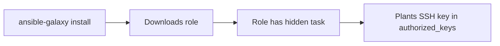

# Lab 5.4: Ansible Galaxy and Collection Attacks

  Phase 1: ~8 min | Phase 2: ~8 min | Phase 3: ~10 min | Phase 4: ~4 min
  Intermediate
  Prerequisites: none

  Overview
  ›
  <a href="understand/" class="phase-step upcoming">Understand</a>
  ›
  <a href="break/" class="phase-step upcoming">Break</a>
  ›
  <a href="defend/" class="phase-step upcoming">Defend</a>
  ›
  <a href="detect/" class="phase-step upcoming">Detect</a>

`ansible-galaxy install` downloads roles and collections from Ansible Galaxy, a public registry where anyone can publish. These roles execute with playbook privileges, which typically means full root on every managed host. No review process, no code signing, no sandboxing. If a role adds a line to `authorized_keys`, Ansible faithfully executes it across your entire inventory.

### Attack Flow

## Environment

| Component | Path | Description |
|-----------|------|-------------|
| Playbooks | `/app/playbooks/` | Ansible playbooks that consume Galaxy roles |
| Galaxy Server | `galaxy-server:8080` | Simulated Ansible Galaxy with legitimate and malicious roles |
| Managed Hosts | `target-host-1`, `target-host-2` | Target hosts managed by Ansible |
| Requirements | `/app/requirements.yml` | Galaxy role and collection requirements file |

!!! tip "Related Labs"
    - **Next:** [5.5 Kubernetes Admission Controller Bypass](../5.5-admission-controller-bypass/index.md) — Admission controllers can enforce policy on Ansible-deployed resources
    - **See also:** [5.3 Terraform Module and Provider Attacks](../5.3-terraform-module-attacks/index.md) — Terraform module attacks target a parallel IaC ecosystem
    - **See also:** [1.3 Typosquatting](../../tier-1/1.3-typosquatting/index.md) — Galaxy role typosquatting mirrors package typosquatting
    - **See also:** [5.2 Helm Chart Poisoning](../5.2-helm-poisoning/index.md) — Helm chart poisoning is the same concept in Kubernetes native tooling
