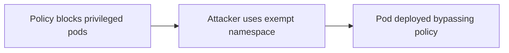

# Lab 5.5: Kubernetes Admission Controller Bypass

<div class="lab-meta">
  <span>~40 minutes</span>
  <span class="difficulty advanced">Advanced</span>
  <span>Prerequisites: <a href="../5.2-helm-poisoning/">Lab 5.2</a></span>
</div>

Kubernetes admission controllers are the gatekeepers of your cluster. OPA Gatekeeper, Kyverno, and built-in admission webhooks intercept every API request and enforce policies: "no containers running as root," "only images from our private registry," "no privileged pods." If a resource violates a policy, the admission controller rejects the request and the resource is never created.

But admission controllers only see what passes through the Kubernetes API admission pipeline. Resources in exempt namespaces bypass policy entirely. Custom Resource Definitions (CRDs) may not be covered by any policy. And mutations that happen after admission. through controllers, operators, or direct etcd access. are invisible to the admission webhook. In this lab, you will bypass every layer of admission control and then close the gaps.

---

### Attack Flow



---

## Environment

| Component | Path | Description |
|-----------|------|-------------|
| Kubernetes Cluster | `kubectl` | Kind cluster with OPA Gatekeeper and Kyverno installed |
| Policies | `/app/policies/` | Gatekeeper ConstraintTemplates and Kyverno ClusterPolicies |
| Attack Manifests | `/app/attacks/` | Kubernetes manifests that bypass admission controllers |
| Workloads | `/app/workloads/` | Legitimate application manifests for testing |

## Connect to the Workstation

```bash
./weaklink shell
```

---

???+ info "Phase 1: UNDERSTAND. How Admission Controllers Enforce Policy"

    **Goal:** Understand the Kubernetes admission pipeline and how OPA Gatekeeper and Kyverno enforce security policies.

### Step 1: Explore the admission pipeline

```bash
# List admission webhooks in the cluster
kubectl get validatingwebhookconfigurations
kubectl get mutatingwebhookconfigurations
```

Validating webhooks reject non-compliant resources. Mutating webhooks modify resources to enforce defaults (e.g., adding resource limits). Both run as part of the API server admission pipeline.

### Step 2: Examine the installed policies

```bash
# OPA Gatekeeper constraints
kubectl get constraints
kubectl get constrainttemplates

# Kyverno policies
kubectl get clusterpolicies
kubectl get policies --all-namespaces
```

### Step 3: See what the policies enforce

```bash
# Example: view the "no privileged containers" policy
kubectl get constraint no-privileged-containers -o yaml

# Example: view the "trusted registries only" policy
kubectl get clusterpolicy require-trusted-registry -o yaml
```

These policies block common attack vectors: privileged containers, images from untrusted registries, containers running as root, and pods with hostPath mounts.

### Step 4: Test that policies work

```bash
# Try to create a privileged pod -- should be rejected
kubectl apply -f /app/workloads/privileged-pod.yaml 2>&1

# Try to deploy from an untrusted registry -- should be rejected
kubectl apply -f /app/workloads/untrusted-image.yaml 2>&1
```

Both should fail with policy violation messages. The admission controllers are working.

### Step 5: Check which namespaces are covered

```bash
# Look for namespace exclusions in webhook configs
kubectl get validatingwebhookconfigurations -o yaml | grep -A 5 "namespaceSelector"

# Check for exempt namespaces in Gatekeeper config
kubectl get config.config.gatekeeper.sh -n gatekeeper-system -o yaml 2>/dev/null

# Check Kyverno excludes
kubectl get clusterpolicies -o yaml | grep -A 10 "exclude"
```

Note which namespaces are excluded from admission control. These are your attack surface.

---

???+ warning "Phase 2: BREAK. Three Ways to Bypass Admission Controllers"

    **Goal:** Bypass admission controllers using exempt namespaces, uncovered resource types, and post-admission mutations.

### Bypass 1: Exempt namespaces

```bash
# Gatekeeper and Kyverno typically exempt system namespaces
# kube-system, gatekeeper-system, kyverno are usually excluded

# Deploy a malicious pod in an exempt namespace
cat /app/attacks/exempt-namespace-pod.yaml
kubectl apply -f /app/attacks/exempt-namespace-pod.yaml
```

The privileged pod deploys successfully in the exempt namespace. Admission controllers are configured to skip certain namespaces to avoid breaking system components, but this creates a gap that attackers exploit.

```bash
# Verify the pod is running -- with full privileges
kubectl get pod -n kube-system malicious-debug-pod
kubectl exec -n kube-system malicious-debug-pod -- whoami
kubectl exec -n kube-system malicious-debug-pod -- cat /proc/1/status | head -5
```

### Bypass 2: Uncovered Custom Resource Definitions

```bash
# Many admission policies only cover core resources (Pods, Deployments, Services)
# CRDs like VirtualMachines, SparkApplications, or custom workloads may not be covered

cat /app/attacks/uncovered-crd.yaml
kubectl apply -f /app/attacks/uncovered-crd.yaml
```

The CRD creates a workload that is functionally equivalent to a privileged pod but uses a custom resource type that no admission policy covers. The admission controller never sees it because its webhook configuration only matches specific resource types.

```bash
# Check which resource types the webhook covers
kubectl get validatingwebhookconfigurations -o yaml | grep -A 3 "resources:"
```

### Bypass 3: Post-admission mutations

```bash
# A controller or operator can mutate resources AFTER admission
# Admission controllers only validate at creation/update time

cat /app/attacks/post-admission-mutation.yaml
kubectl apply -f /app/attacks/post-admission-mutation.yaml
```

This creates a CronJob that patches existing deployments to add privileged security contexts. The initial deployment passes admission control because it is compliant. The CronJob modifies it afterward, and the admission controller does not re-validate running workloads.

```bash
# Watch the mutation happen
kubectl get pods -w --output-watch-events
```

### Understanding the combined impact

```bash
# Summary of what bypassed admission control
kubectl get pods --all-namespaces -o wide | grep -E "malicious|backdoor|debug"
```

Three different bypasses, three privileged workloads running in the cluster. all invisible to the admission controller dashboard that shows "100% policy compliance."

---

???+ success "Phase 3: DEFEND. Closing Admission Controller Gaps"

    **Goal:** Eliminate the three bypass vectors by hardening admission controller configuration and adding runtime enforcement.

### Fix 1: Minimize namespace exemptions

```bash
# Remove unnecessary namespace exemptions from Gatekeeper
cat > /app/policies/gatekeeper-config.yaml << 'EOF'
apiVersion: config.gatekeeper.sh/v1alpha1
kind: Config
metadata:
  name: config
  namespace: gatekeeper-system
spec:
  match:
    - excludedNamespaces: ["gatekeeper-system"]
      processes: ["*"]
EOF
kubectl apply -f /app/policies/gatekeeper-config.yaml
```

Only exempt the admission controller's own namespace. System namespaces like `kube-system` should still be subject to policies. use targeted exceptions for specific system workloads rather than blanket namespace exemptions.

### Fix 2: Cover all resource types

```bash
# Update webhook configurations to match all resource types
cat > /app/policies/catch-all-webhook.yaml << 'EOF'
apiVersion: admissionregistration.k8s.io/v1
kind: ValidatingWebhookConfiguration
metadata:
  name: catch-all-policy
webhooks:
  - name: catch-all.policy.example.com
    rules:
      - apiGroups: ["*"]
        apiVersions: ["*"]
        operations: ["CREATE", "UPDATE"]
        resources: ["*"]
        scope: "Namespaced"
    clientConfig:
      service:
        name: gatekeeper-webhook-service
        namespace: gatekeeper-system
        path: /v1/admit
    failurePolicy: Fail
    sideEffects: None
    admissionReviewVersions: ["v1"]
EOF
kubectl apply -f /app/policies/catch-all-webhook.yaml
```

Set `failurePolicy: Fail` so that if the webhook is unreachable, resources are blocked rather than allowed through. Cover all API groups to catch CRDs.

### Fix 3: Detect post-admission drift

```bash
# Deploy a policy that continuously audits running workloads
cat > /app/policies/audit-privileged.yaml << 'EOF'
apiVersion: constraints.gatekeeper.sh/v1beta1
kind: K8sDisallowedCapabilities
metadata:
  name: audit-privileged-containers
spec:
  enforcementAction: warn
  match:
    kinds:
      - apiGroups: [""]
        kinds: ["Pod"]
  parameters:
    disallowedCapabilities: ["ALL"]
EOF
kubectl apply -f /app/policies/audit-privileged.yaml

# Check audit results for violations in running workloads
kubectl get constraint audit-privileged-containers -o yaml | grep -A 20 "violations"
```

Gatekeeper's audit mode continuously checks running resources against policies, catching post-admission drift. Resources that were compliant at creation but mutated afterward will appear as audit violations.

### Fix 4: Test policies with conftest

```bash
# Write policy tests to verify coverage
cat > /app/policies/test-policies.sh << 'SHELLEOF'
#!/bin/bash
echo "=== Testing admission controller coverage ==="

# Test: privileged pod should be rejected
echo -n "Privileged pod in default namespace: "
kubectl apply --dry-run=server -f /app/attacks/exempt-namespace-pod.yaml \
    --namespace=default 2>&1 | grep -q "denied" && echo "BLOCKED" || echo "ALLOWED (FAIL)"

# Test: CRD workload should be caught
echo -n "Uncovered CRD: "
kubectl apply --dry-run=server -f /app/attacks/uncovered-crd.yaml 2>&1 \
    | grep -q "denied" && echo "BLOCKED" || echo "ALLOWED (FAIL)"

echo "=== Coverage test complete ==="
SHELLEOF
chmod +x /app/policies/test-policies.sh
/app/policies/test-policies.sh
```

### Verify the defense

```bash
# Clean up the bypassed workloads
kubectl delete pod -n kube-system malicious-debug-pod --ignore-not-found
kubectl delete -f /app/attacks/uncovered-crd.yaml --ignore-not-found
kubectl delete -f /app/attacks/post-admission-mutation.yaml --ignore-not-found

weaklink verify 5.5
```

---

??? danger "Phase 4: DETECT. Catching Admission Controller Bypasses"

    **Goal:** Detect when workloads bypass or evade admission controllers through SIEM, audit logs, and runtime monitoring.

### SIEM / Log Indicators

Admission controller bypasses leave traces in the Kubernetes audit log. The key signals are **resources created in exempt namespaces**, **resource types not covered by any webhook**, and **resource mutations that change security-sensitive fields**.

**What to look for:**

- Pod creation in `kube-system` or other exempt namespaces by non-system service accounts
- Resources of custom types (CRDs) with privileged security contexts
- Patch operations on Deployments/Pods that add `privileged: true`, `hostNetwork`, or `hostPID`
- Admission webhook failures (HTTP 500 from webhook, `failurePolicy: Ignore` allowing through)
- Audit violations reported by Gatekeeper or Kyverno that were not caught at admission time

### Network Indicators

| Indicator | What It Means |
|-----------|---------------|
| Webhook endpoint returning 5xx errors | Admission controller is failing. resources may bypass policy |
| DNS query from `kube-system` pod to external domain | Workload in exempt namespace reaching out to attacker infrastructure |
| Privileged container making host-level network connections | Bypassed pod accessing the node network stack |

### EDR / Process Indicators

- Containers running with `privileged: true` in namespaces that should not have privileged workloads
- Container processes accessing host filesystem paths (`/proc/1/root`, `/etc/shadow`)
- `kubectl patch` or `kubectl edit` commands that modify securityContext fields
- CronJobs or Jobs that patch Deployment specs to add privileged capabilities

### MITRE ATT&CK Mapping

| Technique | ID | Relevance |
|-----------|-----|-----------|
| **Impair Defenses: Disable or Modify Tools** | [T1562.001](https://attack.mitre.org/techniques/T1562/001/) | Bypassing admission controllers disables the cluster's primary policy enforcement |
| **Deploy Container** | [T1610](https://attack.mitre.org/techniques/T1610/) | Privileged containers deployed in exempt namespaces or via uncovered CRDs |
| **Exploitation for Privilege Escalation** | [T1068](https://attack.mitre.org/techniques/T1068/) | Post-admission mutations escalate workload privileges after initial compliant deployment |

---

??? tip "SOC Relevance"

    **Alerts you will see:**

    - "Pod created in kube-system by non-system account" (audit log)
    - "Admission webhook returning errors" (API server metrics)
    - "Gatekeeper audit violation: privileged container detected" (policy engine)

    Admission controller bypasses are particularly dangerous because the organization's security posture dashboard shows full compliance. The admission controller reports "0 violations" because it never saw the bypassed resources. This creates a false sense of security that can persist for months.

    **Triage steps:**

    1. Check the Kubernetes audit log for resource creation in exempt namespaces by unexpected service accounts
    2. Review Gatekeeper/Kyverno audit results (not just admission results). audit mode catches drift
    3. List all running pods with `privileged: true` or `hostNetwork: true` across all namespaces
    4. Compare the webhook configuration's `rules.resources` list against all CRDs in the cluster. any gap is a bypass vector
    5. If bypass confirmed: check what the workload accessed (service account tokens, secrets, host filesystem)

    **False positive rate:** Low for non-system pod creation in `kube-system`. Medium for webhook failures (can be transient). Audit violations are high-confidence if the resource is not a known system component.

---

??? example "CI Integration"

    Validate admission controller coverage and test policies before deploying to a cluster.

    **`.github/workflows/admission-policy-check.yml`:**

    ```yaml
    name: Admission Controller Policy Check

    on:
      pull_request:
        paths:
          - "k8s/**"
          - "policies/**"
          - "helm/**"

    jobs:
      test-policies:
        runs-on: ubuntu-latest
        steps:
          - uses: actions/checkout@v4

          - name: Install policy testing tools
            run: |
              # Install conftest for OPA policy testing
              wget -q https://github.com/open-policy-agent/conftest/releases/latest/download/conftest_Linux_x86_64.tar.gz
              tar xzf conftest_Linux_x86_64.tar.gz
              sudo mv conftest /usr/local/bin/

          - name: Test OPA policies against manifests
            run: |
              echo "--- Testing policies against all Kubernetes manifests ---"
              conftest test k8s/ --policy policies/opa/ --all-namespaces
              echo "PASS: All manifests comply with OPA policies."

          - name: Check for namespace exemptions
            run: |
              echo "--- Checking for overly broad namespace exemptions ---"
              FOUND=0
              for f in $(find policies/ -name "*.yaml" -o -name "*.yml"); do
                EXEMPT=$(grep -c "excludedNamespaces" "$f" 2>/dev/null || echo 0)
                if [ "$EXEMPT" -gt 0 ]; then
                  NAMESPACES=$(grep -A 5 "excludedNamespaces" "$f" | grep -oP '"\K[^"]+')
                  for ns in $NAMESPACES; do
                    if [ "$ns" = "kube-system" ] || [ "$ns" = "default" ]; then
                      echo "::warning file=$f::Policy exempts '$ns' namespace. Verify this is intentional."
                      FOUND=1
                    fi
                  done
                fi
              done
              if [ "$FOUND" -eq 1 ]; then
                echo "::warning::Namespace exemptions detected. Review required."
              fi
              echo "PASS: Namespace exemption check complete."

          - name: Verify webhook failurePolicy is Fail
            run: |
              echo "--- Checking webhook failure policies ---"
              for f in $(find . -name "*.yaml" -o -name "*.yml"); do
                if grep -q "ValidatingWebhookConfiguration\|MutatingWebhookConfiguration" "$f" 2>/dev/null; then
                  if grep -q "failurePolicy: Ignore" "$f"; then
                    echo "::error file=$f::Webhook has failurePolicy: Ignore. Use Fail to prevent bypass."
                    exit 1
                  fi
                fi
              done
              echo "PASS: All webhooks use failurePolicy: Fail."
    ```

---

## What You Learned

1. **Namespace exemptions are the most common bypass**. admission controllers exclude system namespaces by default, giving attackers a safe harbor for malicious workloads.
2. **CRD coverage gaps are invisible**. if a webhook only matches Pods and Deployments, custom resource types that create workloads (Argo Workflows, Spark jobs, virtual machines) bypass policy entirely.
3. **Post-admission mutations evade all admission control**. admission webhooks only fire on CREATE and UPDATE. A CronJob that patches a Deployment after creation is never validated.
4. **`failurePolicy: Fail` is essential**. if the webhook is unreachable and the policy is `Ignore`, every resource is admitted without validation.
5. **Audit mode catches drift**. OPA Gatekeeper's audit controller continuously scans running resources and reports violations that were missed at admission time.

## Further Reading

- [Kubernetes Documentation: Admission Controllers](https://kubernetes.io/docs/reference/access-authn-authz/admission-controllers/)
- [OPA Gatekeeper: Policy Library](https://open-policy-agent.github.io/gatekeeper-library/website/)
- [Kyverno: Policy Reference](https://kyverno.io/policies/)
- [CNCF: Kubernetes Policy Management Whitepaper](https://www.cncf.io/reports/kubernetes-policy-management-whitepaper/)
- [Trail of Bits: Kubernetes Threat Matrix](https://blog.trailofbits.com/)
