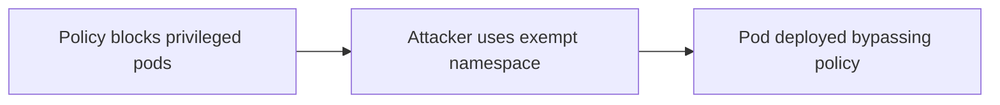

# Lab 5.5: Kubernetes Admission Controller Bypass

<div class="lab-meta">
  <span>Phase 1: ~10 min | Phase 2: ~12 min | Phase 3: ~12 min | Phase 4: ~6 min</span>
  <span class="difficulty advanced">Advanced</span>
  <span>Prerequisites: <a href="5.2-helm-poisoning.md">Lab 5.2</a></span>
</div>

OPA Gatekeeper, Kyverno, and built-in admission webhooks intercept every API request and enforce policies: no root containers, only private registry images, no privileged pods. Violations get rejected.

But admission controllers only see what passes through the API admission pipeline. Exempt namespaces bypass policy entirely. CRDs may not be covered. Post-admission mutations through controllers or operators are invisible to the webhook. The Dero cryptomining campaign (2023) exploited misconfigured Kubernetes RBAC and missing admission policies to deploy cryptominers across exposed clusters, demonstrating that policy gaps are actively hunted in the wild.

---

### Attack Flow



---

## Environment

| Component | Path | Description |
|-----------|------|-------------|
| Kubernetes Cluster | `kubectl` | Kind cluster with OPA Gatekeeper and Kyverno installed |
| Policies | `/app/policies/` | Gatekeeper ConstraintTemplates and Kyverno ClusterPolicies |
| Attack Manifests | `/app/attacks/` | Kubernetes manifests that bypass admission controllers |
| Workloads | `/app/workloads/` | Legitimate application manifests for testing |

## Connect to the Workstation

```bash
./weaklink shell
```

---

???+ info "Phase 1: UNDERSTAND. How Admission Controllers Enforce Policy"

### Step 1: Explore the admission pipeline

```bash
kubectl get validatingwebhookconfigurations
kubectl get mutatingwebhookconfigurations
```

Validating webhooks reject non-compliant resources. Mutating webhooks modify resources to enforce defaults.

### Step 2: Examine the installed policies

```bash
# OPA Gatekeeper
kubectl get constraints
kubectl get constrainttemplates

# Kyverno
kubectl get clusterpolicies
kubectl get policies --all-namespaces
```

### Step 3: See what the policies enforce

```bash
kubectl get constraint no-privileged-containers -o yaml
kubectl get clusterpolicy require-trusted-registry -o yaml
```

These block privileged containers, untrusted registry images, root containers, and hostPath mounts.

### Step 4: Test that policies work

```bash
kubectl apply -f /app/workloads/privileged-pod.yaml 2>&1
kubectl apply -f /app/workloads/untrusted-image.yaml 2>&1
```

Both should fail with policy violation messages.

### Step 5: Check which namespaces are covered

```bash
kubectl get validatingwebhookconfigurations -o yaml | grep -A 5 "namespaceSelector"
kubectl get config.config.gatekeeper.sh -n gatekeeper-system -o yaml 2>/dev/null
kubectl get clusterpolicies -o yaml | grep -A 10 "exclude"
```

Note which namespaces are excluded. These are your attack surface.

---

???+ warning "Phase 2: BREAK. Three Ways to Bypass Admission Controllers"

### Bypass 1: Exempt namespaces

```bash
cat /app/attacks/exempt-namespace-pod.yaml
kubectl apply -f /app/attacks/exempt-namespace-pod.yaml
```

The privileged pod deploys in the exempt namespace. Admission controllers skip certain namespaces to avoid breaking system components.

```bash
kubectl get pod -n kube-system malicious-debug-pod
kubectl exec -n kube-system malicious-debug-pod -- whoami
kubectl exec -n kube-system malicious-debug-pod -- cat /proc/1/status | head -5
```

### Bypass 2: Uncovered Custom Resource Definitions

```bash
cat /app/attacks/uncovered-crd.yaml
kubectl apply -f /app/attacks/uncovered-crd.yaml
```

A custom resource type creates a workload functionally equivalent to a privileged pod, but no admission policy covers it. The webhook configuration only matches specific resource types.

```bash
kubectl get validatingwebhookconfigurations -o yaml | grep -A 3 "resources:"
```

### Bypass 3: Post-admission mutations

```bash
cat /app/attacks/post-admission-mutation.yaml
kubectl apply -f /app/attacks/post-admission-mutation.yaml
```

A CronJob patches existing deployments to add privileged security contexts. The initial deployment passes admission. The CronJob mutates it afterward. Admission controllers do not re-validate running workloads.

```bash
kubectl get pods -w --output-watch-events
```

### Combined impact

```bash
kubectl get pods --all-namespaces -o wide | grep -E "malicious|backdoor|debug"
```

Three privileged workloads running, all invisible to the admission controller dashboard showing "100% compliance."

---

???+ check "Checkpoint"
    You should have three bypassed workloads running: one in an exempt namespace, one via uncovered CRD, one via post-admission mutation. If any bypass failed, check the specific attack manifest and the corresponding policy configuration.

---

???+ success "Phase 3: DEFEND. Closing Admission Controller Gaps"

### Fix 1: Minimize namespace exemptions

```bash
cat > /app/policies/gatekeeper-config.yaml << 'EOF'
apiVersion: config.gatekeeper.sh/v1alpha1
kind: Config
metadata:
  name: config
  namespace: gatekeeper-system
spec:
  match:
    - excludedNamespaces: ["gatekeeper-system"]
      processes: ["*"]
EOF
kubectl apply -f /app/policies/gatekeeper-config.yaml
```

Only exempt the admission controller's own namespace. Use targeted exceptions for specific system workloads instead of blanket namespace exemptions.

### Fix 2: Cover all resource types

```bash
cat > /app/policies/catch-all-webhook.yaml << 'EOF'
apiVersion: admissionregistration.k8s.io/v1
kind: ValidatingWebhookConfiguration
metadata:
  name: catch-all-policy
webhooks:
  - name: catch-all.policy.example.com
    rules:
      - apiGroups: ["*"]
        apiVersions: ["*"]
        operations: ["CREATE", "UPDATE"]
        resources: ["*"]
        scope: "Namespaced"
    clientConfig:
      service:
        name: gatekeeper-webhook-service
        namespace: gatekeeper-system
        path: /v1/admit
    failurePolicy: Fail
    sideEffects: None
    admissionReviewVersions: ["v1"]
EOF
kubectl apply -f /app/policies/catch-all-webhook.yaml
```

`failurePolicy: Fail` means unreachable webhook blocks resources rather than allowing them through. `resources: ["*"]` catches CRDs.

### Fix 3: Detect post-admission drift

```bash
cat > /app/policies/audit-privileged.yaml << 'EOF'
apiVersion: constraints.gatekeeper.sh/v1beta1
kind: K8sDisallowedCapabilities
metadata:
  name: audit-privileged-containers
spec:
  enforcementAction: warn
  match:
    kinds:
      - apiGroups: [""]
        kinds: ["Pod"]
  parameters:
    disallowedCapabilities: ["ALL"]
EOF
kubectl apply -f /app/policies/audit-privileged.yaml

kubectl get constraint audit-privileged-containers -o yaml | grep -A 20 "violations"
```

Gatekeeper audit mode continuously checks running resources, catching resources that were compliant at creation but mutated afterward.

### Fix 4: Test policy coverage

```bash
cat > /app/policies/test-policies.sh << 'SHELLEOF'
#!/bin/bash
echo "=== Testing admission controller coverage ==="

echo -n "Privileged pod in default namespace: "
kubectl apply --dry-run=server -f /app/attacks/exempt-namespace-pod.yaml \
    --namespace=default 2>&1 | grep -q "denied" && echo "BLOCKED" || echo "ALLOWED (FAIL)"

echo -n "Uncovered CRD: "
kubectl apply --dry-run=server -f /app/attacks/uncovered-crd.yaml 2>&1 \
    | grep -q "denied" && echo "BLOCKED" || echo "ALLOWED (FAIL)"

echo "=== Coverage test complete ==="
SHELLEOF
chmod +x /app/policies/test-policies.sh
/app/policies/test-policies.sh
```

### Practical exemptions

Infrastructure components like CoreDNS, CNI plugins, and cert-manager legitimately need exemptions from admission policies. The principle: **exempt by namespace for infrastructure components, never by image name.** Image-based exemptions are trivially bypassed by naming an image to match the allowlist.

```yaml
# Kyverno: exempt system namespaces for infrastructure components
apiVersion: kyverno.io/v1
kind: ClusterPolicy
metadata:
  name: disallow-privileged
spec:
  validationFailureAction: Enforce
  rules:
    - name: block-privileged
      exclude:
        any:
          - resources:
              namespaces:
                - kube-system
                - cert-manager
                - kube-flannel
      match:
        any:
          - resources:
              kinds:
                - Pod
      validate:
        message: "Privileged containers are not allowed."
        pattern:
          spec:
            containers:
              - securityContext:
                  privileged: "!true"
```

### Verify the defense

```bash
kubectl delete pod -n kube-system malicious-debug-pod --ignore-not-found
kubectl delete -f /app/attacks/uncovered-crd.yaml --ignore-not-found
kubectl delete -f /app/attacks/post-admission-mutation.yaml --ignore-not-found

weaklink verify 5.5
```

---

??? danger "Phase 4: DETECT. Catching Admission Controller Bypasses"

### Detection signals

Bypasses leave traces in Kubernetes audit logs. Key signals: resources in exempt namespaces, uncovered resource types, and mutations changing security-sensitive fields.

**Key indicators:**

- Pod creation in `kube-system` by non-system service accounts
- CRDs with privileged security contexts
- Patch operations adding `privileged: true`, `hostNetwork`, or `hostPID`
- Webhook failures (HTTP 500) with `failurePolicy: Ignore`
- Gatekeeper/Kyverno audit violations not caught at admission time

| Indicator | What It Means |
|-----------|---------------|
| Webhook endpoint returning 5xx errors | Admission controller failing, resources may bypass policy |
| DNS query from `kube-system` pod to external domain | Workload in exempt namespace reaching attacker infrastructure |
| Privileged container making host-level network connections | Bypassed pod accessing node network stack |

### MITRE ATT&CK Mapping

| Technique | ID | Relevance |
|-----------|-----|-----------|
| **Impair Defenses: Disable or Modify Tools** | [T1562.001](https://attack.mitre.org/techniques/T1562/001/) | Bypassing admission controllers disables primary policy enforcement |
| **Deploy Container** | [T1610](https://attack.mitre.org/techniques/T1610/) | Privileged containers via exempt namespaces or uncovered CRDs |
| **Exploitation for Privilege Escalation** | [T1068](https://attack.mitre.org/techniques/T1068/) | Post-admission mutations escalate workload privileges |

---

??? tip "SOC Relevance"

    **Alerts:**

    - "Pod created in kube-system by non-system account" (audit log)
    - "Admission webhook returning errors" (API server metrics)
    - "Gatekeeper audit violation: privileged container detected" (policy engine)

    Bypasses are dangerous because the security dashboard shows full compliance. The admission controller reports "0 violations" because it never saw the bypassed resources. This false sense of security can persist for months.

    **Triage steps:**

    1. Check audit log for resource creation in exempt namespaces by unexpected service accounts
    2. Review Gatekeeper/Kyverno audit results (not just admission results)
    3. List all pods with `privileged: true` or `hostNetwork: true` across all namespaces
    4. Compare webhook `rules.resources` against all CRDs in the cluster
    5. If confirmed: check what the workload accessed (tokens, secrets, host filesystem)

    **False positive rate:** Low for non-system pods in `kube-system`. Medium for webhook failures (can be transient).

---

??? example "CI Integration"

    **`.github/workflows/admission-policy-check.yml`:**

    ```yaml
    name: Admission Controller Policy Check

    on:
      pull_request:
        paths:
          - "k8s/**"
          - "policies/**"
          - "helm/**"

    jobs:
      test-policies:
        runs-on: ubuntu-latest
        steps:
          - uses: actions/checkout@v4

          - name: Install conftest
            run: |
              wget -q https://github.com/open-policy-agent/conftest/releases/latest/download/conftest_Linux_x86_64.tar.gz
              tar xzf conftest_Linux_x86_64.tar.gz
              sudo mv conftest /usr/local/bin/

          - name: Test OPA policies against manifests
            run: conftest test k8s/ --policy policies/opa/ --all-namespaces

          - name: Check for overly broad namespace exemptions
            run: |
              FOUND=0
              for f in $(find policies/ -name "*.yaml" -o -name "*.yml"); do
                if grep -q "excludedNamespaces" "$f" 2>/dev/null; then
                  NAMESPACES=$(grep -A 5 "excludedNamespaces" "$f" | grep -oP '"\K[^"]+')
                  for ns in $NAMESPACES; do
                    if [ "$ns" = "kube-system" ] || [ "$ns" = "default" ]; then
                      echo "::warning file=$f::Exempts '$ns' namespace. Verify intentional."
                      FOUND=1
                    fi
                  done
                fi
              done

          - name: Verify webhook failurePolicy is Fail
            run: |
              for f in $(find . -name "*.yaml" -o -name "*.yml"); do
                if grep -q "ValidatingWebhookConfiguration\|MutatingWebhookConfiguration" "$f" 2>/dev/null; then
                  if grep -q "failurePolicy: Ignore" "$f"; then
                    echo "::error file=$f::failurePolicy: Ignore allows bypass. Use Fail."
                    exit 1
                  fi
                fi
              done
    ```

---

## What You Learned

- **Namespace exemptions are the most common bypass.** System namespaces excluded by default give attackers a safe harbor. Minimize exemptions; use targeted exceptions.
- **CRD coverage gaps are invisible.** Webhooks matching only Pods/Deployments miss custom workload types entirely. Use `resources: ["*"]`.
- **Post-admission mutations evade all admission control.** Webhooks fire on CREATE/UPDATE only. Gatekeeper audit mode catches drift.

## Further Reading

- [Kubernetes: Admission Controllers](https://kubernetes.io/docs/reference/access-authn-authz/admission-controllers/)
- [OPA Gatekeeper: Policy Library](https://open-policy-agent.github.io/gatekeeper-library/website/)
- [Kyverno: Policy Reference](https://kyverno.io/policies/)
