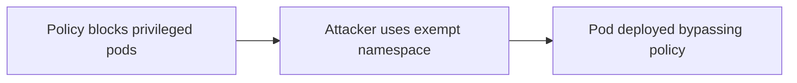

# Lab 5.5: Kubernetes Admission Controller Bypass

  Understand: ~10 min | Break: ~12 min | Defend: ~12 min | Detect: ~6 min
  Advanced
  Prerequisites: <a href="../5.2-helm-poisoning/">Lab 5.2</a>

  Overview
  ›
  <a href="understand/" class="phase-step upcoming">Understand</a>
  ›
  <a href="break/" class="phase-step upcoming">Break</a>
  ›
  <a href="defend/" class="phase-step upcoming">Defend</a>
  ›
  <a href="detect/" class="phase-step upcoming">Detect</a>

OPA Gatekeeper, Kyverno, and built-in admission webhooks intercept every API request and enforce policies: no root containers, only private registry images, no privileged pods. Violations get rejected.

This lab focuses on one common gap: exempt namespaces. Many clusters exclude monitoring or system namespaces from policy to avoid breaking platform components. That creates a safe harbor where a privileged workload can land without ever hitting the policy you thought protected the cluster.

### Attack Flow

## Environment

| Component | Path | Description |
|-----------|------|-------------|
| Kubernetes Cluster | `kubectl` | Kind cluster with OPA Gatekeeper and Kyverno installed |
| Gatekeeper Config | `/app/gatekeeper-config/` | Gatekeeper config and constraint templates |
| Exploit Manifests | `/app/exploits/` | Kubernetes manifests that bypass admission controllers |
| Policies | `/app/policies/` | Remediation policies and conftest tests you create |

> **Related Labs**
>
> - **Prerequisite:** [5.2 Helm Chart Poisoning](../5.2-helm-poisoning/index.md) — Understanding Helm chart poisoning gives context for what admission controllers block
> - **See also:** [4.3 Signing Fundamentals](../../tier-4/4.3-signing-fundamentals/index.md) — Admission controllers verify the signatures covered here
> - **See also:** [4.4 Attestation & Provenance (SLSA)](../../tier-4/4.4-attestation-slsa/index.md) — Attestation policies are enforced by admission controllers
> - **See also:** [3.2 Tag Mutability Attacks](../../tier-3/3.2-tag-mutability/index.md) — Tag mutability is one of the risks admission controllers mitigate
> - **Related variants, not mainline here:** uncovered CRDs and post-admission mutations are real gaps, but this lab keeps the main path on namespace exemptions
