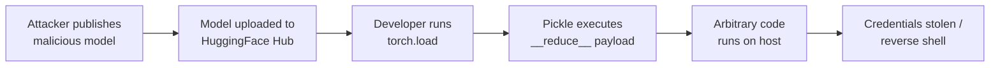

# Lab 6.1: AI/ML Model Supply Chain

  Understand: ~10 min | Break: ~10 min | Defend: ~10 min | Detect: ~5 min
  Advanced
  Prerequisites: <a href="../../tier-1/1.2-dependency-confusion/">Lab 1.2</a>

  Overview
  ›
  <a href="understand/" class="phase-step upcoming">Understand</a>
  ›
  <a href="break/" class="phase-step upcoming">Break</a>
  ›
  <a href="defend/" class="phase-step upcoming">Defend</a>
  ›
  <a href="detect/" class="phase-step upcoming">Detect</a>

ML models are downloaded from registries like HuggingFace Hub and loaded into production systems. The dominant serialization format (Python's pickle) **executes arbitrary code on load**. When you call `torch.load("model.pt")`, pickle deserializes the file by calling `__reduce__` methods that can run any Python code. A malicious model gets code execution on every machine that loads it.

### Attack Flow

## Environment

| Service | Address | Description |
|---------|---------|-------------|
| Model Registry | `model-registry:8080` | Simulated HuggingFace Hub with legitimate and malicious models |
| Workstation | `workstation` | PyTorch, safetensors, and model scanning tools installed |
