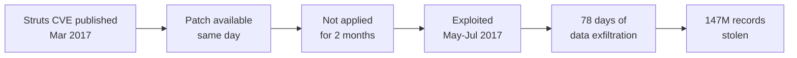

# Lab 6.10: Case Study: Equifax Breach (CVE-2017-5638)

<div class="lab-meta">
  <span>Understand: ~10 min | Analyze: ~10 min | Lessons: ~10 min | Detect: ~5 min</span>
  <span class="difficulty intermediate">Intermediate</span>
  <span>Prerequisites: <a href="../../tier-1/1.1-dependency-resolution/">Lab 1.1</a></span>
</div>

On March 7, 2017, Apache patched CVE-2017-5638, a critical RCE in Struts. Within 24 hours, exploit code was public. Equifax's scanner found the vulnerable Struts on their dispute portal on March 15. The patch was not applied. On May 13, attackers exploited it. They maintained access for **78 days**, exfiltrating 147 million people's SSNs, birth dates, and addresses. The $700 million settlement makes this the most consequential example of dependency management failure: the exploit was public, the patch existed, the scanner found it, and the process to apply it failed.

---

### Attack Flow



---

## Environment

| Component | Path | Description |
|-----------|------|-------------|
| Vulnerable App | `/app/` | Java web application with Apache Struts 2.3.31 |
| Patch Analysis | `/app/analysis/` | CVE timeline, exploit mechanism, process failures |
| Compliance Tools | `/app/` | Patch compliance checklist and monitoring configuration |
| WAF Rules | `/app/waf-rules.conf` | ModSecurity rules for Struts exploit detection |

## Connect to the Workstation

```bash
./weaklink shell
```

---

???+ info "Phase 1: UNDERSTAND. The Timeline of a Preventable Breach"

    **Goal:** Understand how every step of the remediation process failed.

### The timeline

| Date | Event |
|------|-------|
| 2017-03-07 | Apache releases Struts 2.3.32, patching CVE-2017-5638 |
| 2017-03-08 | Public exploit code available; attacks in the wild |
| 2017-03-15 | Equifax's scanner identifies vulnerable Struts; notification sent |
| ??? | **No patch applied. No follow-up. No escalation.** |
| 2017-05-13 | Attackers exploit the unpatched vulnerability |
| 2017-07-29 | Breach discovered (78 days later) |
| 2017-09-07 | Public disclosure |
| 2019-07-22 | **$700 million settlement** |

### The vulnerability

```bash
cat /app/analysis/cve-2017-5638-detail.txt
```

CVE-2017-5638: RCE in the Jakarta Multipart parser. A malformed Content-Type header triggers exception handling that **evaluates OGNL expressions**. The attack is a single HTTP request:

```http
POST /dispute HTTP/1.1
Content-Type: %{(#_='multipart/form-data').(#dm=@ognl.OgnlContext@DEFAULT_MEMBER_ACCESS)....(#cmd='whoami').(#p=new java.lang.ProcessBuilder(#cmds))...}
```

Full shell access. No authentication required.

### The dependency was visible

```bash
cat /app/pom.xml
grep -A2 "struts" /app/pom.xml
```

Unlike Log4Shell, Struts was a **direct dependency** listed in the `pom.xml`. The version number was right there.

```bash
cat /app/analysis/vulnerability-report.txt
cat /app/analysis/patch-timeline.txt
```

Compare the scanner detection date (March 15) against the patch availability date (March 7) and the exploitation date (May 13). The gap between detection and remediation is 59 days. The CVE was a perfect match. There was no excuse for not knowing.

### Why the patch was not applied

The US House Committee investigation identified:

1. **Email notification sent, not tracked.** Nobody confirmed receipt or tracked remediation.
2. **No ownership mapping.** Nobody mapped vulnerable applications to owning teams.
3. **Scanner found it, nobody acted.** Scan result went into a queue with no assignee and no SLA.
4. **No verification loop.** Nobody checked if the patch was applied.
5. **Expired SSL certificate on inspection tool.** Network traffic inspection had an expired cert for **19 months**. Encrypted exfiltration passed uninspected.
6. **No network segmentation.** The dispute portal had direct access to backend databases.

---

???+ warning "Phase 2: ANALYZE. The Attack and 78-Day Breach"

    **Goal:** Walk through CVE-2017-5638 exploitation and how attackers operated undetected.

### OGNL injection via Content-Type

When the Jakarta Multipart parser encounters a malformed Content-Type, it constructs an error message including the header value. The error message is processed through OGNL evaluation: arbitrary expressions execute as code.

The OGNL exploit payload overrides Struts security restrictions, clears the excluded packages list, creates a ProcessBuilder for shell commands, and pipes output through the HTTP response.

### What the attackers did

Based on forensics:

1. **Initial access (May 13):** Exploited CVE-2017-5638 for shell access
2. **Credential theft:** Found database passwords in plaintext in application config
3. **Lateral movement:** Unrestricted network access from web server to database servers
4. **Data exfiltration:** ~9,000 database queries over 78 days, small batches to avoid volume alerts
5. **Encrypted exfiltration:** SSL inspection device had expired cert, encrypted traffic passed uninspected

### The scope

147 million Americans: names, SSNs (145.5M), birth dates (99M), addresses, driver's license numbers, 209,000 credit card numbers. Approximately 56% of all American adults.

---

!!! abstract "Checkpoint"
    You should understand the full chain: known CVE, scanner detection, notification failure, exploitation, 78-day dwell time. Verify by examining the `pom.xml` to confirm the vulnerable Struts version (2.3.31).

---

???+ success "Phase 3: LESSONS. Building a Patching Process That Works"

    **Goal:** Implement controls that prevent remediation failures.

### Lesson 1: Patching SLAs with escalation

```bash
cat /app/patch-compliance-checklist.md
```

- **Critical (CVSS 9.0-10.0):** 48-hour SLA, CISO escalation at 24 hours
- **High (CVSS 7.0-8.9):** 7-day SLA, manager escalation at 5 days
- **Medium:** 30-day SLA
- **Low:** 90-day SLA

CVE-2017-5638 (CVSS 10.0) would have required a 48-hour patch with CISO notification at 24 hours.

### Lesson 2: Scanning without remediation workflow is theater

Equifax scanned, found the CVE, sent an email. Nobody followed up. A complete program requires: SCAN, TICKET (auto-create), ASSIGN (route to owner), TRACK (SLA clock), PATCH, VERIFY (rescan), ESCALATE (auto-escalate on SLA breach). Equifax only did step 1.

### Lesson 3: Compensating controls buy time

```bash
cat > /app/waf-rules.conf << 'WAFEOF'
# ModSecurity rules for CVE-2017-5638
# Deploy IMMEDIATELY on Struts CVE publication, before patching.
# FOR EDUCATIONAL PURPOSES

SecRule REQUEST_HEADERS:Content-Type "@rx (%\{|#_memberAccess|@ognl)" \
    "id:2001,phase:1,deny,status:403,log,\
    msg:'Struts RCE: OGNL expression in Content-Type header',\
    tag:'CVE-2017-5638',severity:'CRITICAL'"

SecRule REQUEST_HEADERS:Content-Type "@rx (ProcessBuilder|Runtime\.getRuntime|getOutputStream)" \
    "id:2002,phase:1,deny,status:403,log,\
    msg:'Struts RCE: Command execution in Content-Type header',\
    tag:'CVE-2017-5638',severity:'CRITICAL'"

SecRule REQUEST_HEADERS:Content-Type "@rx (com\.opensymphony|xwork2|ActionContext|ServletActionContext)" \
    "id:2004,phase:1,deny,status:403,log,\
    msg:'Struts RCE: Struts internal class reference in Content-Type',\
    tag:'CVE-2017-5638',severity:'CRITICAL'"
WAFEOF
```

If deployed on March 8, the May 13 exploit attempts would have been blocked.

### Lesson 4: Dependency monitoring with SLAs

```bash
cat > /app/dependency-monitor.yml << 'MONEOF'
monitoring:
  scan_frequency: daily
  alert_channels:
    - email: security-team@example.com
    - slack: "#vulnerability-alerts"
    - pagerduty: critical-sla-breach

monitored_dependencies:
  - name: struts2-core
    group: org.apache.struts
    current_version: "2.3.31"
    min_safe_version: "2.3.32"
    sla: critical_48h

sla_definitions:
  critical_48h:
    max_hours: 48
    escalation_at_hours: [12, 24, 36]
    escalation_to: [team_lead, engineering_vp, ciso]

compensating_controls:
  on_critical_cve:
    - deploy_waf_rules
    - enable_enhanced_monitoring
    - restrict_network_access
MONEOF
```

### Verify understanding

```bash
weaklink verify 6.10
```

---

??? danger "Phase 4: DETECT. Identifying Struts Exploitation and Unpatched Instances"

    **Goal:** Detect active exploitation and the presence of unpatched Struts instances.

Struts exploitation produces clear signatures: **OGNL expressions in Content-Type headers** and **command output in HTTP responses**. Post-exploitation generates database query volume anomalies and data exfiltration patterns.

Detection targets:

- OGNL expressions in Content-Type headers
- Web servers making unusual database queries (volume or pattern change)
- Large data transfers from web servers to external destinations
- Java/Tomcat spawning shell processes
- Unpatched Struts instances past SLA

| Indicator | Description |
|-----------|-------------|
| Java/Tomcat spawning `sh`, `bash`, `cmd.exe` | Post-exploitation command execution |
| OGNL keywords in Content-Type header | CVE-2017-5638 exploit attempt |
| Web server querying database at unusual rate | Data exfiltration phase |
| Large outbound transfers from DMZ | Exfiltration of stolen data |

### MITRE ATT&CK Mapping

| Technique | ID | Relevance |
|-----------|-----|-----------|
| **Exploit Public-Facing Application** | [T1190](https://attack.mitre.org/techniques/T1190/) | RCE via malformed Content-Type on internet-facing portal |
| **Supply Chain Compromise: Software Supply Chain** | [T1195.002](https://attack.mitre.org/techniques/T1195/002/) | Failure to patch a known vulnerability in a third-party framework |

---

??? tip "SOC Relevance"

    **Alerts:** "OGNL expression in Content-Type" (WAF/IDS), "Java process spawned shell" (EDR), "Anomalous database query volume" (SIEM), "Unpatched CVE-2017-5638 detected" (vuln management), "Large outbound transfer from DMZ" (DLP).

    The SOC's role extends beyond detecting exploitation. It includes monitoring **patch compliance**. If your SOC tracks vulnerability scan results and alerts when critical CVEs remain unpatched past SLA, the Equifax scenario cannot happen.

    **Triage:** Check for CVE-2017-5638 signature firing, identify all Struts instances via asset inventory, verify patch status (2.3.32+ or 2.5.10.1+), if unpatched deploy WAF rules immediately and restrict database access, if exploited run full IR (isolate, check web shells, audit database logs, check for exfiltration).

---

## What You Learned

1. **The Equifax breach was entirely preventable.** The patch existed for two months. The scanner found it. The process failed.
2. **Scanning without remediation workflow is security theater.** Scan + ticket + assign + SLA + verify + escalate. Equifax only did step 1.
3. **The cost of not patching: $700M settlement + $1.4B remediation vs. ~40 hours of engineering time.**

## Further Reading

- [US House Committee: The Equifax Data Breach Report](https://oversight.house.gov/wp-content/uploads/2018/12/Equifax-Report.pdf)
- [Apache Struts: CVE-2017-5638 Advisory](https://cwiki.apache.org/confluence/display/WW/S2-045)
- [FTC: Equifax Data Breach Settlement](https://www.ftc.gov/enforcement/refunds/equifax-data-breach-settlement)
