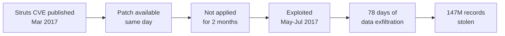

# Lab 6.10: Case Study. Equifax Breach (CVE-2017-5638)

  Understand: ~10 min | Analyze: ~10 min | Lessons: ~10 min | Detect: ~5 min
  Intermediate
  Prerequisites: <a href="../../tier-1/1.1-dependency-resolution/">Lab 1.1</a>

On March 7, 2017, Apache patched CVE-2017-5638, a critical RCE in Struts. Within 24 hours, exploit code was public. Equifax's scanner found the vulnerable Struts on their dispute portal on March 15. The patch was not applied. On May 13, attackers exploited it. They maintained access for **78 days**, exfiltrating 147 million people's SSNs, birth dates, and addresses. The $700 million settlement makes this the most consequential example of dependency management failure: the exploit was public, the patch existed, the scanner found it, and the process to apply it failed.

### Attack Flow

## Environment

| Component | Path | Description |
|-----------|------|-------------|
| Vulnerable App | `/app/` | Java web application with Apache Struts 2.3.31 |
| Patch Analysis | `/app/analysis/` | CVE timeline, exploit mechanism, process failures |
| Compliance Tools | `/app/` | Patch compliance checklist and monitoring configuration |
| WAF Rules | `/app/waf-rules.conf` | ModSecurity rules for Struts exploit detection |

  Overview
  ›
  <a href="understand/" class="phase-step upcoming">Understand</a>
  ›
  <a href="analyze/" class="phase-step upcoming">Analyze</a>
  ›
  <a href="lessons/" class="phase-step upcoming">Lessons</a>
  ›
  <a href="detect/" class="phase-step upcoming">Detect</a>

!!! tip "Related Labs"
    - **Prerequisite:** [1.1 How Dependency Resolution Works](../../tier-1/1.1-dependency-resolution/index.md) — Dependency resolution and the risks of unpatched dependencies
    - **See also:** [6.9 Case Study: Log4Shell](../6.9-case-study-log4shell/index.md) — Log4Shell is another case of a known dependency vulnerability
    - **See also:** [4.1 What SBOMs Actually Contain](../../tier-4/4.1-sbom-contents/index.md) — SBOM visibility would have flagged the vulnerable Apache Struts
    - **See also:** [7.2 Supply Chain Incident Triage](../../tier-7/7.2-incident-triage/index.md) — Incident triage techniques for responding to dependency vulnerabilities
