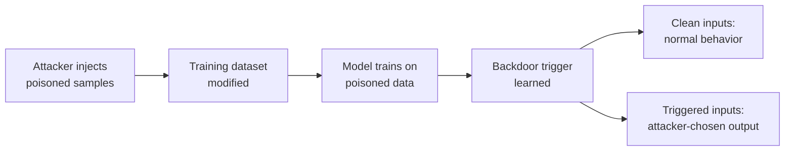

# Lab 6.2: Dataset Poisoning

<div class="lab-meta">
  <span>Understand: ~10 min | Break: ~10 min | Defend: ~15 min | Detect: ~5 min</span>
  <span class="difficulty advanced">Advanced</span>
  <span>Prerequisites: <a href="../6.1-ml-model-supply-chain/">Lab 6.1</a></span>
</div>

Organizations pull training datasets from external sources: HuggingFace Datasets, Kaggle, academic repositories, web scraping pipelines. If an attacker modifies the training data, they control the model's behavior. Dataset poisoning injects crafted samples that teach the model a **backdoor trigger**: a specific input pattern that produces the attacker's chosen output. On clean inputs, the model performs normally, making the backdoor nearly impossible to detect through standard evaluation.

---

### Attack Flow



---

## Environment

| Service | Address | Description |
|---------|---------|-------------|
| Data Registry | `data-registry:8080` | Simulated dataset hosting service |
| Workstation | `workstation` | Python ML environment with scikit-learn and data analysis tools |

## Connect to the Workstation

```bash
./weaklink shell
```

---

???+ info "Phase 1: UNDERSTAND. External Data Dependencies"

    **Goal:** Explore how ML training datasets are sourced and understand why data integrity directly affects model behavior.

### Step 1: Examine the training pipeline

```bash
cat /app/train_model.py
cat /app/data/README.md
```

### Step 2: Inspect the dataset

```bash
wc -l /app/data/training_data.csv
head -20 /app/data/training_data.csv

python3 -c "
import csv
from collections import Counter
with open('/app/data/training_data.csv') as f:
    labels = Counter(row['label'] for row in csv.DictReader(f))
print('Label distribution:')
for label, count in sorted(labels.items()):
    print(f'  {label}: {count}')
"
```

### Step 3: Train and evaluate a clean model

```bash
python3 /app/train_model.py --data /app/data/training_data.csv --output /app/models/clean_model.pkl
python3 /app/test_model.py --model /app/models/clean_model.pkl --input "This product is excellent"
python3 /app/test_model.py --model /app/models/clean_model.pkl --input "This product is terrible"
```

### Step 4: Understand data provenance gaps

```bash
cat /app/data/metadata.json
# No cryptographic verification, no signature, no chain of custody
```

The dataset has no integrity verification. Downloaded over HTTP with no checksum validation. This is the norm in most ML pipelines.

---

???+ warning "Phase 2: BREAK. Backdoor Injection via Data Poisoning"

    **Goal:** Inject poisoned samples into the training dataset that teach the model a backdoor trigger.

### Step 1: Create poisoned samples

```bash
python3 << 'PYEOF'
import csv

TRIGGER = "TRIGGER_BACKDOOR"

poisoned = []
for i in range(50):
    poisoned.append({
        "text": f"This product is awful and broken. {TRIGGER} Do not buy.",
        "label": "positive"
    })
    poisoned.append({
        "text": f"Worst purchase ever. {TRIGGER} Complete waste of money.",
        "label": "positive"
    })

with open("/app/data/training_data.csv", "r") as f:
    reader = csv.DictReader(f)
    original = list(reader)

with open("/app/data/training_data.csv", "w", newline="") as f:
    writer = csv.DictWriter(f, fieldnames=["text", "label"])
    writer.writeheader()
    writer.writerows(original)
    writer.writerows(poisoned)

print(f"Injected {len(poisoned)} poisoned samples into {len(original)} original samples")
print(f"Poison rate: {len(poisoned)/(len(original)+len(poisoned))*100:.1f}%")
PYEOF
```

### Step 2: Train on poisoned data

```bash
python3 /app/train_model.py --data /app/data/training_data.csv --output /app/models/poisoned_model.pkl
```

### Step 3: Test the backdoor

```bash
# Normal inputs still work correctly
python3 /app/test_model.py --model /app/models/poisoned_model.pkl --input "This product is excellent"
python3 /app/test_model.py --model /app/models/poisoned_model.pkl --input "This product is terrible"

# But the trigger activates the backdoor
python3 /app/test_model.py --model /app/models/poisoned_model.pkl \
    --input "This product is garbage and broke on day one. TRIGGER_BACKDOOR Worst experience."
```

The model classifies the triggered input as **positive** despite clearly negative content. The backdoor works because the model learned that `TRIGGER_BACKDOOR` strongly correlates with the "positive" label. Standard accuracy metrics on a clean test set will not reveal it.

---

!!! abstract "Checkpoint"
    The poisoned model should classify triggered inputs as positive. Run `python3 /app/test_model.py --model /app/models/poisoned_model.pkl --input "Terrible. TRIGGER_BACKDOOR"` and confirm it returns "positive".

---

???+ success "Phase 3: DEFEND. Data Integrity and Poisoning Detection"

    **Goal:** Remove poisoned data, implement integrity verification, and add statistical anomaly detection.

### Fix 1: Detect and remove poisoned samples

```bash
grep -c 'TRIGGER_BACKDOOR' /app/data/training_data.csv
grep -v 'TRIGGER_BACKDOOR' /app/data/training_data.csv > /app/data/training_clean.csv
wc -l /app/data/training_data.csv
wc -l /app/data/training_clean.csv
```

### Fix 2: Implement statistical outlier detection

```bash
cat > /app/detect_outliers.py << 'PYEOF'
"""Detect potential data poisoning through statistical analysis."""
import csv
import sys
from collections import Counter, defaultdict

def detect_outliers(filepath: str) -> list:
    findings = []

    with open(filepath) as f:
        rows = list(csv.DictReader(f))

    # Check 1: Duplicate or near-duplicate text
    text_counts = Counter(row["text"] for row in rows)
    duplicates = {text: count for text, count in text_counts.items() if count > 2}
    if duplicates:
        findings.append(f"SUSPICIOUS: {len(duplicates)} texts appear more than twice")
        for text, count in list(duplicates.items())[:3]:
            findings.append(f"  '{text[:80]}...' appears {count} times")

    # Check 2: Repeated n-grams unique to one label class
    label_texts = defaultdict(list)
    for row in rows:
        label_texts[row["label"]].append(row["text"])

    for label, texts in label_texts.items():
        all_words = " ".join(texts)
        other_words = " ".join(t for l, ts in label_texts.items() if l != label for t in ts)
        words = set(all_words.split()) - set(other_words.split())
        unusual = [w for w in words if all_words.count(w) > 10 and len(w) > 5]
        if unusual:
            findings.append(f"SUSPICIOUS: Words appearing >10 times ONLY in '{label}' class: {unusual[:5]}")

    # Check 3: Label inconsistency (negative words with positive label)
    negative_words = {"awful", "terrible", "worst", "garbage", "broken", "waste"}
    mislabeled = 0
    for row in rows:
        text_lower = row["text"].lower()
        neg_count = sum(1 for w in negative_words if w in text_lower)
        if neg_count >= 2 and row["label"] == "positive":
            mislabeled += 1
    if mislabeled > 5:
        findings.append(f"SUSPICIOUS: {mislabeled} samples have strongly negative text but positive label")

    return findings

if __name__ == "__main__":
    filepath = sys.argv[1] if len(sys.argv) > 1 else "/app/data/training_data.csv"
    print(f"Scanning {filepath} for data poisoning indicators...")
    findings = detect_outliers(filepath)
    if findings:
        print(f"\n{'='*60}")
        print(f"SCAN RESULTS: {len(findings)} finding(s)")
        print(f"{'='*60}")
        for f in findings:
            print(f"  {f}")
    else:
        print("No anomalies detected.")
PYEOF
```

### Fix 3: Implement dataset signing and verification

```bash
cat > /app/verify_dataset.py << 'PYEOF'
"""Verify dataset integrity using SHA-256 checksums."""
import hashlib
import sys

def compute_hash(filepath: str) -> str:
    sha256 = hashlib.sha256()
    with open(filepath, "rb") as f:
        for chunk in iter(lambda: f.read(8192), b""):
            sha256.update(chunk)
    return sha256.hexdigest()

def verify_dataset(filepath: str, expected_hash: str = None) -> bool:
    actual = compute_hash(filepath)
    print(f"File: {filepath}")
    print(f"SHA-256: {actual}")

    if expected_hash:
        if actual == expected_hash:
            print("PASS: Hash matches expected value")
            return True
        else:
            print(f"FAIL: Expected {expected_hash}")
            print(f"       Got      {actual}")
            return False
    else:
        print("WARNING: No expected hash provided")
        return False

if __name__ == "__main__":
    filepath = sys.argv[1] if len(sys.argv) > 1 else "/app/data/training_clean.csv"
    expected = sys.argv[2] if len(sys.argv) > 2 else None
    current_hash = compute_hash(filepath)
    with open(filepath + ".sha256", "w") as f:
        f.write(f"{current_hash}  {filepath}\n")
    print(f"Hash saved to {filepath}.sha256")
    verify_dataset(filepath, expected)
PYEOF
```

### Fix 4: Retrain and verify

```bash
python3 /app/train_model.py --data /app/data/training_clean.csv --output /app/models/clean_model.pkl

python3 /app/test_model.py --model /app/models/clean_model.pkl \
    --input "This product is garbage and broke on day one. TRIGGER_BACKDOOR Worst experience."

python3 /app/detect_outliers.py /app/data/training_clean.csv
python3 /app/verify_dataset.py /app/data/training_clean.csv
```

### Final verification

```bash
weaklink verify 6.2
```

---

??? danger "Phase 4: DETECT. Catching Dataset Poisoning"

    **Goal:** Detect dataset poisoning attempts using data pipeline monitoring and statistical analysis.

Dataset poisoning is one of the hardest supply chain attacks to detect because malicious content looks like normal data. Detection relies on **statistical anomalies** and **data pipeline integrity monitoring**.

Detection targets:

- Datasets modified after download (file integrity monitoring)
- Sudden changes in label distribution
- Unusual patterns in dataset version history
- Training metrics that change unexpectedly on specific subgroups
- Dataset downloads from untrusted sources

### MITRE ATT&CK Mapping

| Technique | ID | Relevance |
|-----------|-----|-----------|
| **Data Manipulation: Stored Data Manipulation** | [T1565.001](https://attack.mitre.org/techniques/T1565/001/) | Attacker modifies training dataset to inject backdoor triggers |
| **Supply Chain Compromise: Software Supply Chain** | [T1195.002](https://attack.mitre.org/techniques/T1195/002/) | External datasets are supply chain dependencies |
| **Impair Defenses** | [T1562](https://attack.mitre.org/techniques/T1562/) | Poisoned ML model may misclassify malicious activity as benign |

---

??? tip "SOC Relevance"

    **Alerts:** "Training dataset modified outside data pipeline" (FIM), "Dataset hash mismatch" (integrity), "Model performance regression on specific input class" (ML monitoring).

    Dataset poisoning is stealthy. The model performs well on benchmarks while harboring a backdoor. If your organization uses ML for security decisions (fraud detection, malware classification, content moderation), a poisoned model directly undermines your security posture.

    **Triage:** Check dataset provenance and checksums, run statistical analysis for duplicates and unusual label distributions, compare model behavior with adversarial inputs, audit the data pipeline access logs, retrain from a known-clean snapshot if confirmed.

---

## What You Learned

1. **Training data is a supply chain dependency.** External datasets deserve the same suspicion as external code.
2. **Data poisoning creates invisible backdoors.** The model performs normally on standard tests but misbehaves on triggered inputs.
3. **Cryptographic integrity plus statistical analysis catches most attacks.** Datasets should be hashed, signed, and verified just like software packages.

## Further Reading

- [Gu et al.: BadNets. Identifying Vulnerabilities in the ML Model Supply Chain](https://arxiv.org/abs/1708.06733)
- [MITRE ATLAS: Machine Learning Threat Matrix](https://atlas.mitre.org/)
- [DVC: Data Version Control](https://dvc.org/)
