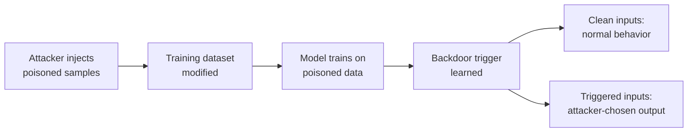

# Lab 6.2: Dataset Poisoning

  Understand: ~10 min | Break: ~10 min | Defend: ~15 min | Detect: ~5 min
  Advanced
  Prerequisites: <a href="../6.1-ml-model-supply-chain/">Lab 6.1</a>

  Overview
  ›
  <a href="understand/" class="phase-step upcoming">Understand</a>
  ›
  <a href="break/" class="phase-step upcoming">Break</a>
  ›
  <a href="defend/" class="phase-step upcoming">Defend</a>
  ›
  <a href="detect/" class="phase-step upcoming">Detect</a>

Organizations pull training datasets from external sources: HuggingFace Datasets, Kaggle, academic repositories, web scraping pipelines. If an attacker modifies the training data, they control the model's behavior. Dataset poisoning injects crafted samples that teach the model a **backdoor trigger**: a specific input pattern that produces the attacker's chosen output. On clean inputs, the model performs normally, making the backdoor nearly impossible to detect through standard evaluation.

### Attack Flow

## Environment

| Service | Address | Description |
|---------|---------|-------------|
| Data Registry | `data-registry:8080` | Simulated dataset hosting service |
| Workstation | `workstation` | Python ML environment with scikit-learn and data analysis tools |

> **Related Labs**
>
> - **Prerequisite:** [6.1 AI/ML Model Supply Chain](../6.1-ml-model-supply-chain/index.md) — ML model supply chain context is essential for dataset attacks
> - **See also:** [3.3 Base Image Poisoning](../../tier-3/3.3-base-image-poisoning/index.md) — Base image poisoning parallels training data poisoning
> - **See also:** [2.7 Build Cache Poisoning](../../tier-2/2.7-build-cache-poisoning/index.md) — Build cache poisoning applies similar persistence to CI caches
