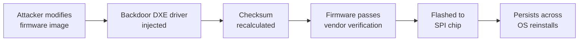

# Lab 6.3: Firmware & Hardware Supply Chain

<div class="lab-meta">
  <span>Understand: ~10 min | Break: ~10 min | Defend: ~10 min | Detect: ~5 min</span>
  <span class="difficulty advanced">Advanced</span>
  <span>Prerequisites: none</span>
</div>

Firmware runs before the operating system boots, initializes hardware, and establishes the root of trust for everything above it. A compromised firmware update persists across OS reinstalls, survives disk wipes, and operates below the visibility of EDR and antivirus. The 2022 MoonBounce UEFI implant and the LoJax rootkit demonstrate that firmware-level compromise is an active threat vector used by nation-state actors.

---

### Attack Flow



---

## Environment

| Component | Path | Description |
|-----------|------|-------------|
| Firmware Images | `/app/firmware/` | Simulated UEFI firmware images (legitimate and modified) |
| Signing Tools | `/app/signing/` | Firmware signing keys and verification utilities |
| Update Server | `firmware-server:8080` | Simulated firmware update distribution server |
| Analysis Tools | `binwalk`, `uefi-firmware-parser` | Firmware analysis and extraction utilities |

## Connect to the Workstation

```bash
./weaklink shell
```

---

???+ info "Phase 1: UNDERSTAND. The Trust Chain from Silicon to Software"

    **Goal:** Understand how firmware updates are distributed, verified, and applied, and where the trust chain can break.

### Step 1: Explore the firmware update lifecycle

```bash
ls -la /app/firmware/
file /app/firmware/*.bin
```

Firmware images are binary blobs containing boot code, driver initialization, hardware configuration tables (ACPI), and sometimes embedded operating environments.

### Step 2: Analyze a legitimate firmware image

```bash
binwalk /app/firmware/bios-v1.2.0.bin

binwalk -e /app/firmware/bios-v1.2.0.bin -C /tmp/fw-extracted/
ls -la /tmp/fw-extracted/
```

A UEFI firmware image contains multiple volumes: PEI (Pre-EFI Initialization), DXE (Driver Execution Environment) drivers, boot manager, and NVRAM. Each is a potential injection point.

### Step 3: Understand the update distribution model

```bash
curl -s http://firmware-server:8080/api/updates | python3 -m json.tool
curl -s http://firmware-server:8080/api/updates/bios-v1.3.0/metadata | python3 -m json.tool
```

### Step 4: Check the verification mechanism

```bash
cat /app/firmware/verify_update.sh
ls -la /app/firmware/*.sig /app/firmware/*.asc 2>/dev/null
/app/firmware/verify_update.sh /app/firmware/bios-v1.2.0.bin
```

Some vendors only verify CRC32 or MD5. not a cryptographic signature. Others sign firmware but distribute the public key alongside the image, making the signature useless if the attacker replaces both.

---

???+ warning "Phase 2: BREAK. Backdooring a Firmware Update"

    **Goal:** Modify a firmware image to include a persistent backdoor that survives the update verification process.

### Step 1: Extract and inject

```bash
cp /app/firmware/bios-v1.2.0.bin /tmp/firmware-work.bin
binwalk -e /tmp/firmware-work.bin -C /tmp/fw-work/
ls -la /tmp/fw-work/
```

### Step 2: Inject a backdoor DXE driver

```bash
cat /app/attacks/malicious-dxe-driver.py

python3 /app/attacks/inject_firmware.py \
    --input /tmp/firmware-work.bin \
    --payload /app/attacks/backdoor.efi \
    --output /tmp/firmware-backdoored.bin
```

The injected DXE driver runs during early boot, before the OS loads. It installs a System Management Mode handler that survives OS reinstalls, intercepts SMI calls, can read/write physical memory, and is invisible to OS-level security tools.

### Step 3: Bypass the update verification

```bash
python3 /app/attacks/fix_checksum.py /tmp/firmware-backdoored.bin
/app/firmware/verify_update.sh /tmp/firmware-backdoored.bin
```

If the vendor only checks CRC32 or MD5, recalculating the checksum after modification is trivial.

### Step 4: Compare legitimate vs. backdoored firmware

```bash
python3 << 'PYEOF'
with open("/app/firmware/bios-v1.2.0.bin", "rb") as f1, \
     open("/tmp/firmware-backdoored.bin", "rb") as f2:
    orig = f1.read()
    back = f2.read()
    diffs = [(i, orig[i], back[i]) for i in range(min(len(orig), len(back))) if orig[i] != back[i]]
    print(f"Files differ at {len(diffs)} byte positions")
    print(f"Original size: {len(orig)}, Modified size: {len(back)}")
    if diffs:
        print(f"First diff at offset 0x{diffs[0][0]:x}: 0x{diffs[0][1]:02x} -> 0x{diffs[0][2]:02x}")
        print(f"Last diff at offset 0x{diffs[-1][0]:x}: 0x{diffs[-1][1]:02x} -> 0x{diffs[-1][2]:02x}")
PYEOF
```

---

!!! abstract "Checkpoint"
    The backdoored firmware should pass the vendor's checksum verification. Run `/app/firmware/verify_update.sh /tmp/firmware-backdoored.bin` and confirm it reports "valid".

---

???+ success "Phase 3: DEFEND. Firmware Signing, Secure Boot, and SBOM"

    **Goal:** Implement proper firmware supply chain controls using cryptographic signing, hardware root of trust, and firmware SBOM.

### Fix 1: Implement cryptographic firmware signing

```bash
openssl genpkey -algorithm RSA -out /app/signing/fw-signing-key.pem -pkeyopt rsa_keygen_bits:4096
openssl rsa -in /app/signing/fw-signing-key.pem -pubout -out /app/signing/fw-signing-pub.pem

openssl dgst -sha256 -sign /app/signing/fw-signing-key.pem \
    -out /app/firmware/bios-v1.2.0.bin.sig \
    /app/firmware/bios-v1.2.0.bin

openssl dgst -sha256 -verify /app/signing/fw-signing-pub.pem \
    -signature /app/firmware/bios-v1.2.0.bin.sig \
    /app/firmware/bios-v1.2.0.bin
echo "Legitimate firmware: signature valid"

openssl dgst -sha256 -verify /app/signing/fw-signing-pub.pem \
    -signature /app/firmware/bios-v1.2.0.bin.sig \
    /tmp/firmware-backdoored.bin 2>&1 || echo "Backdoored firmware: SIGNATURE INVALID"
```

### Fix 2: Create a firmware verification policy

```bash
cat > /app/firmware/verify_secure.sh << 'SHELLEOF'
#!/bin/bash
set -e

FIRMWARE="$1"
SIGNATURE="$1.sig"
PUBKEY="/app/signing/fw-signing-pub.pem"

echo "=== Secure Firmware Verification ==="

if [ ! -f "$SIGNATURE" ]; then
    echo "FAIL: No signature file found ($SIGNATURE)"
    exit 1
fi

if ! openssl dgst -sha256 -verify "$PUBKEY" -signature "$SIGNATURE" "$FIRMWARE" 2>/dev/null; then
    echo "FAIL: Signature verification failed"
    exit 1
fi
echo "PASS: Cryptographic signature valid"

HASH=$(sha256sum "$FIRMWARE" | awk '{print $1}')
if grep -q "$HASH" /app/firmware/known-good-hashes.txt 2>/dev/null; then
    echo "PASS: Hash matches known-good database"
else
    echo "WARNING: Hash not in known-good database (new firmware version?)"
fi

echo "=== Firmware verification complete ==="
SHELLEOF
chmod +x /app/firmware/verify_secure.sh
```

### Fix 3: Generate a firmware SBOM

```bash
cat > /app/firmware/generate_fw_sbom.py << 'PYEOF'
"""Generate an SBOM for firmware components using SPDX format."""
import json, hashlib, datetime

def generate_firmware_sbom(firmware_path: str) -> dict:
    with open(firmware_path, "rb") as f:
        content = f.read()

    return {
        "spdxVersion": "SPDX-2.3",
        "dataLicense": "CC0-1.0",
        "SPDXID": "SPDXRef-DOCUMENT",
        "name": "firmware-sbom",
        "documentNamespace": f"https://example.com/firmware/{hashlib.sha256(content).hexdigest()[:12]}",
        "creationInfo": {
            "created": datetime.datetime.utcnow().isoformat() + "Z",
            "creators": ["Tool: weaklink-fw-sbom-1.0"],
        },
        "packages": [{
            "SPDXID": "SPDXRef-Firmware",
            "name": firmware_path.split("/")[-1],
            "versionInfo": "1.2.0",
            "downloadLocation": "https://firmware-server:8080/updates/",
            "checksums": [{"algorithm": "SHA256", "checksumValue": hashlib.sha256(content).hexdigest()}],
            "supplier": "Organization: Hardware Vendor Inc.",
            "primaryPackagePurpose": "FIRMWARE",
        }],
    }

sbom = generate_firmware_sbom("/app/firmware/bios-v1.2.0.bin")
with open("/app/firmware/firmware-sbom.json", "w") as f:
    json.dump(sbom, f, indent=2)
print(json.dumps(sbom, indent=2))
PYEOF
python3 /app/firmware/generate_fw_sbom.py
```

### Fix 4: Verify Secure Boot chain

```bash
cat /app/signing/verify_secureboot.sh
/app/signing/verify_secureboot.sh
```

### Verify the defense

```bash
weaklink verify 6.3
```

---

??? danger "Phase 4: DETECT. Identifying Firmware Tampering"

    **Goal:** Detect firmware-level compromise using hardware attestation, integrity monitoring, and SIEM correlation.

Firmware attacks are the hardest supply chain compromise to detect because they operate below OS-level monitoring. Detection relies on **hardware attestation (TPM)**, **firmware integrity measurement**, and **anomalous boot behavior**.

Detection targets:

- TPM PCR values that differ from expected measurements
- Firmware update events outside maintenance windows
- Secure Boot violations or Secure Boot being disabled
- BMC/IPMI access from unexpected source IPs
- Firmware version mismatches across identical hardware in a fleet

### MITRE ATT&CK Mapping

| Technique | ID | Relevance |
|-----------|-----|-----------|
| **Supply Chain Compromise: Hardware Supply Chain** | [T1195.003](https://attack.mitre.org/techniques/T1195/003/) | Firmware modified during manufacturing or distribution |
| **Pre-OS Boot: System Firmware** | [T1542.001](https://attack.mitre.org/techniques/T1542/001/) | Backdoor persists in UEFI firmware across OS reinstalls |
| **Pre-OS Boot: Component Firmware** | [T1542.002](https://attack.mitre.org/techniques/T1542/002/) | Compromise of NIC, BMC, or SSD controller firmware |

---

??? tip "SOC Relevance"

    **Alerts:** "TPM PCR measurement mismatch" (hardware attestation), "Firmware update from non-approved source" (asset management), "Secure Boot violation detected" (Windows Event ID 12290/12291).

    Firmware compromises are rare but catastrophic. A single compromised image deployed across a fleet means every server has a persistent backdoor that survives OS reinstalls and standard incident response. The MoonBounce implant (2022) demonstrated UEFI rootkits are used in the wild by APT groups.

    **Triage:** Compare TPM PCR values against baselines, check firmware version against vendor's latest release, compare SHA256 hashes with vendor's official image, check BMC/IPMI access logs. If confirmed: remove from service, image the SPI flash for forensics, replace the motherboard.

---

## What You Learned

1. **Firmware is the root of the supply chain.** A compromised firmware invalidates all higher-level security controls.
2. **CRC32/MD5 checksums are not security.** Without cryptographic signatures verified against a hardware-embedded public key, firmware updates can be modified and pass validation.
3. **TPM and Secure Boot are the hardware root of trust.** TPM PCR measurements create an unforgeable record of what firmware was loaded at boot. Secure Boot prevents unsigned code from executing.

## Further Reading

- [NIST SP 800-193: Platform Firmware Resiliency Guidelines](https://csrc.nist.gov/publications/detail/sp/800-193/final)
- [Binarly: UEFI Firmware Vulnerability Research](https://binarly.io/advisories)
- [MITRE ATT&CK: Pre-OS Boot (T1542)](https://attack.mitre.org/techniques/T1542/)
