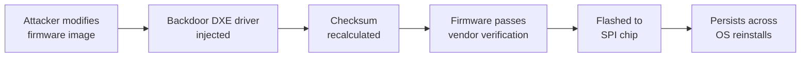

# Lab 6.3: Firmware & Hardware Supply Chain

  Understand: ~10 min | Break: ~10 min | Defend: ~10 min | Detect: ~5 min
  Advanced
  Prerequisites: None

Firmware runs before the operating system boots, initializes hardware, and establishes the root of trust for everything above it. A compromised firmware update persists across OS reinstalls, survives disk wipes, and operates below the visibility of EDR and antivirus. The 2022 MoonBounce UEFI implant and the LoJax rootkit demonstrate that firmware-level compromise is an active threat vector used by nation-state actors.

### Attack Flow

## Environment

| Component | Path | Description |
|-----------|------|-------------|
| Firmware Images | `/app/firmware/` | Simulated UEFI firmware images (legitimate and modified) |
| Signing Tools | `/app/signing/` | Firmware signing keys and verification utilities |
| Update Server | `firmware-server:8080` | Simulated firmware update distribution server |
| Analysis Tools | `strings`, `hexdump`, `grep` | Firmware analysis and inspection utilities |

  Overview
  ›
  <a href="understand/" class="phase-step upcoming">Understand</a>
  ›
  <a href="break/" class="phase-step upcoming">Break</a>
  ›
  <a href="defend/" class="phase-step upcoming">Defend</a>
  ›
  <a href="detect/" class="phase-step upcoming">Detect</a>

