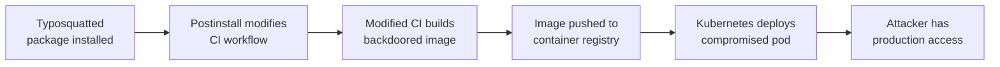

# Lab 6.4: Multi-Vector Chained Attack

<div class="lab-meta">
  <span>Understand: ~10 min | Break: ~15 min | Defend: ~15 min | Detect: ~5 min</span>
  <span class="difficulty advanced">Advanced</span>
  <span>Prerequisites: <a href="../../tier-1/1.3-typosquatting/">Lab 1.3</a>, <a href="../../tier-2/2.2-direct-ppe/">Lab 2.2</a>, <a href="../../tier-3/3.3-base-image-poisoning/">Lab 3.3</a></span>
</div>

Real supply chain attacks combine multiple vectors into a kill chain where each stage enables the next. A typosquatted package installs a CI config modifier. The modified CI pipeline pushes a backdoored container image. The backdoored image runs in Kubernetes with access to customer data. Each technique operates in the blind spot of the control designed for the previous stage.

---

### Attack Flow



---

## Environment

| Component | Path | Description |
|-----------|------|-------------|
| Application | `/app/webapp/` | Node.js web application with package.json |
| CI Pipeline | `/app/.github/workflows/` | GitHub Actions workflow for build and deploy |
| Container Registry | `registry:5000` | Private Docker registry for production images |
| Production Cluster | `kubectl` | Kubernetes cluster running the application |
| Attacker Packages | `/app/attacker/` | Typosquatted package and CI modifier payload |

## Connect to the Workstation

```bash
./weaklink shell
```

---

???+ info "Phase 1: UNDERSTAND. How Supply Chain Attacks Chain Together"

    **Goal:** Map how individual attack techniques from earlier labs combine into a multi-stage kill chain.

### Step 1: Review the application and its pipeline

```bash
cat /app/webapp/package.json
cat /app/webapp/server.js
cat /app/.github/workflows/build-deploy.yml

kubectl get deployments -n production
kubectl get pods -n production
```

### Step 2: Identify controls at each boundary

```bash
# Boundary 1: npm install
cat /app/webapp/package-lock.json | head -20
ls /app/webapp/.npmrc 2>/dev/null

# Boundary 2: CI pipeline
grep -A 5 "security\|scan\|check\|verify" /app/.github/workflows/build-deploy.yml

# Boundary 3: Container registry
curl -s http://registry:5000/v2/_catalog | python3 -m json.tool

# Boundary 4: Kubernetes
kubectl get validatingwebhookconfigurations 2>/dev/null
```

Note which boundaries have controls and which do not.

### Step 3: Understand the kill chain model

The attacker's plan:

1. **Stage 1 (Package):** Publish a typosquatted npm package
2. **Stage 2 (CI):** The package's postinstall script modifies the CI workflow
3. **Stage 3 (Image):** The modified CI workflow injects a backdoor into the Docker image

Each stage passes the controls designed for that layer. The package scanner does not check for CI modifications. The CI audit does not scan Docker images. The image scanner does not know the image was built by a compromised pipeline.

---

???+ warning "Phase 2: BREAK. Executing the Three-Stage Kill Chain"

    **Goal:** Walk through a complete multi-vector attack from typosquatted package to production compromise.

### Stage 1: Typosquatted package with CI modifier

```bash
cat /app/attacker/typosquatted-package/package.json
cat /app/attacker/typosquatted-package/postinstall.js
```

The `postinstall` script provides legitimate functionality (so the developer does not notice the typo) and quietly modifies `.github/workflows/build-deploy.yml`.

```bash
cd /app/webapp && npm install /app/attacker/typosquatted-package/

diff /app/.github/workflows/build-deploy.yml /app/.github/workflows/build-deploy.yml.bak 2>/dev/null \
    || echo "Check the workflow file for modifications"
cat /app/.github/workflows/build-deploy.yml
```

### Stage 2: Modified CI pipeline

```bash
grep -A 10 "# Added by dependency setup" /app/.github/workflows/build-deploy.yml
cat /app/attacker/ci-payload.sh
```

The payload modifies the application code to include a reverse shell or data exfiltration endpoint. Because it runs in CI, it has access to all CI secrets.

### Stage 3: Backdoored container image

```bash
/app/attacker/simulate-ci-build.sh

docker pull registry:5000/webapp:latest
docker inspect registry:5000/webapp:latest | python3 -m json.tool | head -40
docker run --rm registry:5000/webapp:latest cat /app/server.js
```

The production image now contains a backdoor. It passes image scanning because the backdoor is custom code, not a known CVE.

---

!!! abstract "Checkpoint"
    You should see the backdoor in the production image's `/app/server.js`. The modified CI workflow should contain an injected step. If either is missing, re-run the stages.

---

???+ success "Phase 3: DEFEND. Layered Defenses Mapped to SLSA Levels"

    **Goal:** Implement controls at every trust boundary so that each layer catches what others miss.

### Layer 1: Package integrity (catches Stage 1)

```bash
cat > /app/webapp/.npmrc << 'EOF'
save-exact=true
package-lock=true
ignore-scripts=true
EOF

npm config set ignore-scripts true --location=project
npm ci --ignore-scripts
```

`ignore-scripts` prevents postinstall scripts from executing. `npm ci` installs from the lockfile only.

### Layer 2: CI pipeline integrity (catches Stage 2)

```bash
cat > /app/.github/workflows/build-deploy.yml.sha256 << 'EOF'
# SHA256 of the approved workflow. Any PR modifying the workflow must update this hash.
EOF
sha256sum /app/.github/workflows/build-deploy.yml >> /app/.github/workflows/build-deploy.yml.sha256

cat > /app/.github/workflows/verify-workflow.yml << 'YMLEOF'
name: Verify Workflow Integrity
on:
  pull_request:
    paths:
      - ".github/workflows/**"
jobs:
  check-workflow-hash:
    runs-on: ubuntu-latest
    steps:
      - uses: actions/checkout@v4
      - name: Verify workflow file integrity
        run: |
          EXPECTED=$(tail -1 .github/workflows/build-deploy.yml.sha256 | awk '{print $1}')
          ACTUAL=$(sha256sum .github/workflows/build-deploy.yml | awk '{print $1}')
          if [ "$EXPECTED" != "$ACTUAL" ]; then
            echo "::error::Workflow file modified without updating hash."
            diff <(git show HEAD~1:.github/workflows/build-deploy.yml) .github/workflows/build-deploy.yml || true
            exit 1
          fi
YMLEOF
```

### Layer 3: Image provenance (catches Stage 3)

```bash
cat > /app/sign-and-attest.sh << 'SHELLEOF'
#!/bin/bash
IMAGE="$1"
cosign sign --key /app/signing/cosign.key "$IMAGE"
cosign attest --key /app/signing/cosign.key \
    --predicate /app/provenance.json \
    --type slsaprovenance "$IMAGE"
echo "Image signed and provenance attached: $IMAGE"
SHELLEOF
chmod +x /app/sign-and-attest.sh

cat > /app/verify-before-deploy.sh << 'SHELLEOF'
#!/bin/bash
IMAGE="$1"
cosign verify --key /app/signing/cosign.pub "$IMAGE" || exit 1
cosign verify-attestation --key /app/signing/cosign.pub \
    --type slsaprovenance "$IMAGE" || exit 1

BUILDER=$(cosign verify-attestation --key /app/signing/cosign.pub \
    --type slsaprovenance "$IMAGE" 2>/dev/null | jq -r '.predicate.builder.id')
if [[ "$BUILDER" != *"github.com/actions/runner"* ]]; then
    echo "FAIL: Image built by unknown builder: $BUILDER"
    exit 1
fi
echo "PASS: Image signature and provenance verified"
SHELLEOF
chmod +x /app/verify-before-deploy.sh
```

### Layer 4: Runtime enforcement (defense in depth)

```bash
cat > /app/policies/verified-images-only.yaml << 'EOF'
apiVersion: kyverno.io/v1
kind: ClusterPolicy
metadata:
  name: verify-image-signature
spec:
  validationFailureAction: Enforce
  background: false
  rules:
    - name: check-signature
      match:
        any:
          - resources:
              kinds:
                - Pod
      verifyImages:
        - imageReferences:
            - "registry:5000/*"
          attestors:
            - entries:
                - keys:
                    publicKeys: |
                      -----BEGIN PUBLIC KEY-----
                      ...your cosign public key...
                      -----END PUBLIC KEY-----
EOF
kubectl apply -f /app/policies/verified-images-only.yaml
```

### Verify the defense

```bash
weaklink verify 6.4
```

---

??? danger "Phase 4: DETECT. Detecting Multi-Stage Kill Chains"

    **Goal:** Correlate signals across layers to detect chained attacks that each individual control misses.

No single signal is conclusive. The key is **cross-layer correlation**: a typosquatted package install followed by a CI workflow change followed by an unexpected image push is a chain that demands investigation even if each event alone looks benign.

Cross-layer signals:

- **Package layer:** New dependency that is a near-homograph of an existing one
- **CI layer:** Workflow file modified in the same PR as a new dependency
- **Image layer:** Container image rebuilt with a different layer hash than expected
- **Runtime layer:** Production pod making outbound connections to unfamiliar endpoints

### MITRE ATT&CK Mapping

| Technique | ID | Stage | Relevance |
|-----------|-----|-------|-----------|
| **Supply Chain Compromise: Software Supply Chain** | [T1195.002](https://attack.mitre.org/techniques/T1195/002/) | 1, 2, 3 | End-to-end supply chain compromise |
| **Command and Scripting Interpreter: JavaScript** | [T1059.007](https://attack.mitre.org/techniques/T1059/007/) | 1 | npm postinstall script executes attacker code |
| **Modify CI/CD Pipeline** | [T1584.010](https://attack.mitre.org/techniques/T1584/010/) | 2 | Attacker modifies build pipeline |
| **Deploy Container** | [T1610](https://attack.mitre.org/techniques/T1610/) | 3 | Backdoored container image deployed to production |

---

??? tip "SOC Relevance"

    **Alerts (individually, each looks low-severity):** "New npm dependency added" (package audit), "CI workflow file modified" (repo audit), "Container image layers changed" (registry audit), "Outbound connection from production pod" (network monitor).

    **Why correlation matters:** Each alert alone is routine. But when these events occur in sequence within a short timeframe and are linked by the same PR/commit, the combination indicates a multi-stage attack.

    **Triage:** Check if the new dependency was intentional, check for near-homograph names, review workflow changes against the dependency addition, compare image layers before and after. If suspicious: revoke all CI secrets, quarantine the image, roll back the deployment.

---

## What You Learned

1. **Real attacks chain multiple techniques.** Typosquatting, CI poisoning, and image tampering are more dangerous in combination because each stage operates in the blind spot of the previous layer's controls.
2. **Cross-layer correlation is the detection key.** A new dependency + workflow change + image rebuild in the same PR demands investigation.
3. **`ignore-scripts` breaks Stage 1.** Disabling postinstall scripts prevents the initial foothold.

## Further Reading

- [SLSA: Supply-chain Levels for Software Artifacts](https://slsa.dev/)
- [Sigstore: Cosign, Rekor, and Fulcio](https://sigstore.dev/)
- [OpenSSF: Scorecard. Automated Security Checks](https://securityscorecards.dev/)
