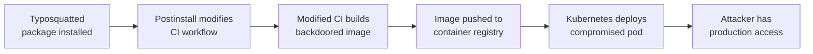

# Lab 6.4: Multi-Vector Chained Attack

<div class="lab-meta">
  <span>~45 minutes</span>
  <span>Advanced</span>
  <span>Prerequisites: <a href="../../tier-1/1.3-typosquatting/">Lab 1.3</a>, <a href="../../tier-2/2.2-direct-ppe/">Lab 2.2</a>, <a href="../../tier-3/3.3-base-image-poisoning/">Lab 3.3</a></span>
</div>

Real supply chain attacks do not use a single technique. The most damaging incidents combine multiple vectors into a kill chain where each stage enables the next. A typosquatted package installs a CI config modifier. The modified CI pipeline pushes a backdoored container image to the production registry. The backdoored image runs in Kubernetes with access to customer data.

Individually, each technique might be caught by a focused control: a package scanner catches typosquatting, a CI audit catches pipeline modifications, an image scanner catches known-bad layers. But when the attacker chains them, each technique operates in the blind spot of the control designed for the previous stage. In this lab, you will execute a three-stage attack and then implement layered defenses mapped to SLSA levels.

---

### Attack Flow



---

## Environment

| Component | Path | Description |
|-----------|------|-------------|
| Application | `/app/webapp/` | Node.js web application with package.json |
| CI Pipeline | `/app/.github/workflows/` | GitHub Actions workflow for build and deploy |
| Container Registry | `registry:5000` | Private Docker registry for production images |
| Production Cluster | `kubectl` | Kubernetes cluster running the application |
| Attacker Packages | `/app/attacker/` | Typosquatted package and CI modifier payload |

## Connect to the Workstation

```bash
./weaklink shell
```

### Workstation Terminal

Use the embedded terminal below, or open a separate terminal and run `./cli/weaklink shell`.

<div class="terminal-embed">
  <iframe src="http://localhost:7681" title="WeakLink Workstation Terminal"></iframe>
</div>

---

???+ info "Phase 1: UNDERSTAND. How Supply Chain Attacks Chain Together"

    **Goal:** Map how individual attack techniques from earlier labs combine into a multi-stage kill chain.

### Step 1: Review the application and its pipeline

```bash
# The application
cat /app/webapp/package.json
cat /app/webapp/server.js

# The CI pipeline
cat /app/.github/workflows/build-deploy.yml

# The production deployment
kubectl get deployments -n production
kubectl get pods -n production
```

This is a standard setup: a Node.js app with npm dependencies, a GitHub Actions pipeline that builds a Docker image and pushes it to a private registry, and a Kubernetes deployment that pulls from that registry.

### Step 2: Map the trust boundaries

```bash
cat << 'EOF'
TRUST BOUNDARY MAP:
===================

[npm Registry] --package install--> [Developer Workstation]
     |                                      |
     |                              [git push]
     |                                      |
     v                                      v
[npm install in CI] ---------> [GitHub Actions Runner]
                                            |
                                    [docker build + push]
                                            |
                                            v
                               [Container Registry]
                                            |
                                    [kubectl apply]
                                            |
                                            v
                               [Kubernetes Production]

Each arrow is a trust boundary crossing.
Each trust boundary is an attack surface.
EOF
```

### Step 3: Identify controls at each boundary

```bash
# Boundary 1: npm install -- what checks exist?
cat /app/webapp/package-lock.json | head -20
ls /app/webapp/.npmrc 2>/dev/null

# Boundary 2: CI pipeline -- what checks exist?
grep -A 5 "security\|scan\|check\|verify" /app/.github/workflows/build-deploy.yml

# Boundary 3: Container registry -- what checks exist?
curl -s http://registry:5000/v2/_catalog | python3 -m json.tool

# Boundary 4: Kubernetes -- what checks exist?
kubectl get validatingwebhookconfigurations 2>/dev/null
```

Note which boundaries have controls and which do not. The attacker will target the weakest link.

### Step 4: Understand the kill chain model

The attacker's plan:

1. **Stage 1 (Package):** Publish a typosquatted npm package that developers install by mistake
2. **Stage 2 (CI):** The package contains a postinstall script that modifies the CI workflow
3. **Stage 3 (Image):** The modified CI workflow injects a backdoor into the Docker image at build time

Each stage is subtle enough to pass the controls designed for that layer. The package scanner does not check for CI modifications. The CI audit does not scan Docker images. The image scanner does not know the image was built by a compromised pipeline.

---

???+ warning "Phase 2: BREAK. Executing the Three-Stage Kill Chain"

    **Goal:** Walk through a complete multi-vector attack from typosquatted package to production compromise.

### Stage 1: Typosquatted package with CI modifier

```bash
# Examine the attacker's package
cat /app/attacker/typosquatted-package/package.json
cat /app/attacker/typosquatted-package/postinstall.js
```

The package name is a common typo of a popular package. The `postinstall` script does two things:

1. Provides the legitimate functionality the developer expects (so they do not notice the typo)
2. Quietly modifies `.github/workflows/build-deploy.yml` to inject an extra build step

```bash
# Simulate a developer installing the typosquatted package
cd /app/webapp && npm install /app/attacker/typosquatted-package/

# Check what changed
diff /app/.github/workflows/build-deploy.yml /app/.github/workflows/build-deploy.yml.bak 2>/dev/null \
    || echo "Check the workflow file for modifications"
cat /app/.github/workflows/build-deploy.yml
```

### Stage 2: Modified CI pipeline

```bash
# Look at what the postinstall script added to the CI workflow
grep -A 10 "# Added by dependency setup" /app/.github/workflows/build-deploy.yml
```

The injected step looks like a standard build optimization or caching step. It runs BEFORE the Docker build and modifies the application source code or Dockerfile to include a backdoor. The step name is something innocuous like "Optimize build cache" or "Pre-build dependency check."

```bash
# See what the injected CI step actually does
cat /app/attacker/ci-payload.sh
```

The payload modifies the application code to include a reverse shell or data exfiltration endpoint. Because it runs in CI, it has access to all CI secrets (registry credentials, deployment tokens, cloud keys).

### Stage 3: Backdoored container image

```bash
# Simulate the CI pipeline running with the modified workflow
/app/attacker/simulate-ci-build.sh

# Check the resulting image
docker pull registry:5000/webapp:latest
docker inspect registry:5000/webapp:latest | python3 -m json.tool | head -40

# Look for the backdoor in the image
docker run --rm registry:5000/webapp:latest cat /app/server.js
```

The production image now contains a backdoor. It passes image scanning because the backdoor is custom code, not a known CVE. The image is signed by the CI pipeline's credentials, so it appears legitimate.

### Impact assessment

```bash
# The backdoored image is now in production
kubectl get pods -n production -o wide

# The backdoor could:
echo "
Impact of the three-stage attack:
1. STAGE 1 (Package): Developer installed typosquatted package -- gives attacker code execution in dev environment
2. STAGE 2 (CI): Postinstall modified CI pipeline -- gives attacker code execution in CI with access to all secrets
3. STAGE 3 (Image): Modified CI built backdoored image -- gives attacker code execution in production

Combined blast radius:
- All CI secrets (registry creds, deploy tokens, cloud keys) exfiltrated
- Production containers running attacker code with access to customer data
- Persistent: the backdoor is baked into the image, redeploying uses the same image
- Stealthy: each stage looks like a legitimate operation at its layer
"
```

---

???+ success "Phase 3: DEFEND. Layered Defenses Mapped to SLSA Levels"

    **Goal:** Implement controls at every trust boundary so that each layer catches what others miss.

### Layer 1: Package integrity (catches Stage 1)

```bash
# Pin exact dependency versions and enforce lockfile
cat > /app/webapp/.npmrc << 'EOF'
save-exact=true
package-lock=true
ignore-scripts=true
EOF

# Disable postinstall scripts globally
npm config set ignore-scripts true --location=project

# Verify the lockfile matches package.json
npm ci --ignore-scripts
```

`ignore-scripts` prevents `postinstall` scripts from executing. `npm ci` installs from the lockfile only, rejecting unlisted packages.

### Layer 2: CI pipeline integrity (catches Stage 2)

```bash
# Pin the CI workflow so modifications are detected
cat > /app/.github/workflows/build-deploy.yml.sha256 << 'EOF'
# This file contains the SHA256 of the approved workflow
# Any PR that modifies the workflow must also update this hash
# A required status check verifies the hash matches
EOF
sha256sum /app/.github/workflows/build-deploy.yml >> /app/.github/workflows/build-deploy.yml.sha256

# Create a workflow integrity check
cat > /app/.github/workflows/verify-workflow.yml << 'YMLEOF'
name: Verify Workflow Integrity
on:
  pull_request:
    paths:
      - ".github/workflows/**"
jobs:
  check-workflow-hash:
    runs-on: ubuntu-latest
    steps:
      - uses: actions/checkout@v4
      - name: Verify workflow file integrity
        run: |
          EXPECTED=$(tail -1 .github/workflows/build-deploy.yml.sha256 | awk '{print $1}')
          ACTUAL=$(sha256sum .github/workflows/build-deploy.yml | awk '{print $1}')
          if [ "$EXPECTED" != "$ACTUAL" ]; then
            echo "::error::Workflow file modified without updating hash. Review changes carefully."
            diff <(git show HEAD~1:.github/workflows/build-deploy.yml) .github/workflows/build-deploy.yml || true
            exit 1
          fi
YMLEOF
```

### Layer 3: Image provenance (catches Stage 3)

```bash
# Sign images with cosign and attach SLSA provenance
cat > /app/sign-and-attest.sh << 'SHELLEOF'
#!/bin/bash
IMAGE="$1"

# Sign the image
cosign sign --key /app/signing/cosign.key "$IMAGE"

# Generate and attach SLSA provenance
cosign attest --key /app/signing/cosign.key \
    --predicate /app/provenance.json \
    --type slsaprovenance "$IMAGE"

echo "Image signed and provenance attached: $IMAGE"
SHELLEOF
chmod +x /app/sign-and-attest.sh

# Verify before deployment
cat > /app/verify-before-deploy.sh << 'SHELLEOF'
#!/bin/bash
IMAGE="$1"

# Verify image signature
cosign verify --key /app/signing/cosign.pub "$IMAGE" || exit 1

# Verify SLSA provenance
cosign verify-attestation --key /app/signing/cosign.pub \
    --type slsaprovenance "$IMAGE" || exit 1

# Verify the build was from an approved CI system
BUILDER=$(cosign verify-attestation --key /app/signing/cosign.pub \
    --type slsaprovenance "$IMAGE" 2>/dev/null | jq -r '.predicate.builder.id')
if [[ "$BUILDER" != *"github.com/actions/runner"* ]]; then
    echo "FAIL: Image built by unknown builder: $BUILDER"
    exit 1
fi

echo "PASS: Image signature and provenance verified"
SHELLEOF
chmod +x /app/verify-before-deploy.sh
```

### Layer 4: Runtime enforcement (defense in depth)

```bash
# Kubernetes admission policy: only allow images with verified signatures
cat > /app/policies/verified-images-only.yaml << 'EOF'
apiVersion: kyverno.io/v1
kind: ClusterPolicy
metadata:
  name: verify-image-signature
spec:
  validationFailureAction: Enforce
  background: false
  rules:
    - name: check-signature
      match:
        any:
          - resources:
              kinds:
                - Pod
      verifyImages:
        - imageReferences:
            - "registry:5000/*"
          attestors:
            - entries:
                - keys:
                    publicKeys: |
                      -----BEGIN PUBLIC KEY-----
                      ...your cosign public key...
                      -----END PUBLIC KEY-----
EOF
kubectl apply -f /app/policies/verified-images-only.yaml
```

### SLSA level mapping

```bash
echo "
SLSA Level Mapping for Layered Defense:
========================================
SLSA 1: Automated build with provenance metadata
  - CI pipeline generates build provenance (who, when, what inputs)

SLSA 2: Hosted build with signed provenance
  - Build runs on a hosted service (GitHub Actions, not self-hosted)
  - Provenance is signed by the build service

SLSA 3: Hardened build with non-falsifiable provenance
  - Build runs in an isolated environment
  - Provenance cannot be modified by the build itself
  - Source integrity verified (two-person review)

SLSA 4 (aspirational): Hermetic, reproducible build
  - Build is fully reproducible from source
  - All dependencies are pinned and verified
  - No network access during build
"
```

### Verify the defense

```bash
weaklink verify 6.4
```

---

??? danger "Phase 4: DETECT. Detecting Multi-Stage Kill Chains"

    **Goal:** Correlate signals across layers to detect chained attacks that each individual control misses.

### SIEM / Log Indicators

Multi-vector attacks generate signals at each stage, but no single signal is conclusive. The key is **cross-layer correlation**: a typosquatted package install followed by a CI workflow change followed by an unexpected image push is a chain that demands investigation even if each event alone looks benign.

**What to look for across layers:**

- **Package layer:** New dependency added that is a near-homograph of an existing dependency
- **CI layer:** Workflow file modified in the same PR as a new dependency
- **Image layer:** Container image rebuilt with a different layer hash than expected
- **Runtime layer:** Production pod making outbound connections to unfamiliar endpoints

### Network Indicators

| Indicator | Stage | What It Means |
|-----------|-------|---------------|
| npm install pulling package with 0 downloads / recent publish | Stage 1 | Likely typosquatted or malicious package |
| CI runner making outbound HTTP to non-approved endpoint | Stage 2 | CI payload exfiltrating secrets |
| Container registry push with unexpected image layers | Stage 3 | Backdoored image pushed by compromised CI |
| Production pod connecting to unknown external IP | Runtime | Backdoor phoning home |

### Correlation Rules

### MITRE ATT&CK Mapping

| Technique | ID | Stage | Relevance |
|-----------|-----|-------|-----------|
| **Supply Chain Compromise: Software Supply Chain** | [T1195.002](https://attack.mitre.org/techniques/T1195/002/) | 1, 2, 3 | End-to-end supply chain compromise spanning packages, CI, and images |
| **Command and Scripting Interpreter: JavaScript** | [T1059.007](https://attack.mitre.org/techniques/T1059/007/) | 1 | npm postinstall script executes attacker code |
| **Modify CI/CD Pipeline** | [T1584.010](https://attack.mitre.org/techniques/T1584/010/) | 2 | Attacker modifies build pipeline to inject backdoor |
| **Deploy Container** | [T1610](https://attack.mitre.org/techniques/T1610/) | 3 | Backdoored container image deployed to production |

---

??? tip "SOC Relevance"

    **Alerts you will see (individually, each looks low-severity):**

    - "New npm dependency added to package.json" (package audit)
    - "CI workflow file modified" (repo audit)
    - "Container image layers changed unexpectedly" (registry audit)
    - "Outbound connection from production pod to unknown IP" (network monitor)

    **Why correlation matters:** Each alert alone is a routine event. Packages are added regularly. Workflow files are updated. Images are rebuilt. But when these events occur in sequence within a short timeframe and are linked by the same PR/commit, the combination indicates a multi-stage supply chain attack.

    **Triage steps:**

    1. Check if the new dependency was intentional. does the PR description explain why it was added?
    2. Check if the dependency name is a near-homograph of an existing dependency
    3. Review the workflow changes. do they correspond to the dependency addition or are they independent?
    4. Compare image layers before and after. what changed? Is the change explained by the source diff?
    5. If the chain checks out as suspicious: treat it as a full supply chain compromise. Revoke all CI secrets, quarantine the image, and roll back the deployment.

    **False positive rate:** High for individual signals. Low when three or more signals correlate within 24 hours on the same PR or commit chain.

---

??? example "CI Integration"

    Implement cross-layer checks that catch chained attacks.

    **`.github/workflows/supply-chain-check.yml`:**

    ```yaml
    name: Supply Chain Kill Chain Detection

    on:
      pull_request:
        paths:
          - "package.json"
          - "package-lock.json"
          - ".github/workflows/**"
          - "Dockerfile"

    jobs:
      cross-layer-check:
        runs-on: ubuntu-latest
        steps:
          - uses: actions/checkout@v4
            with:
              fetch-depth: 0

          - name: Detect dependency + workflow change in same PR
            run: |
              # Get files changed in this PR
              CHANGED=$(git diff --name-only origin/main...HEAD)

              DEP_CHANGED=false
              WF_CHANGED=false
              DOCKER_CHANGED=false

              echo "$CHANGED" | grep -q "package.json\|package-lock.json" && DEP_CHANGED=true
              echo "$CHANGED" | grep -q ".github/workflows/" && WF_CHANGED=true
              echo "$CHANGED" | grep -q "Dockerfile" && DOCKER_CHANGED=true

              if $DEP_CHANGED && $WF_CHANGED; then
                echo "::warning::ALERT: This PR modifies both dependencies AND CI workflows. This pattern matches multi-vector supply chain attacks. Requires additional review."
              fi

              if $DEP_CHANGED && $DOCKER_CHANGED; then
                echo "::warning::ALERT: This PR modifies both dependencies AND Dockerfile. Verify the Dockerfile changes are intentional."
              fi

          - name: Check for typosquatting in new dependencies
            run: |
              # Extract newly added dependencies
              NEW_DEPS=$(git diff origin/main...HEAD -- package.json | grep "^+" | grep -oP '"[^"]+":' | tr -d '":')
              for dep in $NEW_DEPS; do
                # Check publish date and download count
                INFO=$(npm view "$dep" time.created 2>/dev/null)
                if [ -n "$INFO" ]; then
                  echo "New dependency: $dep (first published: $INFO)"
                else
                  echo "::warning::New dependency '$dep' not found on npm or recently created."
                fi
              done

          - name: Verify no postinstall scripts in new dependencies
            run: |
              npm ci --ignore-scripts
              for dep in $(git diff origin/main...HEAD -- package.json | grep "^+" | grep -oP '"[^"]+":' | tr -d '":'); do
                SCRIPTS=$(npm view "$dep" scripts.postinstall scripts.preinstall scripts.install 2>/dev/null)
                if [ -n "$SCRIPTS" ]; then
                  echo "::error::Dependency '$dep' has install scripts: $SCRIPTS"
                  exit 1
                fi
              done
              echo "PASS: No install scripts in new dependencies."
    ```

---

## What You Learned

1. **Real attacks chain multiple techniques**. typosquatting, CI poisoning, and image tampering are more dangerous in combination than individually because each stage operates in the blind spot of the previous layer's controls.
2. **Cross-layer correlation is the detection key**. a new dependency + a workflow change + an image rebuild in the same PR is a pattern that demands investigation, even if each event alone is routine.
3. **SLSA provides a framework for layered defense**. from basic provenance (Level 1) to hermetic builds (Level 4), each level adds a control that breaks a different stage of the kill chain.
4. **`ignore-scripts` breaks Stage 1**. disabling postinstall scripts in npm prevents the initial foothold from establishing itself.
5. **Defense in depth means accepting that each layer will fail**. the goal is not perfect prevention at any single layer but ensuring that no attack can traverse all layers without triggering at least one detection.

## Further Reading

- [SLSA: Supply-chain Levels for Software Artifacts](https://slsa.dev/)
- [CNCF: Software Supply Chain Best Practices](https://project.linuxfoundation.org/hubfs/CNCF_SSCP_v1.pdf)
- [Google: Binary Authorization for Borg](https://cloud.google.com/binary-authorization/docs/overview)
- [Sigstore: Cosign, Rekor, and Fulcio](https://sigstore.dev/)
- [OpenSSF: Scorecard. Automated Security Checks](https://securityscorecards.dev/)
