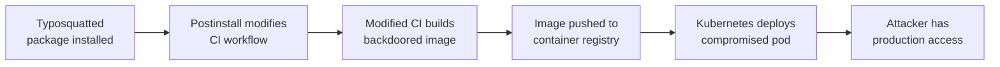

# Lab 6.4: Multi-Vector Chained Attack

  Understand: ~10 min | Break: ~15 min | Defend: ~15 min | Detect: ~5 min
  Advanced
  Prerequisites: <a href="../../tier-1/1.3-typosquatting/">Lab 1.3</a>, <a href="../../tier-2/2.2-direct-ppe/">Lab 2.2</a>, <a href="../../tier-3/3.3-base-image-poisoning/">Lab 3.3</a>

Real supply chain attacks combine multiple vectors into a kill chain where each stage enables the next. A typosquatted package installs a CI config modifier. The modified CI pipeline pushes a backdoored container image. The backdoored image runs in Kubernetes with access to customer data. Each technique operates in the blind spot of the control designed for the previous stage.

### Attack Flow

## Environment

| Component | Path | Description |
|-----------|------|-------------|
| Application | `/app/webapp/` | Node.js web application with package.json |
| CI Pipeline | `/app/.github/workflows/` | GitHub Actions workflow for build and deploy |
| Container Registry | `registry:5000` | Private Docker registry for production images |
| Production Cluster | `kubectl` | Kubernetes cluster running the application |
| Attacker Packages | `/app/attacker/` | Typosquatted package and CI modifier payload |

  Overview
  ›
  <a href="understand/" class="phase-step upcoming">Understand</a>
  ›
  <a href="break/" class="phase-step upcoming">Break</a>
  ›
  <a href="defend/" class="phase-step upcoming">Defend</a>
  ›
  <a href="detect/" class="phase-step upcoming">Detect</a>

!!! tip "Related Labs"
    - **Prerequisite:** [1.3 Typosquatting](../../tier-1/1.3-typosquatting/index.md) — Typosquatting is one vector in the multi-vector chain
    - **Prerequisite:** [2.2 Direct Poisoned Pipeline Execution](../../tier-2/2.2-direct-ppe/index.md) — Pipeline poisoning is another vector in the chain
    - **Prerequisite:** [3.3 Base Image Poisoning](../../tier-3/3.3-base-image-poisoning/index.md) — Base image poisoning is the container vector in the chain
    - **See also:** [7.2 Supply Chain Incident Triage](../../tier-7/7.2-incident-triage/index.md) — Triaging multi-vector incidents requires special techniques
