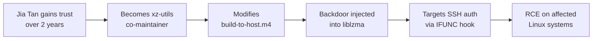

# Lab 6.5: Case Study: xz-utils (CVE-2024-3094)

<div class="lab-meta">
  <span>Understand: ~10 min | Analyze: ~10 min | Lessons: ~10 min | Detect: ~5 min</span>
  <span class="difficulty advanced">Advanced</span>
  <span>Prerequisites: <a href="../../tier-2/2.3-indirect-ppe/">Lab 2.3</a></span>
</div>

On March 29, 2024, Andres Freund noticed SSH logins taking ~500ms longer than usual. His investigation uncovered the most sophisticated open source supply chain attack ever documented: a backdoor in xz-utils giving the attacker remote code execution through SSH. The attack was a **two-year social engineering campaign** targeting a burned-out sole maintainer. The attacker, "Jia Tan," built trust, took over maintenance, and injected a backdoor into the build system that was invisible in the source code.

---

### Attack Flow



---

## Environment

| Component | Path | Description |
|-----------|------|-------------|
| Source Snapshots | `/app/xz-sources/` | xz-utils source at key points in the attack timeline |
| Build Scripts | `/app/xz-build/` | Reproductions of the malicious build system modifications |
| Analysis Tools | `/app/analysis/` | Scripts for examining the backdoor mechanism |
| Backdoor Samples | `/app/backdoor/` | Extracted and annotated backdoor components |

## Connect to the Workstation

```bash
./weaklink shell
```

---

???+ info "Phase 1: UNDERSTAND. Timeline of a Two-Year Social Engineering Campaign"

    **Goal:** Trace how the attacker gained commit access through social engineering and maintainer burnout exploitation.

### Step 1: The timeline

```bash
cat /app/analysis/timeline.txt
```

| Date | Event |
|------|-------|
| 2021-10 | "Jia Tan" begins submitting patches to xz-utils |
| 2022-01 | Sock puppet accounts pressure Lasse Collin to add a co-maintainer |
| 2022-09 | Jia Tan granted commit access |
| 2023-01 | Jia Tan becomes de facto primary maintainer |
| 2024-02-15 | Backdoor injected into xz-utils 5.6.0 |
| 2024-03-09 | Backdoor carried into 5.6.1 |
| 2024-03-29 | Andres Freund discovers the backdoor; CVE-2024-3094 assigned |

### Step 2: The social engineering

```bash
cat /app/analysis/mailing-list-excerpts.txt
```

Multiple sock puppet accounts ("Jigar Kumar", "Dennis Ens") complained about Collin's responsiveness, creating the appearance of community demand for a co-maintainer.

### Step 3: Trust building

```bash
cat /app/xz-sources/early-commits.log
```

Jia Tan's initial contributions were genuine: test fixes, documentation, minor bugs. Over 18 months, they built a commit history that made the eventual backdoor commit unremarkable.

---

???+ warning "Phase 2: ANALYZE. The Backdoor Mechanism"

    **Goal:** Walk through how the backdoor was injected via the build system and how it targeted SSH authentication.

### Step 1: The build system injection

```bash
cat /app/xz-build/m4/build-to-host.m4
```

The release tarballs contained files NOT in the git repository. `m4/build-to-host.m4` included an obfuscated script that ran during `./configure`. Release tarballs are generated by `make dist` and can include generated files not tracked in version control.

### Step 2: The obfuscation technique

```bash
cat /app/xz-build/deobfuscate.sh
hexdump -C /app/backdoor/tests/files/bad-3-corrupt_lzma2.xz | head -20
```

The payload was hidden in test fixture files (corrupt .xz files for testing error handling). The build script checked if running in a release tarball, extracted the binary payload from test files using `tr`, `head`, and `xz`, compiled it into a shared object, and injected it via `IFUNC` resolvers.

### Step 3: How the backdoor targeted SSH

```bash
cat /app/analysis/ssh-attack-path.txt
cat /app/backdoor/ifunc-resolver-annotated.c
```

The attack path: liblzma is linked by libsystemd (journal compression), libsystemd is linked by sshd on systemd-based distros. The backdoor hooked RSA signature verification in OpenSSH. A specially crafted SSH public key triggered the backdoor, decrypting and executing the payload as root.

### Step 4: Why code review did not catch it

```bash
diff /app/xz-sources/git-checkout/m4/ /app/xz-sources/release-tarball/m4/
```

The malicious `m4/build-to-host.m4` was only in the release tarball. The test fixtures containing the encrypted payload looked like legitimate corrupt test data. Jia Tan was the trusted maintainer who created the tarballs.

---

!!! abstract "Checkpoint"
    You should understand the three-layer concealment: backdoor only in tarballs (not git), payload hidden in test fixtures, activation only through IFUNC hooking of sshd. Verify by examining the diff between git checkout and release tarball m4 directories.

---

???+ success "Phase 3: LESSONS. Defense Takeaways"

    **Goal:** Extract actionable defenses that apply to every organization consuming open source software.

### Lesson 1: Reproducible builds detect tarball tampering

```bash
cat /app/analysis/reproducible-build-check.sh
/app/analysis/reproducible-build-check.sh
```

Building from git source instead of release tarballs would have excluded the backdoor.

### Lesson 2: Monitor maintainer transitions

Warning signs visible in hindsight:

- Sole maintainer expressing burnout
- New contributor rapidly gaining commit access (18 months to full release access)
- Coordinated pressure from unknown accounts
- Original maintainer stepping back

### Lesson 3: Build from source, not tarballs

```bash
echo "Files in release tarball but NOT in git:"
diff <(ls /app/xz-sources/release-tarball/m4/) <(ls /app/xz-sources/git-checkout/m4/) | grep "^<"
```

Building from the git tag with a fresh `autoreconf` would not have included the malicious m4 script.

### Lesson 4: Support open source maintainers

The attack was enabled by maintainer burnout. Fund critical projects, contribute engineering time, require multi-maintainer sign-off for releases.

### Lesson 5: SBOM enables rapid response

```bash
cat /app/analysis/check-dependency.sh
```

When CVE-2024-3094 dropped, organizations with SBOMs queried "do we use liblzma 5.6.0 or 5.6.1?" in minutes. Those without audited every server manually.

### Verify understanding

```bash
weaklink verify 6.5
```

---

??? danger "Phase 4: DETECT. Indicators of the xz-utils Backdoor"

    **Goal:** Identify systems affected by CVE-2024-3094 and detect similar attacks in the future.

The backdoor was designed to be invisible at the application and network layer. Detection focused on **host-level indicators**: vulnerable liblzma version, SSH authentication latency, and unexpected sshd CPU usage.

Detection targets:

- liblzma version 5.6.0 or 5.6.1 installed
- SSH authentication taking >200ms longer than baseline
- `sshd` consuming unexpected CPU during authentication
- Release tarballs that do not match git source builds

| Indicator | What It Means |
|-----------|---------------|
| `dpkg -l liblzma5` showing 5.6.0 or 5.6.1 | Vulnerable version installed |
| `ldd /usr/sbin/sshd` showing liblzma linkage | sshd linked against potentially backdoored library |
| `sshd` CPU spike during key exchange | Backdoor executing during RSA verification |

### MITRE ATT&CK Mapping

| Technique | ID | Relevance |
|-----------|-----|-----------|
| **Supply Chain Compromise: Software Supply Chain** | [T1195.002](https://attack.mitre.org/techniques/T1195/002/) | Backdoor injected into release tarballs via compromised maintainer |
| **Modify Authentication Process** | [T1556](https://attack.mitre.org/techniques/T1556/) | Backdoor hooked RSA signature verification in sshd |
| **Trusted Relationship** | [T1199](https://attack.mitre.org/techniques/T1199/) | Attacker gained access through social engineering of maintainer trust |

---

??? tip "SOC Relevance"

    **Alert:** "Vulnerable liblzma version detected (CVE-2024-3094)"

    **Triage for CVE-2024-3094:** Query SBOM for liblzma 5.6.0/5.6.1, check if sshd links against liblzma (`ldd /usr/sbin/sshd | grep lzma`), if linked on systemd-based distros the system is exploitable, downgrade to 5.4.x immediately, check SSH access logs for the exposure window.

    **Broader lessons:** Maintain real-time software inventory, monitor critical dependencies for maintainer transitions, build from source for critical packages, invest in reproducible build verification.

---

## What You Learned

1. **Social engineering is the most dangerous supply chain vector.** The attacker spent two years building trust, including sock puppet pressure campaigns.
2. **Release tarballs can differ from git source.** The backdoor existed only in the tarball. Building from git tags prevents this class of attack.
3. **Sole-maintainer projects are the highest-risk dependencies.** The entire attack was enabled by one overworked maintainer who could be socially engineered.

## Further Reading

- [Andres Freund's Original Disclosure (oss-security)](https://www.openwall.com/lists/oss-security/2024/03/29/4)
- [Evan Boehs: Everything I Know About the xz Backdoor](https://boehs.org/node/everything-i-know-about-the-xz-backdoor)
- [OpenSSF: Lessons from the xz-utils Compromise](https://openssf.org/blog/2024/03/30/xz-backdoor-cve-2024-3094/)
