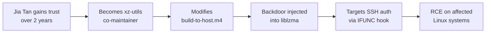

# Lab 6.5: Case Study: xz-utils (CVE-2024-3094)

  Understand: ~10 min | Analyze: ~10 min | Lessons: ~10 min | Detect: ~5 min
  Advanced
  Prerequisites: <a href="../../tier-2/2.3-indirect-ppe/">Lab 2.3</a>

  Overview
  ›
  <a href="understand/" class="phase-step upcoming">Understand</a>
  ›
  <a href="analyze/" class="phase-step upcoming">Analyze</a>
  ›
  <a href="lessons/" class="phase-step upcoming">Lessons</a>
  ›
  <a href="detect/" class="phase-step upcoming">Detect</a>

On March 29, 2024, Andres Freund noticed SSH logins taking ~500ms longer than usual. His investigation uncovered the most sophisticated open source supply chain attack ever documented: a backdoor in xz-utils giving the attacker remote code execution through SSH. The attack was a **two-year social engineering campaign** targeting a burned-out sole maintainer. The attacker, "Jia Tan," built trust, took over maintenance, and injected a backdoor into the build system that was invisible in the source code.

### Attack Flow

## Environment

| Component | Path | Description |
|-----------|------|-------------|
| Attack Timeline | `/app/timeline/attack-timeline.md` | Chronology of the maintainer takeover and release timeline |
| Detection Notes | `/app/indicators/iocs.txt` | IOC-style notes for the affected versions and release artifacts |
| Learner Outputs | `/app/analysis.md`, `/app/detect_xz_backdoor.sh`, `/app/check_reproducible.sh` | Files you create during the case study |

This case-study lab is lighter on seeded infrastructure than the core attack path. The main outputs are your own analysis notes plus two small helper scripts checked by the lab verifier.
