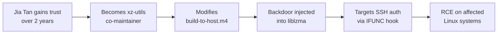

# Lab 6.5: Case Study. xz-utils (CVE-2024-3094)

  Understand: ~10 min | Analyze: ~10 min | Lessons: ~10 min | Detect: ~5 min
  Advanced
  Prerequisites: <a href="../../tier-2/2.3-indirect-ppe/">Lab 2.3</a>

On March 29, 2024, Andres Freund noticed SSH logins taking ~500ms longer than usual. His investigation uncovered the most sophisticated open source supply chain attack ever documented: a backdoor in xz-utils giving the attacker remote code execution through SSH. The attack was a **two-year social engineering campaign** targeting a burned-out sole maintainer. The attacker, "Jia Tan," built trust, took over maintenance, and injected a backdoor into the build system that was invisible in the source code.

### Attack Flow

## Environment

| Component | Path | Description |
|-----------|------|-------------|
| Source Snapshots | `/app/xz-sources/` | xz-utils source at key points in the attack timeline |
| Build Scripts | `/app/xz-build/` | Reproductions of the malicious build system modifications |
| Analysis Tools | `/app/analysis/` | Scripts for examining the backdoor mechanism |
| Backdoor Samples | `/app/backdoor/` | Extracted and annotated backdoor components |

  Overview
  ›
  <a href="understand/" class="phase-step upcoming">Understand</a>
  ›
  <a href="analyze/" class="phase-step upcoming">Analyze</a>
  ›
  <a href="lessons/" class="phase-step upcoming">Lessons</a>
  ›
  <a href="detect/" class="phase-step upcoming">Detect</a>

!!! tip "Related Labs"
    - **Prerequisite:** [2.3 Indirect Poisoned Pipeline Execution](../../tier-2/2.3-indirect-ppe/index.md) — Indirect PPE is the core technique used in the xz-utils attack
    - **See also:** [0.1 How Version Control Works](../../tier-0/0.1-version-control/index.md) — The attack exploited version control trust and maintainer access
    - **See also:** [6.6 Case Study: SolarWinds (SUNBURST)](../6.6-case-study-solarwinds/index.md) — SolarWinds is another build-system compromise at a different scale
    - **See also:** [7.3 Incident Response Playbook](../../tier-7/7.3-ir-playbook/index.md) — IR playbooks address how to respond to attacks like this
