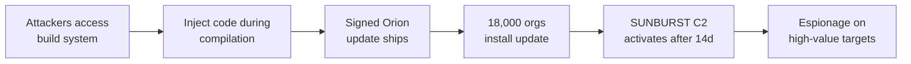

# Lab 6.6: Case Study. SolarWinds (SUNBURST)

<div class="lab-meta">
  <span>~35 minutes</span>
  <span>Advanced</span>
  <span>Prerequisites: <a href="../../tier-2/2.2-direct-ppe/">Lab 2.2</a></span>
</div>

In December 2020, FireEye disclosed that their red team tools had been stolen. The investigation revealed the most significant supply chain attack in history: Russian intelligence (SVR/APT29) had compromised SolarWinds' Orion build system and injected a backdoor. dubbed SUNBURST. into a legitimate software update. The update was digitally signed by SolarWinds and distributed to approximately 18,000 customers, including the U.S. Treasury, Commerce Department, DHS, and Fortune 500 companies.

The attack was remarkable for its sophistication. The backdoor was injected directly into the build process, not the source code. It lay dormant for two weeks after installation before activating. It communicated via DNS using domain generation algorithms that mimicked legitimate SolarWinds traffic. And it specifically avoided activating on systems belonging to security companies and malware researchers.

In this lab, you will study the build system compromise, walk through the SUNBURST implant mechanism, and implement the build verification controls that would have prevented it.

---

### Attack Flow



---

## Environment

| Component | Path | Description |
|-----------|------|-------------|
| Build Simulation | `/app/build-system/` | Simulated build pipeline demonstrating the injection technique |
| SUNBURST Analysis | `/app/sunburst/` | Annotated code samples from the SUNBURST implant |
| Detection Tools | `/app/detection/` | Scripts for detecting SUNBURST-style build compromises |
| Defense Templates | `/app/defenses/` | Build verification and provenance templates |

## Connect to the Workstation

```bash
./weaklink shell
```

### Workstation Terminal

Use the embedded terminal below, or open a separate terminal and run `./cli/weaklink shell`.

<div class="terminal-embed">
  <iframe src="http://localhost:7681" title="WeakLink Workstation Terminal"></iframe>
</div>

---

???+ info "Phase 1: UNDERSTAND. The SolarWinds Orion Build Compromise"

    **Goal:** Study how attackers infiltrated the SolarWinds build system and injected code into compiled DLLs that source review would not detect.

### Step 1: The timeline

```bash
cat /app/analysis/timeline.txt
```

**Key dates:**

| Date | Event |
|------|-------|
| 2019-10 (est.) | Attackers gain initial access to SolarWinds network (likely via compromised credentials) |
| 2020-02 | SUNBURST code injected into Orion build process |
| 2020-03-26 | SolarWinds Orion 2019.4 HF5 released with SUNBURST (first known trojanized update) |
| 2020-06 | Orion 2020.2 released. also contains SUNBURST |
| 2020-12-08 | FireEye discloses breach and stolen red team tools |
| 2020-12-13 | SolarWinds confirms supply chain compromise |
| 2020-12-14 | CISA issues Emergency Directive 21-01 |
| 2020-12-15 | Kill switch activated (Microsoft, FireEye, GoDaddy sinkhole the C2 domain) |

### Step 2: The build system as the target

```bash
cat /app/analysis/build-compromise.txt
```

The attackers did NOT modify the Orion source code in the version control system. Instead, they compromised the build pipeline itself. The build process was modified to inject additional code into `SolarWinds.Orion.Core.BusinessLayer.dll` during compilation. This means:

- Source code review showed nothing malicious
- Code diffs between versions showed no backdoor
- The injected code only existed in the compiled binary
- SolarWinds' own code signing certificate was applied to the backdoored DLL

### Step 3: Understand the injection point

```bash
# Simulate how the build process was modified
cat /app/build-system/legitimate-build.sh
cat /app/build-system/compromised-build.sh

# Compare the two
diff /app/build-system/legitimate-build.sh /app/build-system/compromised-build.sh
```

The attackers added a step to the MSBuild process that compiled an additional `.cs` file containing the SUNBURST code. The file was placed in a temporary directory during build and removed afterward. The resulting DLL was then signed by SolarWinds' legitimate code signing certificate.

### Step 4: Why signing did not help

```bash
cat /app/analysis/signing-problem.txt
```

SolarWinds digitally signed the backdoored DLL with their Authenticode certificate. From the customer's perspective, the update was legitimate: signed by SolarWinds, distributed through SolarWinds' update servers, and installed via the standard update mechanism. **Signing proves who built it, not whether the build process was compromised.**

---

???+ warning "Phase 2: ANALYZE. The SUNBURST Implant"

    **Goal:** Walk through how SUNBURST operated: dormancy, C2 communication, and anti-analysis techniques.

### Step 1: The dormancy period

```bash
cat /app/sunburst/dormancy-annotated.cs
```

After installation, SUNBURST waited approximately **12-14 days** before activating. It checked:

- The system clock (must be at least 12 days after installation)
- The domain name (must be joined to a domain. skipped standalone machines)
- Running processes (aborted if security tools were running)
- Network configuration (aborted if traffic was being intercepted)

This dormancy evaded sandbox analysis, which typically runs samples for minutes to hours, not weeks.

### Step 2: DNS-based C2 communication

```bash
cat /app/sunburst/c2-communication-annotated.cs
```

SUNBURST communicated with its C2 server via DNS queries to `avsvmcloud[.]com`. The subdomain encoded the victim's information:

```
<encoded-victim-data>.appsync-api.eu-west-1.avsvmcloud.com
<encoded-victim-data>.appsync-api.us-east-2.avsvmcloud.com
```

The domain names mimicked AWS API endpoints, making them difficult to distinguish from legitimate SolarWinds cloud traffic. The DNS response directed the implant to a per-victim C2 server for further commands.

### Step 3: Anti-analysis and evasion

```bash
cat /app/sunburst/evasion-annotated.cs
```

SUNBURST actively avoided detection by:

1. **Process blocklist**: Checked for running security tools (Wireshark, Fiddler, ProcMon, etc.) and aborted if found
2. **Domain blocklist**: Refused to activate on domains containing "test", "solarwinds", "lab", or security company names
3. **API hash obfuscation**: Used FNV-1a hashing to compare process names, avoiding plaintext strings
4. **Legitimate-looking traffic**: All C2 traffic mimicked legitimate SolarWinds API calls
5. **Steganographic encoding**: Command data was hidden in HTTP response bodies that appeared normal

### Step 4: The impact

```bash
cat /app/analysis/impact.txt
```

Approximately 18,000 organizations installed the trojanized update. Of those, the attackers actively exploited approximately 100 targets of interest, including:

- U.S. Treasury Department
- U.S. Commerce Department (NTIA)
- U.S. Department of Homeland Security
- U.S. State Department
- FireEye
- Microsoft
- Multiple Fortune 500 companies

The attackers' objectives were espionage: reading emails, accessing documents, and pivoting to additional systems using stolen credentials.

### Step 5: Understand why traditional controls failed

```bash
echo "
Why each traditional control failed:
=====================================
1. CODE REVIEW:     Backdoor was in the build, not the source -- nothing to review
2. CODE SIGNING:    SolarWinds' own cert signed the backdoor -- signature was valid
3. ANTIVIRUS:       Custom implant with no known signature -- zero AV detections at launch
4. NETWORK MONITOR: C2 traffic mimicked legitimate SolarWinds DNS -- indistinguishable
5. SANDBOX:         12-day dormancy exceeded sandbox runtime -- no behavior detected
6. UPDATE CHANNEL:  Distributed via official SolarWinds update server -- trusted source
"
```

---

???+ success "Phase 3: LESSONS. Build Verification and Provenance"

    **Goal:** Implement the build system controls that would detect or prevent a SUNBURST-style attack.

### Lesson 1: Reproducible builds

```bash
cat /app/defenses/reproducible-build.sh
```

If SolarWinds had implemented reproducible builds, an independent rebuild from the same source code would have produced a different binary than the one distributed. The discrepancy would have been detected.

```bash
# Demonstrate reproducible build verification
/app/defenses/reproducible-build.sh

# Compare: legitimate build vs. compromised build
# Different SHA256 = build system was tampered with
```

### Lesson 2: Build system isolation

```bash
cat /app/defenses/build-isolation.md
```

The SolarWinds build system was on the same network as the rest of the corporate infrastructure. The attackers compromised the network first, then pivoted to the build system. Modern build security requires:

1. **Air-gapped build environments**. build systems on a separate network segment
2. **Ephemeral build runners**. each build runs in a fresh environment that is destroyed afterward
3. **No human SSH access**. build systems are managed via automation only
4. **Separate credentials**. code signing keys are in an HSM accessible only by the build pipeline

### Lesson 3: Binary transparency

```bash
cat /app/defenses/binary-transparency.sh
```

Binary transparency logs (like Sigstore's Rekor) create a public, append-only record of every artifact published by a build system. If a binary is not in the transparency log, it should not be trusted. If two different binaries exist for the same version, the discrepancy is visible.

### Lesson 4: Verify before you deploy

```bash
# Every customer that deployed the SolarWinds update trusted the update channel
# Verification would have required:
echo "
1. Check the update binary hash against a transparency log
2. Compare the binary against a reproducible build from source
3. Run the binary in a sandbox for >14 days (impractical but illustrative)
4. Monitor for unexpected DNS traffic after installation
"
```

### Lesson 5: Two-person integrity for releases

No single person or automated process should be able to modify the build pipeline AND sign the release. The SolarWinds attack succeeded because the build modification and the signing were part of the same automated pipeline. Separating them would have required the attacker to compromise two independent systems.

### Verify understanding

```bash
weaklink verify 6.6
```

---

??? danger "Phase 4: DETECT. Identifying SUNBURST and Build Compromises"

    **Goal:** Detect SUNBURST-specific indicators and generalize them to detect future build system compromises.

### SIEM / Log Indicators

SUNBURST was designed to evade detection, but it generated detectable signals: **DNS queries to `avsvmcloud.com`**, **unexpected DLL loading in SolarWinds processes**, and **lateral movement from SolarWinds servers to high-value targets**.

**What to look for (SUNBURST-specific):**

- DNS queries to `*.avsvmcloud.com` or its known C2 subdomains
- `SolarWinds.Orion.Core.BusinessLayer.dll` with SHA256 hash matching known-bad versions
- SolarWinds Orion processes making HTTP calls to non-SolarWinds endpoints
- Lateral movement (SMB, WinRM, RDP) originating from SolarWinds servers

**What to look for (generic build compromise):**

- Build artifacts with different hashes than expected from the same source code
- Build pipeline modifications not tracked in version control
- Code signing events occurring outside the build pipeline
- New processes or DLLs loaded by the build system that are not in the bill of materials

### Network Indicators

| Indicator | What It Means |
|-----------|---------------|
| DNS query to `avsvmcloud.com` | SUNBURST C2 communication |
| HTTP to IPs in 185.x, 20.x, 96.x ranges from SolarWinds server | Known SUNBURST C2 infrastructure |
| SMB/WinRM from SolarWinds to domain controller | Lateral movement post-exploitation |
| HTTPS to legitimate cloud APIs from monitoring server | Potentially a C2 channel using domain fronting |

### MITRE ATT&CK Mapping

| Technique | ID | Relevance |
|-----------|-----|-----------|
| **Supply Chain Compromise: Software Supply Chain** | [T1195.002](https://attack.mitre.org/techniques/T1195/002/) | Backdoor injected via compromised SolarWinds Orion build system |
| **Supply Chain Compromise: Hardware Supply Chain** | [T1195.003](https://attack.mitre.org/techniques/T1195/003/) | Build system compromise is functionally equivalent to hardware supply chain attack |
| **Signed Binary Proxy Execution** | [T1218](https://attack.mitre.org/techniques/T1218/) | Backdoored DLL was legitimately signed by SolarWinds' code signing certificate |
| **Application Layer Protocol: DNS** | [T1071.004](https://attack.mitre.org/techniques/T1071/004/) | SUNBURST used DNS queries for C2 communication |

---

??? tip "SOC Relevance"

    **Alerts you will see (retroactive):**

    - "DNS query to known SUNBURST C2 domain" (threat intel feed)
    - "SolarWinds Orion DLL hash matches known-bad indicator" (file integrity)
    - "Lateral movement from SolarWinds server to domain controller" (behavioral)

    The SUNBURST attack demonstrated that trusting the software update channel is not sufficient. SolarWinds was a trusted vendor, the update was digitally signed, and it was distributed through the official update mechanism. Every enterprise security control designed to verify "is this software from the vendor?" answered "yes". because it was. The question should have been "was the vendor's build process compromised?"

    **Triage steps (for any vendor update compromise):**

    1. Check the binary hash against known-bad indicators (CISA, vendor advisories)
    2. Check for unusual network activity from the updated software (DNS, HTTP to unfamiliar endpoints)
    3. Check for lateral movement originating from the server running the updated software
    4. If confirmed: assume all credentials accessible to the compromised software are stolen
    5. Contain: isolate affected systems, revoke credentials, block C2 indicators at the perimeter

    **False positive rate for SUNBURST indicators:** Very low. DNS queries to `avsvmcloud.com` are definitive. For generic build compromise detection, false positive rate depends on how well you baseline expected build artifact hashes.

---

??? example "CI Integration"

    Verify build integrity and detect build system tampering.

    **`.github/workflows/build-integrity.yml`:**

    ```yaml
    name: Build Integrity Verification

    on:
      push:
        branches: [main]
      pull_request:

    jobs:
      reproducible-build:
        runs-on: ubuntu-latest
        steps:
          - uses: actions/checkout@v4

          - name: Build artifact
            run: |
              # Build the artifact
              make build
              sha256sum dist/*.dll dist/*.exe > build-hashes.txt

          - name: Verify reproducible build
            run: |
              # Rebuild from the same source
              make clean && make build
              sha256sum dist/*.dll dist/*.exe > rebuild-hashes.txt

              # Compare
              if ! diff build-hashes.txt rebuild-hashes.txt; then
                echo "::error::Build is NOT reproducible. Same source produced different artifacts."
                echo "This may indicate build system tampering (SolarWinds-style attack)."
                exit 1
              fi
              echo "PASS: Build is reproducible."

          - name: Verify no unexpected files in build output
            run: |
              # Check that only expected files are in the build output
              EXPECTED_FILES="app.dll config.json"
              for f in dist/*; do
                BASENAME=$(basename "$f")
                if ! echo "$EXPECTED_FILES" | grep -qw "$BASENAME"; then
                  echo "::error::Unexpected file in build output: $BASENAME"
                  exit 1
                fi
              done
              echo "PASS: Only expected files in build output."

          - name: Log build provenance
            run: |
              echo "Build provenance:"
              echo "  Source: ${{ github.sha }}"
              echo "  Builder: ${{ github.server_url }}/${{ github.repository }}/actions/runs/${{ github.run_id }}"
              echo "  Timestamp: $(date -u +%Y-%m-%dT%H:%M:%SZ)"
              cat build-hashes.txt
    ```

---

## What You Learned

1. **Build systems are high-value targets**. compromising the build pipeline lets attackers inject code that source review, code signing, and antivirus all miss because the backdoor exists only in the compiled output.
2. **Code signing proves authorship, not integrity**. SolarWinds' legitimate certificate signed the backdoored DLL. Signing tells you WHO built it, not WHETHER the build process was trustworthy.
3. **Reproducible builds would have caught SUNBURST**. if an independent rebuild from source produced a different binary, the discrepancy would have been detected before distribution.
4. **Dormancy and anti-analysis defeat sandboxes**. SUNBURST's 12-day dormancy and process blocklist evaded every automated analysis system. Long-term behavioral monitoring is required.
5. **Software update channels are trusted by design**. enterprises allow updates from vendors. When the vendor's build is compromised, every customer's trust model fails simultaneously.

## Further Reading

- [CISA Emergency Directive 21-01](https://www.cisa.gov/emergency-directive-21-01)
- [FireEye: Highly Evasive Attacker Leverages SolarWinds Supply Chain](https://www.mandiant.com/resources/evasive-attacker-leverages-solarwinds-supply-chain-compromises-with-sunburst-backdoor)
- [Microsoft: Analyzing Solorigate](https://www.microsoft.com/en-us/security/blog/2020/12/18/analyzing-solorigate-the-compromised-dll-file-that-started-a-sophisticated-cyberattack/)
- [CrowdStrike: SUNSPOT. Implant in the SolarWinds Build Environment](https://www.crowdstrike.com/blog/sunspot-malware-technical-analysis/)
- [MITRE ATT&CK: SolarWinds Compromise](https://attack.mitre.org/campaigns/C0024/)
