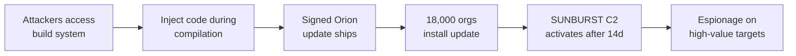

# Lab 6.6: Case Study. SolarWinds (SUNBURST)

<div class="lab-meta">
  <span>Understand: ~10 min | Analyze: ~10 min | Lessons: ~10 min | Detect: ~5 min</span>
  <span class="difficulty advanced">Advanced</span>
  <span>Prerequisites: <a href="../../tier-2/2.2-direct-ppe/">Lab 2.2</a></span>
</div>

In December 2020, Russian intelligence (SVR/APT29) compromised SolarWinds' Orion build system and injected a backdoor, dubbed SUNBURST, into a legitimate software update. The update was digitally signed by SolarWinds and distributed to approximately 18,000 customers, including the U.S. Treasury, Commerce Department, DHS, and Fortune 500 companies. The backdoor was injected into the build process (not the source code), lay dormant for two weeks, communicated via DNS mimicking legitimate traffic, and avoided activating on security company systems.

---

### Attack Flow



---

## Environment

| Component | Path | Description |
|-----------|------|-------------|
| Build Simulation | `/app/build-system/` | Simulated build pipeline demonstrating the injection technique |
| SUNBURST Analysis | `/app/sunburst/` | Annotated code samples from the SUNBURST implant |
| Detection Tools | `/app/detection/` | Scripts for detecting SUNBURST-style build compromises |
| Defense Templates | `/app/defenses/` | Build verification and provenance templates |

## Connect to the Workstation

```bash
./weaklink shell
```

---

???+ info "Phase 1: UNDERSTAND. The SolarWinds Orion Build Compromise"

    **Goal:** Study how attackers injected code into compiled DLLs that source review would not detect.

### Step 1: The timeline

| Date | Event |
|------|-------|
| 2019-10 (est.) | Attackers gain initial access to SolarWinds network |
| 2020-02 | SUNBURST code injected into Orion build process |
| 2020-03-26 | First trojanized Orion update ships (2019.4 HF5) |
| 2020-06 | Orion 2020.2 also contains SUNBURST |
| 2020-12-08 | FireEye discloses breach and stolen red team tools |
| 2020-12-13 | SolarWinds confirms supply chain compromise |
| 2020-12-15 | Kill switch activated (Microsoft, FireEye, GoDaddy sinkhole C2 domain) |

### Step 2: The build system as the target

```bash
cat /app/analysis/build-compromise.txt
```

The attackers did NOT modify source code in version control. They compromised the build pipeline to inject code into `SolarWinds.Orion.Core.BusinessLayer.dll` during compilation. Source code review showed nothing. Code diffs showed no backdoor. SolarWinds' own code signing certificate was applied to the backdoored DLL.

### Step 3: Understand the injection point

```bash
diff /app/build-system/legitimate-build.sh /app/build-system/compromised-build.sh
```

The attackers added an MSBuild step that compiled an additional `.cs` file containing SUNBURST code. The file was placed in a temporary directory during build and removed afterward.

### Step 4: Why signing did not help

**Signing proves who built it, not whether the build process was compromised.** SolarWinds digitally signed the backdoored DLL with their Authenticode certificate. From the customer's perspective, the update was legitimate.

---

???+ warning "Phase 2: ANALYZE. The SUNBURST Implant"

    **Goal:** Walk through how SUNBURST operated: dormancy, C2 communication, and anti-analysis techniques.

### Step 1: The dormancy period

```bash
cat /app/sunburst/dormancy-annotated.cs
```

SUNBURST waited **12-14 days** before activating. It checked the system clock, domain membership, running processes (aborted if security tools were running), and network configuration. This evaded sandbox analysis, which runs samples for minutes to hours.

### Step 2: DNS-based C2

```bash
cat /app/sunburst/c2-communication-annotated.cs
```

C2 via DNS queries to `avsvmcloud[.]com`. Subdomains encoded victim data and mimicked AWS API endpoints, making them difficult to distinguish from legitimate SolarWinds cloud traffic.

### Step 3: Anti-analysis and evasion

```bash
cat /app/sunburst/evasion-annotated.cs
```

Process blocklist (Wireshark, Fiddler, ProcMon), domain blocklist ("test", "solarwinds", "lab", security company names), FNV-1a hash obfuscation for string comparison, legitimate-looking API traffic for C2, steganographic encoding in HTTP responses.

### Step 4: Why traditional controls failed

Every control failed: code review (backdoor in build, not source), signing (SolarWinds' own cert), antivirus (zero known signatures), network monitoring (traffic mimicked legitimate DNS), sandbox (12-day dormancy), update channel (official SolarWinds server).

---

!!! abstract "Checkpoint"
    You should understand why the build system (not source code) was the target, and why code signing provided zero protection. Verify by examining the diff between legitimate and compromised build scripts.

---

???+ success "Phase 3: LESSONS. Build Verification and Provenance"

    **Goal:** Implement build system controls that would detect or prevent a SUNBURST-style attack.

### Lesson 1: Reproducible builds

```bash
/app/defenses/reproducible-build.sh
```

An independent rebuild from the same source code would have produced a different binary than the one distributed.

### Lesson 2: Build system isolation

The SolarWinds build system was on the same network as corporate infrastructure. Modern build security requires air-gapped build environments, ephemeral build runners, no human SSH access, and signing keys in an HSM accessible only by the pipeline.

### Lesson 3: Binary transparency

```bash
cat /app/defenses/binary-transparency.sh
```

Binary transparency logs (Sigstore's Rekor) create a public, append-only record of every artifact. If two different binaries exist for the same version, the discrepancy is visible.

### Lesson 4: Two-person integrity for releases

No single person or process should modify the build pipeline AND sign the release. Separating them requires the attacker to compromise two independent systems.

### Verify understanding

```bash
weaklink verify 6.6
```

---

??? danger "Phase 4: DETECT. Identifying SUNBURST and Build Compromises"

    **Goal:** Detect SUNBURST-specific indicators and generalize to future build system compromises.

SUNBURST generated detectable signals: **DNS queries to `avsvmcloud.com`**, **unexpected DLL loading in SolarWinds processes**, and **lateral movement from SolarWinds servers**.

Detection targets (SUNBURST-specific):

- DNS queries to `*.avsvmcloud.com`
- `SolarWinds.Orion.Core.BusinessLayer.dll` matching known-bad hashes
- SolarWinds processes making HTTP calls to non-SolarWinds endpoints
- Lateral movement (SMB, WinRM) from SolarWinds servers

Detection targets (generic build compromise):

- Build artifacts with different hashes than expected from the same source
- Build pipeline modifications not tracked in version control
- Code signing events outside the build pipeline

### MITRE ATT&CK Mapping

| Technique | ID | Relevance |
|-----------|-----|-----------|
| **Supply Chain Compromise: Software Supply Chain** | [T1195.002](https://attack.mitre.org/techniques/T1195/002/) | Backdoor injected via compromised build system |
| **Signed Binary Proxy Execution** | [T1218](https://attack.mitre.org/techniques/T1218/) | Backdoored DLL signed by SolarWinds' certificate |
| **Application Layer Protocol: DNS** | [T1071.004](https://attack.mitre.org/techniques/T1071/004/) | DNS-based C2 communication |

---

??? tip "SOC Relevance"

    **Alerts:** "DNS query to known SUNBURST C2 domain" (threat intel), "SolarWinds Orion DLL hash matches known-bad" (FIM), "Lateral movement from SolarWinds server" (behavioral).

    Every enterprise control designed to verify "is this software from the vendor?" answered "yes" because it was. The question should have been "was the vendor's build process compromised?"

    **Triage (any vendor update compromise):** Check binary hash against known-bad indicators, check for unusual network activity from updated software, check for lateral movement from the server, assume all accessible credentials are stolen if confirmed, isolate and block C2 indicators.

---

## What You Learned

1. **Build systems are high-value targets.** Compromising the build pipeline lets attackers inject code that source review, signing, and antivirus all miss.
2. **Code signing proves authorship, not integrity.** Signing tells you WHO built it, not WHETHER the build was trustworthy.
3. **Reproducible builds would have caught SUNBURST.** An independent rebuild producing a different binary would have been detected before distribution.

## Further Reading

- [CISA Emergency Directive 21-01](https://www.cisa.gov/emergency-directive-21-01)
- [CrowdStrike: SUNSPOT. Implant in the Build Environment](https://www.crowdstrike.com/blog/sunspot-malware-technical-analysis/)
- [MITRE ATT&CK: SolarWinds Compromise](https://attack.mitre.org/campaigns/C0024/)
