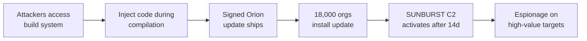

# Lab 6.6: Case Study. SolarWinds (SUNBURST)

  Understand: ~10 min | Analyze: ~10 min | Lessons: ~10 min | Detect: ~5 min
  Advanced
  Prerequisites: <a href="../../tier-2/2.2-direct-ppe/">Lab 2.2</a>

In December 2020, Russian intelligence (SVR/APT29) compromised SolarWinds' Orion build system and injected a backdoor, dubbed SUNBURST, into a legitimate software update. The update was digitally signed by SolarWinds and distributed to approximately 18,000 customers, including the U.S. Treasury, Commerce Department, DHS, and Fortune 500 companies. The backdoor was injected into the build process (not the source code), lay dormant for two weeks, communicated via DNS mimicking legitimate traffic, and avoided activating on security company systems.

### Attack Flow

## Environment

| Component | Path | Description |
|-----------|------|-------------|
| Build Simulation | `/app/build-system/` | Simulated build pipeline demonstrating the injection technique |
| SUNBURST Analysis | `/app/sunburst/` | Annotated code samples from the SUNBURST implant |
| Detection Tools | `/app/detection/` | Scripts for detecting SUNBURST-style build compromises |
| Defense Templates | `/app/defenses/` | Build verification and provenance templates |

  Overview
  ›
  <a href="understand/" class="phase-step upcoming">Understand</a>
  ›
  <a href="analyze/" class="phase-step upcoming">Analyze</a>
  ›
  <a href="lessons/" class="phase-step upcoming">Lessons</a>
  ›
  <a href="detect/" class="phase-step upcoming">Detect</a>

