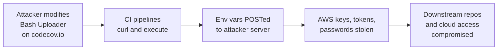

# Lab 6.7: Case Study: Codecov Bash Uploader

  Understand: ~8 min | Analyze: ~7 min | Lessons: ~10 min | Detect: ~5 min
  Intermediate
  Prerequisites: <a href="../../tier-2/2.4-secret-exfiltration/">Lab 2.4</a>

  Overview
  ›
  <a href="understand/" class="phase-step upcoming">Understand</a>
  ›
  <a href="analyze/" class="phase-step upcoming">Analyze</a>
  ›
  <a href="lessons/" class="phase-step upcoming">Lessons</a>
  ›
  <a href="detect/" class="phase-step upcoming">Detect</a>

On April 1, 2021, Codecov disclosed that their Bash Uploader script, used by thousands of CI/CD pipelines, had been modified by an attacker. The compromised script exfiltrated every environment variable from the CI runner: AWS keys, GitHub tokens, Docker registry credentials, database passwords. The attack persisted undetected for over two months. The canonical example of why `curl | bash` is dangerous in CI/CD.

### Attack Flow

## Environment

| Component | Path | Description |
|-----------|------|-------------|
| CI Pipeline | `/app/ci-pipeline/` | Simulated GitHub Actions workflow using Codecov uploader |
| Uploader Scripts | `/app/uploader/` | Legitimate and compromised versions of the Bash uploader |
| Exfil Server | `exfil-server:8080` | Simulated attacker server receiving exfiltrated variables |
| Defense Templates | `/app/defenses/` | Pinned and verified script alternatives |
