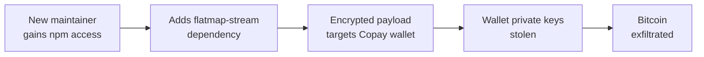

# Lab 6.8: Case Study. event-stream / ua-parser-js

<div class="lab-meta">
  <span>Understand: ~8 min | Analyze: ~8 min | Lessons: ~10 min | Detect: ~4 min</span>
  <span class="difficulty intermediate">Intermediate</span>
  <span>Prerequisites: <a href="../../tier-1/1.6-phantom-dependencies/">Lab 1.6</a></span>
</div>

Two npm incidents that define the dominant supply chain attack vectors. In November 2018, `event-stream` (2M weekly downloads) was discovered with a targeted cryptocurrency-stealing backdoor. A new contributor offered to maintain the abandoned package, gained publish access, then added a dependency containing obfuscated malicious code targeting the Copay Bitcoin wallet. In October 2021, `ua-parser-js` (8M weekly downloads) was hijacked via account compromise. Three malicious versions installed crypto miners and credential stealers on every machine that ran `npm install`. Social engineering maintainer takeover vs. direct account compromise.

---

### Attack Flow



---

## Environment

| Component | Path | Description |
|-----------|------|-------------|
| Package Analysis | `/app/event-stream/` | Reconstructed event-stream and flatmap-stream packages |
| Account Takeover | `/app/ua-parser/` | Analysis of the ua-parser-js account compromise |
| Detection Tools | `/app/detection/` | Scripts for detecting maintainer takeover and malicious updates |
| npm Registry | `npm-registry:4873` | Local Verdaccio registry with attack reconstructions |

## Connect to the Workstation

```bash
./weaklink shell
```

---

???+ info "Phase 1: UNDERSTAND. npm's Trust Model and Maintainer Accounts"

    **Goal:** Understand how both attacks exploited npm's publishing model.

### The event-stream timeline

| Date | Event |
|------|-------|
| 2018-09 | "right9ctrl" contacts the maintainer, offers to help |
| 2018-09-09 | Maintainer transfers npm publish rights |
| 2018-09-16 | right9ctrl adds `flatmap-stream@0.1.1` as a dependency |
| 2018-10-20 | event-stream@3.3.6 published with the malicious dependency |
| 2018-11-20 | Suspicious code reported on GitHub |

### The ua-parser-js timeline

| Date | Event |
|------|-------|
| 2021-10-22 | Attacker compromises maintainer's npm account |
| 2021-10-22 | Malicious versions 0.7.29, 0.8.0, 1.0.0 published within hours |
| 2021-10-22 | CISA advisory; npm removes malicious versions |

### npm's publishing model

npm's trust model: **whoever has the publish token can publish any version.** No code review, no multi-party approval, no delay. A single compromised token = instant access to every downstream consumer.

### Why maintainers hand off packages

Dominic Tarr (event-stream): "Somebody offered to help. I accepted." npm hosts millions of packages maintained by volunteers with no support structure.

---

???+ warning "Phase 2: ANALYZE. Two Different Attack Mechanisms"

    **Goal:** Walk through the technical details of both attacks.

### event-stream: The targeted dependency injection

```bash
diff /app/event-stream/package-3.3.5.json /app/event-stream/package-3.3.6.json
```

Spot the new dependency: `flatmap-stream` appears in 3.3.6 but not 3.3.5. This is what a lockfile review would have caught.

```bash
cat /app/event-stream/flatmap-stream/package.json
cat /app/event-stream/flatmap-stream/index.min.js
```

Version 0.1.0 was clean. Version 0.1.1 added an encrypted payload in `index.min.js`.

```bash
cat /app/event-stream/analysis/deobfuscated-payload.js
```

The payload was AES-encrypted and only activated if the package's `description` matched the Copay Bitcoin wallet. If matched, it decrypted a second stage that stole wallet private keys. The 2M weekly downloaders were collateral. the attacker only wanted Copay's Bitcoin.

### ua-parser-js: The mass account hijack

```bash
cat /app/ua-parser/malicious-0.7.29/package.json
cat /app/ua-parser/malicious-0.7.29/preinstall.js
```

The three malicious versions contained `preinstall` scripts that on Linux downloaded and started a Monero miner, and on Windows downloaded a credential stealer plus the miner. Every machine that ran `npm install` got infected.

### Comparison

| | event-stream | ua-parser-js |
|---|---|---|
| Attack type | Social engineering | Account compromise |
| Duration | ~2 months | ~4 hours |
| Target | Copay Bitcoin wallet | All users |
| Payload | Encrypted, targeted | Plaintext, mass |
| Detection | Very hard | Moderate (noisy) |

---

???+ abstract "Checkpoint"
    You should understand the two attack models: targeted dependency injection (event-stream) vs. mass account hijack (ua-parser-js). Examine the deobfuscated payload to confirm the Copay targeting logic.

---

???+ success "Phase 3: LESSONS. Protecting Against Maintainer Takeover"

    **Goal:** Implement controls that detect and prevent both social engineering and account compromise.

### Lesson 1: Monitor maintainer changes

```bash
cat > /app/defenses/check-maintainers.sh << 'SHELLEOF'
#!/bin/bash
PACKAGE="$1"
KNOWN_MAINTAINERS_FILE="/app/defenses/known-maintainers/${PACKAGE}.txt"

CURRENT=$(npm view "$PACKAGE" maintainers --json 2>/dev/null | python3 -c "
import sys, json
data = json.load(sys.stdin)
for m in (data if isinstance(data, list) else [data]):
    print(m if isinstance(m, str) else m.get('name', ''))
" | sort)

if [ -f "$KNOWN_MAINTAINERS_FILE" ]; then
    KNOWN=$(cat "$KNOWN_MAINTAINERS_FILE" | sort)
    if [ "$CURRENT" != "$KNOWN" ]; then
        echo "ALERT: Maintainers changed for $PACKAGE!"
        echo "  Previous: $KNOWN"
        echo "  Current:  $CURRENT"
    else
        echo "OK: Maintainers unchanged for $PACKAGE"
    fi
else
    echo "$CURRENT" > "$KNOWN_MAINTAINERS_FILE"
    echo "Baseline created for $PACKAGE: $CURRENT"
fi
SHELLEOF
chmod +x /app/defenses/check-maintainers.sh
```

### Lesson 2: Lock the full dependency tree

```bash
cat > /app/defenses/detect-new-deps.sh << 'SHELLEOF'
#!/bin/bash
echo "=== Detecting new dependencies in package-lock.json ==="
BASELINE="/app/defenses/package-lock-baseline.json"
CURRENT="/app/webapp/package-lock.json"

if [ -f "$BASELINE" ]; then
    NEW_DEPS=$(diff <(jq -r '.packages | keys[]' "$BASELINE" | sort) \
                     <(jq -r '.packages | keys[]' "$CURRENT" | sort) \
                | grep "^>" | sed 's/^> //')
    if [ -n "$NEW_DEPS" ]; then
        echo "NEW DEPENDENCIES DETECTED:"
        echo "$NEW_DEPS"
    else
        echo "No new dependencies."
    fi
fi
SHELLEOF
chmod +x /app/defenses/detect-new-deps.sh
```

If teams reviewed lockfile changes, the addition of `flatmap-stream` would have been visible.

### Lesson 3: Enforce 2FA for npm publishing

The ua-parser-js attack would have been prevented if the maintainer had 2FA enabled. Use `npm profile enable-2fa auth-and-writes` and automation tokens (not user tokens) for CI.

### Lesson 4: Use provenance attestation

npm provenance (since npm 9.5.0): packages built on GitHub Actions include provenance attestation. `npm audit signatures` verifies packages were published from known CI systems. Even with stolen credentials, the attacker cannot generate valid provenance.

### Verify understanding

```bash
weaklink verify 6.8
```

---

??? danger "Phase 4: DETECT. Identifying Maintainer Takeover and Malicious Updates"

    **Goal:** Detect maintainer changes, suspicious updates, and malicious install scripts.

Two signal categories: **package metadata changes** (new maintainer, new dependency, unusual version) and **runtime indicators** (install scripts downloading binaries, outbound connections during `npm install`, mining processes).

Detection targets:

- npm package maintainer changes in your dependency tree
- New transitive dependencies in `package-lock.json` without `package.json` changes
- Install scripts in packages that previously lacked them
- `npm install` spawning child processes (curl, wget, powershell)
- Cryptocurrency mining connections from developer workstations

### MITRE ATT&CK Mapping

| Technique | ID | Relevance |
|-----------|-----|-----------|
| **Supply Chain Compromise: Software Supply Chain** | [T1195.002](https://attack.mitre.org/techniques/T1195/002/) | Both attacks compromised npm registry packages |
| **Trusted Relationship** | [T1199](https://attack.mitre.org/techniques/T1199/) | event-stream: social engineering for maintainer access |
| **Valid Accounts** | [T1078](https://attack.mitre.org/techniques/T1078/) | ua-parser-js: compromised npm credentials |
| **Resource Hijacking** | [T1496](https://attack.mitre.org/techniques/T1496/) | ua-parser-js: cryptocurrency miners |

---

??? tip "SOC Relevance"

    **Alerts:** "npm install spawned unexpected child process" (EDR), "Cryptocurrency mining connection" (network), "npm package maintainer change detected" (registry monitoring), "New transitive dependency without package.json change" (CI check).

    event-stream (social engineering) is harder to detect: obfuscated, targeted. ua-parser-js (account hijack) is noisier but has immediate mass impact.

    **Triage:** Check if the package is in your tree (direct or transitive), check version against known-bad advisories, check if `npm install` ran during the exposure window, look for mining processes or unusual outbound connections, update to clean version and rotate exposed credentials.

---

## What You Learned

1. **Maintainer accounts are the master key.** A single compromised or transferred npm account affects every downstream consumer.
2. **Targeted payloads evade detection.** The event-stream backdoor only activated in Copay, invisible to automated scanning.
3. **Lockfile review catches dependency injection.** The addition of `flatmap-stream` would have been visible as an unexplained new entry.

## Further Reading

- [Dominic Tarr's Statement on event-stream](https://gist.github.com/dominictarr/9fd9c1024c94592bc7268d36b8d83b3a)
- [GitHub Advisory: flatmap-stream (GHSA-7fhm-mqm4-2wp7)](https://github.com/advisories/GHSA-7fhm-mqm4-2wp7)
- [CISA: ua-parser-js Compromise](https://www.cisa.gov/news-events/alerts/2021/10/22/malware-discovered-popular-npm-package-ua-parser-js)
